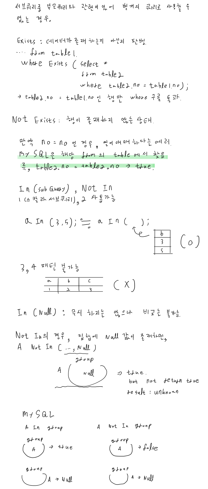

# SQL 첫걸음

## 1장 데이터베이스와 SQL
- 1강 데이터베이스 

- 2강 다양한 데이터베이스

- 3강 데이터베이스 서버

## 2장 테이블에서 데이터 검색
- 4강 Hello World 실행하기
- 5강 테이블 구조 참조하기  

- 6강 검색 조건 지정하기
- 7강 조건 조합하기
- 8강 패턴 매칭에 의한 검색

## 3장 정렬과 연산
- 9강 정렬 Order by
- 10강 복수의 열을 지정해 정렬하기  

- 11강 결과 행 제한하기 Limit

- 12강 수치 연산

- 13강 문자열 연산

- 14강 날짜 연산

- 15강 Case 문으로 데이터 변환하기

## 4장 데이터 추가, 삭제, 갱신
- 16강 행 추가하기 Insert
- 17강 삭제하기 Delete
- 18강 데이터 갱신하기 Update 

- 19강 물리삭제와 논리삭제

## 5장 집계와 서브쿼리
- 20강 행 개수 구하기 Count
- 21강 Count 이외의 집계함수 

- 22강 그룹화 Group by

- 23강 서브쿼리

- 24강 상관 서브쿼리

## 6장 데이터베이스 객체 작성과 삭제
- 25강 데이터베이스 객체 

- 26강 테이블 작성, 삭제, 변경

- 27강 제약

- 28강 인덱스 구조
- 29강 인덱스 작성과 삭제

- 30강 뷰 작성과 삭제

## 7장 복수의 테이블 다루기
- 31강 집합 연산

- 32강 테이블 결합

- 33강 관계형 모델

## 8장 데이터베이스 설계
- 34강 데이터베이스 설계

- 35강 정규화

- 36강 트랜잭션

## 추가 학습
- Exist
- In (Select)
- 제약
- Join
- 정규화
- 트랜잭션

## Reference