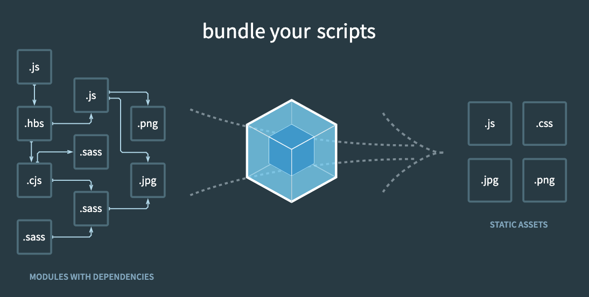

# Webpack

- [생활코딩 홈페이지](https://opentutorials.org/module/4566)
- [Youtube divide](https://www.youtube.com/playlist?list=PLuHgQVnccGMChcT9IKopFDoAIoTA-03DA)

## 1. 수업소개
- [WEB2 JavaScript](https://opentutorials.org/module/3180) 수업 참고
  - [학습 내용 정리](./JavaScriptOpentutorials.md)
- [npm](https://opentutorials.org/module/4044) 수업 참고
  - [학습 내용 정리](./npm.md)

<br><br>

- Webpack 
  - 브라우저에서 웹 페이지를 동적으로 제어하는 기술인 **JavaScript를 더 잘다루기 위한 기술**
  - Webpack을 이용하여 하나의 JavaScript 파일에 JS, CSS, 이미지와 같은 여러 모듈들을 모을 수 있고, 필요하다면 다시 분리할 수 있음
- 웹에 요구사항이 점점 더 다양하고 복잡해짐에 따라 점점 더 많은 파일이 필요, 이로 인해 서버와의 통신이 여러번 반복되며 자원이 낭비됨
- 다양한 JavaScript Package를 사용할 경우, 서로 다른 Package에서 서로 같은 이름의 변수나 함수를 사용할 수 있음. 이는 예상하지 못한 충돌, 의도하지 않은 결과를 발생시킴
- 이러한 문제를 해결하기 위해 등장한 도구를 **Bundler**라고 함
  - bundle(묶음) 즉, 여러 개의 파일을 묶어주는 도구
  - Webpack, Browserify, Parcel 등이 이에 속함

## 2. 웹팩이전의 세계와 모듈의 개념
- JS로 HTML의 화면을 그려주는 간단한 예제 작성, module의 유무에 따른 차이 비교
- 파일 시스템으로는 실행이 불가능하니 VS Code Live Server 플러그인 이용
- withoutModule
  - [index.html](PracticeSource/Webpack/withoutModule/index.html), [hello.js](PracticeSource/Webpack/withoutModule/source/hello.js), [world.js](PracticeSource/Webpack/withoutModule/source/world.js)
  - 서로 같은 이름의 변수를 사용하기 때문에 의도치 않는 결과가 생성될 가능성이 있음
- withModule
  - [index.html](PracticeSource/Webpack/withModule/index.html), [hello.js](PracticeSource/Webpack/withModule/source/hello.js), [world.js](PracticeSource/Webpack/withModule/source/world.js)
  - 모듈을 사용하고 싶은 script 태그의 type을 module로 설정
  - 전통적인 script 호출 방법 대신 script 태그 내부에서 **import A from 'path'** 키워드 사용
  - 호출 대상이 되는 script 파일에서는 **export** 키워드로 외부에서 사용될 변수, 함수를 정의
  - module은 비교적 최신 기능이기 때문에 브라우저간 호환성 문제가 있으며, module이 많아질수록 더 많은 자원과 시간을 요구함
- 이러한 요구와 문제를 해결하기위해 **Bundler**라는 도구가 생겨남

## 3. 웹팩의 도입
- Webpack 도입 시, refactoring 효과를 기대할 수 있음
- refactoring : 구동되는 방법은 그대로 유지하며, 내부의 코드를 더 효율적으로 바꾸는 과정
- [앞서 작성한 코드](PracticeSource/Webpack/withModule/index.html)의 기능은 유지, 구형 브라우저에서 사용 가능하고 여러 개의 파일을 하나의 파일로 제공(Bundling)하는 것을 원함
- Webpack을 사용하기 위해 프로젝트를 Node.js Package로 설정하고 Webpack 설치
```sh
# Shell
npm init -y # Node.js Package로 설정
npm install -D webpack webpack-cli # webpack 설치
```
- 소스코드 수정 [index.html](PracticeSource/Webpack/startWebpack/index.html), [index.js](PracticeSource/Webpack/startWebpack/source/index.js), [hello.js](PracticeSource/Webpack/startWebpack/source/hello.js), [world.js](PracticeSource/Webpack/startWebpack/source/world.js)
- Application의 entry(기입, 시작) file은 index.js
- Webpack을 사용하여 index.js을 Bundling. 이때, index.js에서 사용하는 하위 파일도 포함됨
- Bundling 결과를 public 폴더에 index_bundle.js로 저장
```sh
# Shell
npx webpack --mode production --entry ./source/index.js --output-path ./public --output-filename index_bundle.js
```

## 4. 설정파일 도입
## 5. 모드의 도입
## 6. 로더의 도입
## 7. output 설정
## 8. 플러그인의 도입
## 9. 선물
## 10. npm 패키지 사용
## 11. 수업을 마치며
## Reference