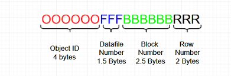
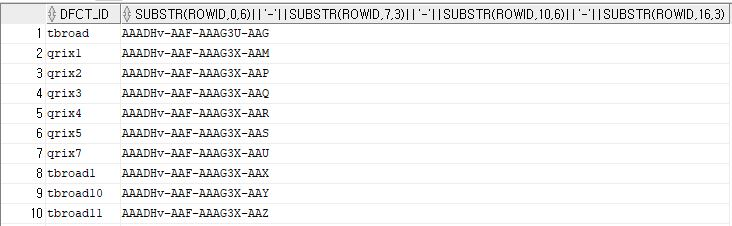
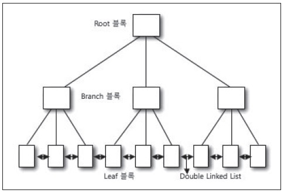
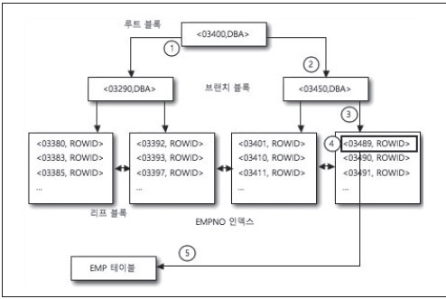
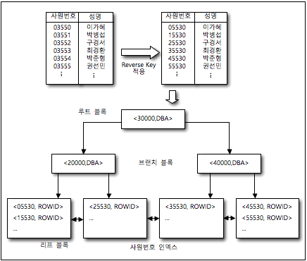
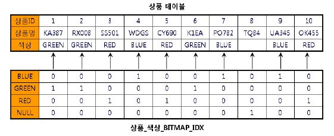
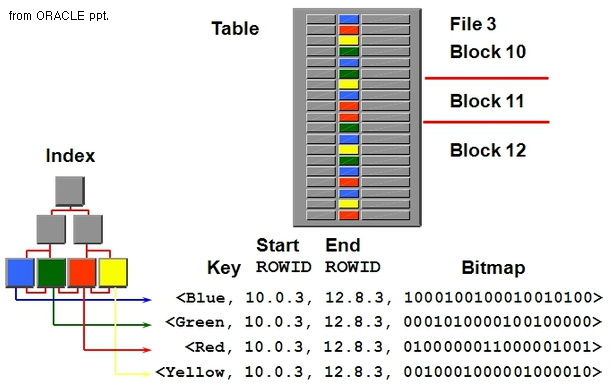
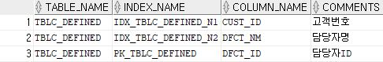
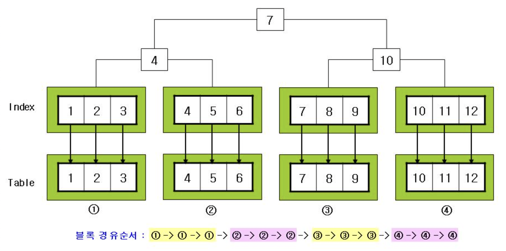
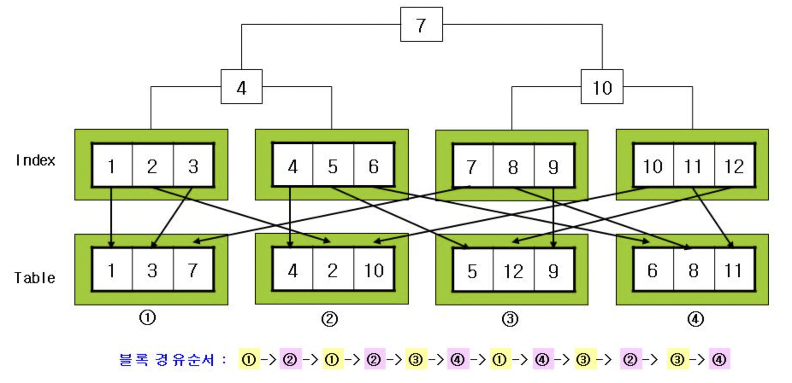

# 클러스터링 팩터, 인덱스의 구조 및 원리

## 1. 인덱스의 목적과 구성
인덱스는 데이터베이스 **테이블에 있는 데이터를 빨리 찾기 위한 용도의 데이터베이스 객체**이며 일종의 색인기술<br>
책의 색인의 경우, 내용(키워드) - 페이지로 되어있듯이, 데이터 베이스의 인덱스는 Key(인덱스로 만들 테이블의 컬럼 값) - RowID로 구성<br>

RowID



- 오브젝트 고유번호 + 데이터파일에 할당되는 번호+블록 위치 번호+블록 내의 행 번호

### TsisBill RowID

```sql
SELECT 
  DFCT_ID,
  substr(ROWID,0,6)||'-'||substr(ROWID,7,3)||'-'||substr(ROWID,10,6)||'-'||substr(ROWID,16,3) 
FROM TBLC_DEFINED 
WHERE CUST_ID='43'
```



AAADHv는 전부 같음 -> 같은 테이블의 경우 같은 오브젝트 번호를 가짐<br>
AAF는 전부 같음 -> 테이블스페이스 상대 파일 번호, 익스텐트(EXTENT)가 다른 데이터 파일에 할당될 수 있지만 조회 결과에서는 전부 같음<br>
1번 ROW AAAG3U, 나머지 AAAG3X -> 1번 행만 다른 블럭에 저장되어있음<br>
3~6번 데이터번호로 추정하건데 순서대로 데이터가 들어감<br>

만약 인덱스가 구조없이 저장된다면 테이블에서 데이터를 직접 읽는 것과 효율이 크게 다르지 않음<br>
따라서, 자료구조를 통해 인덱스를 구조화 하는 방법이 필요<br>

## 2. 인덱스 구조와 원리(탐색방법)
### B*TREE 인덱스 구조



- 루트 블록(ROOT BLOCK)
  - 루트 블록은 인덱스의 다음 단계의 브랜치 블록을 가리키는 항목들을 포함하고 있다.  
- 브랜치 블록(BRANCH BLOCK)
  - 브랜치 블록은 < Separator Key, DBA>로 구성돼 있으며, 브랜치 블록 밑의 리프 블록을 가리킨다.  
- 리프 블록(LEAF BLOCK)
  - 리프 블록은 실제 < 인덱스 Key 값, ROWID>로 구성된다. 이는 해당 데이터를 액세스하는 Key가 된다.  
- 더블 링크드 리스트(Double Linked List)
  - 리프 블록간의 양 방향 통신을 의미한다. 더블 링크드 리스트는 리프 블록의 한 인덱스 값에서 범위(RANGE) 스캔을 빠르게 할 수 있게 해준다. 이 부분은 B*TREE 인덱스의 액세스에서 자세히 살펴본다.  

### B*TREE 인덱스 원리 (탐색 방법)

```sql
SELECT ENAME, ADDRESS
FROM EMP
WHERE EMPNO = ‘03489’;
-- WHERE EMPNO BEWTEEN ‘03411’ AND ‘03492’;
```



1. EMPNO 인덱스의 루트 블록을 확인 루트 블록의 Separator Key를 확인해 EMPNO의 값이 03400을 기준으로 더 큰 값이면 우측으로, 더 작은 값이면 좌측으로 분기
2. 루트 블록의 Separator Key를 통해 03489는 03400보다 크기 때문에 우측 브랜치 블록으로 이동
3. 브랜치 블록을 스캔해 브랜치 블록 Separator Key를 확인한 결과, <03450,DBA>, 그렇기 때문에 03450보다 값이 크면 좌측으로, 작으면 우측으로 이동(03489는 03450보다 크므로 우측 아래로 이동)
4. 브랜치 블록에서 리프 블록으로 이동하게 되면 해당 블록을 스캔해 <03489,ROWID>라는 인덱스 값을 확인
5. 해당 인덱스 값의 ROWID를 통해 실제 테이블을 액세스

-> 날짜, 사번과 같이 순차적으로 증가하는 데이터를 B*TREE로 인덱싱하는 경우, 오른쪽 노드에서만 삽입이 발생하게됨

### REVERSE KEY 인덱스 구조

먼저 기존 테이블에 대한 인덱스 키 컬럼의 값을 반대로 변경해 B*TREE 인덱스를 생성<br>
해당 데이터는 리버스 키 인덱스에서 인덱스 키 컬럼의 값이 변경되어 인덱스에 저장<br>



-> B-TREE, Reverse Key 인덱스에서는 실제 컬럼 값을 인덱스에도 보관하고 있어야 하며, 성별, 확인여부 등 값의 분포가 적은 경우 비효율적

### 비트맵(Bitmap) 인덱스 구조

B-tree index와 마찬가지로 root, branch, leaf 로 구성되어 있지만 leaf 가 bitmap으로 구성되어 있음<br>
분포가 적은 색상 컬럼을 기준으로 비트맵 작성, 즉 1개의 index값이 테이블상의 여러 개의 record를 표현<br>





leaf노드 도달시, 비트맵에서 데이터가 1인 row의 RowID만을 획득<br>
해당 인덱스에 End RowID와 비트맵을 수정, 비트맵의 마지막에 추가됨<br>

## 3. 인덱스의 생성

### B*Tree, Reverse Key 인덱스

```sql
CREATE[UNIQUE] INDEX scott.emp_ename_idx
     ON scott.emp(ename);
    -- REVERSE;
```

UNIQUE 키워드 추가시 컬럼 중복값 헝용하지 않음<br>
Reverse 리버스 키 인덱스 생성<br>

### 비트맵(Bitmap) 인덱스

```sql
CREATE BITMAP INDEX DEPT_IDX 
    ON DEPT(DNAME);
```

### 티시스빌 인덱스 확인

```sql
SELECT A.TABLE_NAME
     , A.INDEX_NAME
     , A.COLUMN_NAME
     , B.COMMENTS
  FROM ALL_IND_COLUMNS  A -- 현재 사용자가 엑세스할 수 있는 테이블에 대한 인덱스 정의
     , ALL_COL_COMMENTS B -- 현재 사용자가 엑세스할 수 있는 테이블 컬럼에 대한 인덱스 정의
 WHERE A.TABLE_NAME  = 'TBLC_DEFINED'
   AND A.TABLE_OWNER = B.OWNER
   AND A.TABLE_NAME  = B.TABLE_NAME
   AND A.COLUMN_NAME = B.COLUMN_NAME
 ORDER BY A.INDEX_NAME, A.COLUMN_POSITION;
```



## 4. 클러스터링 펙터
클러스터링 팩터(Clustering Factor)**는 Index를 Scan하는 동안 방문(access)하게 되는 Table의 Data Block의 개수**, B-Tree 인덱스를 사용한 Range Scan 비용 계산식의 중요한 요소<br>
클러스터링 팩터는 데이터가 테이블 전체에 무작위로 분산된 정도를 나타내는 하나의 숫자(테이블 내 데이터의 흩어짐의 정도)<br>
과거에 읽언던 Block인지의 여부는 중요하지 않고, 바로 직전에 읽었던 Block인지가 중요한 요소<br>
Clustering Factor값이 클수록 성능에 악영향<br>

### Good Clustering Factor



- Clustering Factor의 최소값은 Table의 Data Block의 수


### Bad Clustering Factor



- Clustering Factor의 최대값은 Table의 Row의 수

## Reference
- RowID
  - https://tksmart.dooray.com/popup/project/posts/2804994201263135974
- B*Tree 인덱스
  - http://www.gurubee.net/lecture/2935
  - https://www.kdata.or.kr/info/info_04_view.html?field=&keyword=&type=techreport&page=9&dbnum=186939&mode=detail&type=techreport
- Reverse Key 인덱스
  - http://www.gurubee.net/lecture/2959
- Bitmap 인덱스
  - http://wiki.gurubee.net/pages/viewpage.action?pageId=1507452
  - https://blog.naver.com/salinokl/220797257199
  - https://hayleyfish.tistory.com/77
- 클러스터링 펙터
  - http://wiki.gurubee.net/pages/viewpage.action?pageId=3080204
  - http://wiki.gurubee.net/display/CORE/Clustering+Factor
