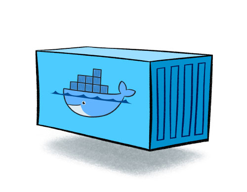
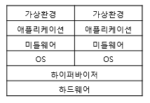
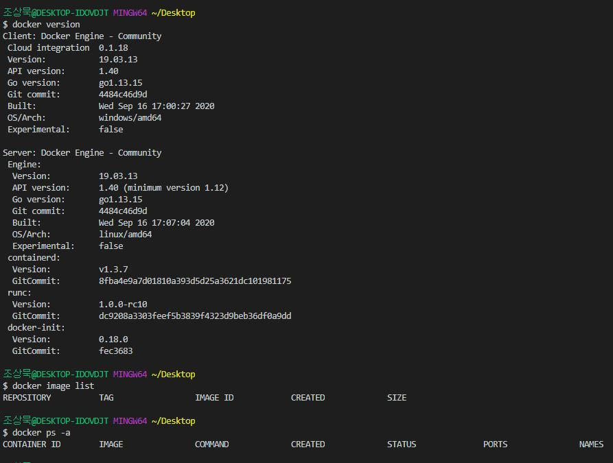
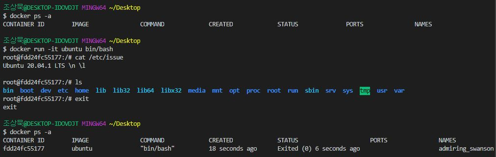
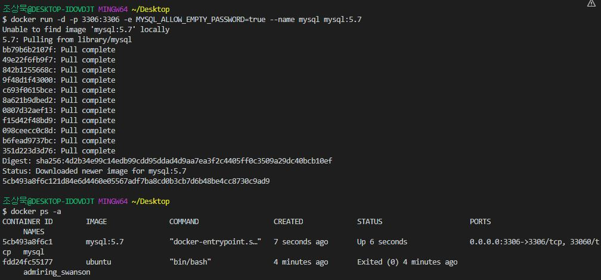

# Docker

## Docker란?
도커는 **컨테이너 기반의 오픈소스 가상화 플랫폼**입니다.  
 

**컨테이너(Container)**  
리눅스 컨테이너는 단일 리눅스 호스트에 격리된 리눅스 시스템을 여러개 실행하는 운영체제(OS) 수준의 가상화 기술로,  
다양한 프로그램, 실행 **환경을 컨테이너로 추상화**하고 동일한 인터페이스를 제공하여 프로그램의 **배포 및 관리를 단순**하게 해줍니다.   
백엔드 프로그램, 데이터베이스 서버, 메시지 큐등 어떤 프로그램도 컨테이너로 추상화할 수 있고 조립PC, AWS 등 어디에서든 실행할 수 있습니다.  

control groups과 namespace를 이용한 LXC가 있었고 FreeBSD에선 Jail, Solaris의 Solaris Zones, Google의 lmctfy(Let Me Contain That For You)라는 컨테이너 기술이 존재하지만 성공하진 못했습니다.  
그러다 2013년 3월 산타클라라에서 열린 Pycon Conference(파이콘)에서 dotCloud의 창업자인 **Solomon Hykes(솔로몬 하이크스)**가 **The future of Linux Containers** 라는 세션을 발표하면서 세상에 알려졌습니다.  
기존의 기술과는 다르게 **사용자들이 원하는 기능을 간단하지만 획기적인 아이디어로 구현**하여 인기를 얻으면서 2013년 10월 아예 회사이름을 도커(Docker Inc.)로 바꾸고 2014년 6월 도커 1.0을 발표한 후 계속해서 빠르게 성장하고 있습니다.  

## 가상화 개념
**호스트 가상화**  
  
호스트가상화는 Base가 되는 Host OS위에 Guest OS가 구동되는 방식으로, 가상의 하드웨어를 에뮬레이팅하기 때문에 호스트 운영체제에 크게 제약사항이 없이 구동 가능하지만,  
OS위에 OS가 얹히는 방식이기 때문에 오버헤드가 크고 느리기 때문에 운영환경에서 사용하기 부적합합니다.  

**하이퍼바이저 가상화**  
  
하이퍼가상화는 Host OS없이 하드웨어에 하이퍼바이저를 설치하여 사용하는 방식입니다. 전가상화와 반가상화 방식이 존재하며, 차이는 OS - 하이퍼바이저 - 하드웨어간 명령 방식으로 볼 수 있습니다.  
별도의 Host OS가 없기 때문에 오버헤드가 적고, 하드웨어를 직접 제어하기 때문에 효율적으로 리소스를 사용할 수 있지만, 자체적으로 머신에 대한 관리 기능이 없기 때문에 관리를 위한 컴퓨터나 콘솔이 필요합니다.  

**컨테이너 가상화**  
  
호스트 OS위에 컨테이너관리 소프트웨어를 설치하여, 논리적으로 컨테이너를 나누어 사용합니다.  
컨테이너는 어플리케이션 동작을 위한 라이브러리와 어플리케이션등으로 구성되기때문에 이를 각각 개별 서버처럼 사용가능합니다.  

## 이미지(Image)
이미지는 **컨테이너 실행에 필요한 파일과 설정 값등을 포함하고 있는 것**으로 상태값을 가지지 않고 변하지 않으며(Immutable), **의존성 파일을 컴파일하고 이것저것 설치할 필요가 없습니다.**  
**이미지를 실행한 상태가 컨테이너라고 볼 수 있고 추가되거나 변경 혹은 추가되는 값은 컨테이너에 저장**됩니다.  
같은 이미지에서 여러개의 컨테이너를 생성할 수 있고 컨테이너의 상태가 바뀌거나 컨테이너가 삭제되더라도 이미지는 변하지 않고 그대로 남아있습니다.  

ubuntu이미지는 ubuntu를 실행하기 위한 모든 파일을 가지고 있고 MySQL이미지는 debian을 기반으로 MySQL을 실행하는데 필요한 파일과 실행 명령어, 포트 정보등을 가지고 있습니다.  
좀 더 복잡한 예로 Gitlab 이미지는 centos를 기반으로 ruby, go, database, redis, gitlab source, nginx등을 가지고 있습니다.  
도커 이미지는 Docker hub에 등록하거나 Docker Registry 저장소를 직접 만들어 관리할 수 있으며, 누구나 쉽게 이미지를 만들고 배포할 수 있습니다.  

## Dockerfile
도커는 이미지를 만들기 위해 Dockerfile이라는 파일에 자체 DSL(Domain-specific language)언어를 이용하여 이미지 생성 과정을 적습니다.  
이를 통해 서버에 어떤 프로그램을 설치하려고 이것저것 의존성 패키지를 설치하고 설정파일을 만들 필요없이 Dockerfile로 관리할 수 있습니다.  
```dsl
# vertx/vertx3 debian version
FROM subicura/vertx3:3.3.1
MAINTAINER chungsub.kim@purpleworks.co.kr

ADD build/distributions/app-3.3.1.tar /
ADD config.template.json /app-3.3.1/bin/config.json
ADD docker/script/start.sh /usr/local/bin/
RUN ln -s /usr/local/bin/start.sh /start.sh

EXPOSE 8080
EXPOSE 7000

CMD ["start.sh"]
```

## 자주 사용하는 명령어
```sh
# 도커 버젼 확인 및 실행 확인
docker version

# 이미지 리스트
docker image list

# 컨테이너 리스트
docker container list

# 컨테이너 진행 상황
## 컨테이너는 종료되어도 삭제되지 않고 남아있음
## 종료된 건 다시 시작할 수 있고 컨테이너의 읽기/쓰기 레이어는 그대로 존재
docker ps -a

# 컨테이너 생성
## -d  detached mode 흔히 말하는 백그라운드 모드
## -p  호스트와 컨테이너의 포트를 연결 (포워딩)
## -v  호스트와 컨테이너의 디렉토리를 연결 (마운트)
## -e  컨테이너 내에서 사용할 환경변수 설정
## –name   컨테이너 이름 설정
## –rm 프로세스 종료시 컨테이너 자동 제거
## -it -i와 -t를 동시에 사용한 것으로 터미널 입력을 위한 옵션
docker run [OPTIONS] IMAGE[:TAG|@DIGEST] [COMMAND] [ARG...]

# 컨테이너 중지
docker stop awesome_mcclintock

# 컨테이너 시작
docker start awesome_mcclintock

# 컨테이너 명령어 실행하기
docker exec [OPTIONS] CONTAINER COMMAND [ARG...]
docker exec -it optimistic_poitras /bin/bash

# 컨테이너 삭제
docker rm -v $(docker ps -a -q -f status=exited)

# 이미지 생성
docker commit -m "java, node install" awesome_mcclintock basic:0.1
```

## 연습
1. 도커 실행 확인 및 버젼 확인, 이미지/컨테이너 목록 확인  
  

- 도커는 서버와 클라이언트를 구분하여 실행됨  

2. 우분투 실행  
  

- 저장된 이미지가 없었기 때문에 공식 이미지를 다운로드(Pull)받음, 실행 후 별도의 명령을 입력하지 않았기 때문에 바로 종료  

3. 우분투 입력모드 실행  
  

- 실행 중인 컨테이너 없음  
  - -it 터미널 입력을 위한 옵션, bin/bash 실행  
  - 실제 우분투 처럼 사용 및 종료  
  - 컨테이너 목록 확인 시 종료된 컨테이너 1개 확인  

4. Mysql 실행  
 

- -d 백그라운드 모드, -p 포트 연결, -e 실행 옵션, --name 컨테이너 이름  
  - 실행 컨테이너 목록에 Up으로 표현됨  

5. 실행중인 Mysql 접근  
 

- 컨테이너 명령어 실행하기 (exec)

## MySQL 설치 및 테스트
```sh
docker run -d -p 3306:3306 -e MYSQL_ALLOW_EMPTY_PASSWORD=true --name mysql mysql:5.7
docker exec -it mysql /bin/bash

mysql -h127.0.0.1 -uroot # or $ mysql -uroot
mysql> show databases;
```

## Redis 설치 및 테스트
```sh
docker run --name redis_t0.1 -d -p 6379:6379 redis
docker run -d -p 1234:6379 redis
telnet localhost 1234

set mykey hello
get mykey
```

## Reference
- 공식 문서 : https://docs.docker.com/
- Docker에 MySQL 설치 : https://blusky10.tistory.com/362
- Docker란? : https://subicura.com/2017/01/19/docker-guide-for-beginners-1.html
- Docker 설치하고 컨테이너 실행 : https://subicura.com/2017/01/19/docker-guide-for-beginners-2.html
- 이미지 만들고 배포하기 : https://subicura.com/2017/02/10/docker-guide-for-beginners-create-image-and-deploy.html
- Youtube 얄팍한 코딩 사전, 도커 개념: https://www.youtube.com/watch?v=tPjpcsgxgWc