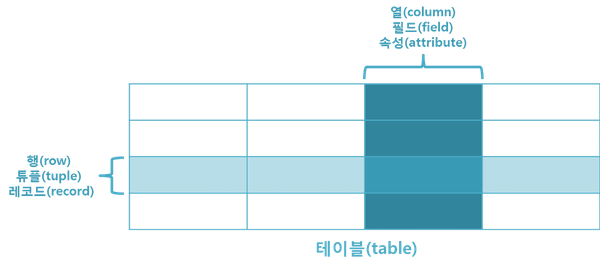
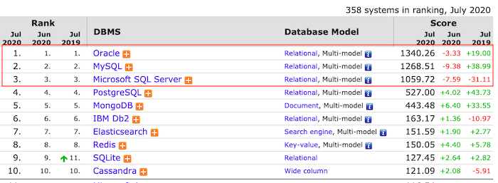
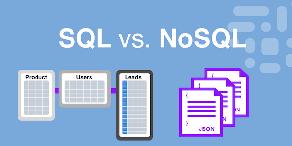
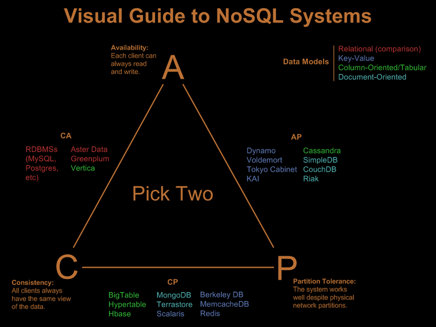
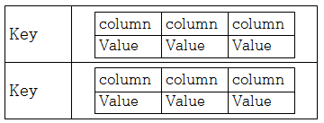

# NoSQL

## No..?SQL...?
1998년 카를로 스트로찌(Carlo Strozzi)라는 엔지니어가 공개한 표준 SQL 인터페이스를 채용하지 않은  
경량 Open Source 관계형 데이터베이스를 NoSQL이라고 명명한데서 유래  

> **SQL**(Structured Query Language, 구조화 질의어)는 IBM 산호세 연구소의 에드거 F.커드가 도입한 **관계형 모델**을 기반으로 하는 관계형 데이터베이스 관리 시스템(RDBMS)의 데이터를 관리하기 위해 설계된 특수 목적의 프로그래밍 언어이다. 현재 사용되는 대부분의 데이터베이스는 관계형 데이터베이스 모델을 기반으로 한다. 

모든 데이터를 2차원의 테이블 형태로 표현하고, 데이타 간의 상관관계에서 개체간의 관계를 표현하는데 초점  

  

DB-Engines Ranking - Trend Popularity  
  

## NoSQL, 왜 필요할까?
  

2000년대에 들어서면서 인터넷 서비스(SNS)등이 보편적으로 사용 되면서 특정 고객 혹은 기업이 아닌 전 세계의 불특정 다수의 사람들을 대상으로 하는 형태의 서비스가 발전  
이는 기존의 기업 시스템에서 볼 수 없었던 대규모 데이터를 생산되며, 기존 기업 데이터에 비해 매우 단순한 형태  

기존의 **RDBMS의 경우, 많은 데이터량과 데이터 처리량이 계속적으로 증가**한다면 
- 스키마 문제 : 단순한 빅데이터를 RDB의 스키마에 맞춰 변경해서 넣으려면 매우 긴 시간의 down time이 발생
- 스케일업의 한계 : 관계 모델과 트랜잭션의 연산, 일관성, 속성을 유지하면서 분산환경(스케일아웃)에서 RDBMS를 조작하는 것은 어려움

이러한 어려움에서 관계형 데이터베이스가 아닌 다른 형태의 데이터 저장 기술을 필요로 함  
구글과 아마존에 의해 빅테이블(Bigtable)과 Dynamo라는 논문을 시작으로 기존의 RDBMS를 보완할 NoSQL이 본격적으로 등장하는 계기  

## NoSQL의 특징
기본 RDBMS의 한계를 극복하기 위해 만들어진 새로운 형태의 데이터베이스  

- NoSQL은 RDBMS와는 달리 데이터 간의 관계를 정의하지 않음  

가장 큰 특징 중의 하나는 관계형 데이터베이스인 RDBMS가 데이터의 관계를 Foreign Key 등으로 정의하고  
이를 이용해 Join 등의 관계형 연산을 한다고 하면, NoSQL은 데이터 간의 관계를 정의하지 않는다.  
-> 대부분의 NoSQL은 Key/Value 형태의 Map 구조로 이루어 지며, Key와 Value의 값의 형태에 따라 NoSQL을 구분  

- RDBMS에 비해 훨씬 더 대용량의 데이터를 저장 가능  

RDBMS의 복잡도와 용량 한계를 극복하기 위한 목적으로 등장한 만큼, 페타바이트급의 대용량 데이터를 저장할 수 있다.  

- 분산형 구조(CAP 이론)  

분산형 구조를 통해 데이터를 여러 대의 서버에 분산해 저장하고,  
분산 시에 데이터를 상호 복제해 특정 서버에 장애가 발생했을 때에도 데이터 유실이나 서비스 중지가 없는 형태의 구조다.  

  

- Consistency : **일관성**을 뜻합니다. 모든 클라이언트들은 항상 같은 데이터를 볼 수 있어야 합니다. 한 데이터를 동시에 두 클라이언트가 바라봤을 때 그 데이터가 항상 같아야만 만족합니다
- Availability : **가용성**을 뜻합니다. 각 클라이언트는 항상 데이터를 읽고 쓸 수 있어야만 합니다. 어떤 상황이던 간에 (장애가 발생해도) 정상적으로 데이터를 읽고 쓸 수 있어야 만족합니다.
- Partition Tolerance : **파티션 허용, 분산화 가능**을 뜻합니다. 물리적인 네트워크 분산 환경에서도 시스템이 잘 작동해야 만족합니다.

## NoSQL의 분류
1. Key/Value Database : Redis(인메모리), Oracle Coherence 등  
  

- 흔히 알고있는 Map의 구조로, 유일성을 가지는 Key 값을 통해 데이터를 구분  
- 메모리를 저장소로 쓰는 경우, 아주 빠른 get과 put을 지원  
- Value는 문자열이나 정수와 같은 원시 타입이 가능  
- Value에는 key/Value이 들어갈 수도 있는데 이를  Column Family이라고 하며, Key 안에 (Column, Value) 조합으로 된 여러 개의 필드를 갖는 것을 의미  

2. Big Table Database (= Ordered Key/Value) : Hbase, Cassandra 등  
- Key/Value Store와 데이터 저장 방식은 동일  
- 보통 NoSQL은 RDBMS의 order by같은 정렬기능을 제공해주지 않지만, 이 모델은 내부적으로 Key를 정렬  
- 키를 정렬함으로써, 값을 날짜나 선착순으로 정렬해서 보여줄 때 매우 유용하다.  

3. Document Database : MongoDB, CouchDB, Riak  
Key/Value Store의 확장된 형태로, value에 Document라는 타입을 저장  
Document는 구조화된 문서 데이터(XML, JSON, YAML 등)을 의미  
복잡한 데이터 구조를 표현가능  
쿼리 처리에 있어서 데이터를 파싱해서 연산을 해야하므로 overhead가 key-value 모델보다 크며 큰 크기의 document를 다룰 때는 성능이 저하  

## 장점과 단점
**NoSQL의 장점**
- 데이터 분산에 용이
- 복제 및 장애대응(Recovery)에 용이
- 데이터를 고속으로 처리할 필요가 있는 경우
- 로그 등 계속 적재되야하고 대량의 데이터를 저장하고 싶은 경우 용이
- 유연한 데이터 모델 변경
- 스케일 아웃 가능

**NoSQL의 단점**
- 각 솔루션의 특징을 이해할 필요가 있음. 학습곡선이 높다
- 새로운 기술로 분류되기 때문에 운영에 대한 노하우가 부족
- RDBMS와 비교하여 아직 버그가 상대적으로 많은 상태
- 데이터 변경시, 똑같이 업데이트

**언제 쓰는게 좋을까?**
- 정확한 데이터 구조를 알 수 없거나 변경 / 확장 될 수 있는 경우
- 읽기 처리를 자주하지만 데이터를 자주 변경하지 않는 경우 (즉, 한번의 변경으로 많은 문서를 업뎃할 필요가 없는 경우)
- db를 수평적 확장 해야하는 경우(데이터의 양이 엄청나게 많은 경우)

## 현황 & 적용 사례
**2020년 4월 28일 작성된 Gartner 의 Market Share: Database Management Systems, Worldwide, 2019**
>The DBMS market saw strong growth of 18.2% in 2019, primarily driven by cloud dbPaaS growth. The nonrelational DBMS segment continued its strong above-market-rate growth at 51.7%, while RDBMS grew a healthy 15.2%. Prerelational-era DBMS continued its decline.

**Daum**
- Daum 클라우드 Tenth
  - 2004년 11월 부터 Daum 자체 개발 분산 파일 시스템
- Daum Cafe
  - ‘최근 방문 카페’ 기능에 Cassandra 적용
- Daum view 추천 플랫폼 (예정)
  - 사용자의 추천을 모두 수집한다.
  - 소셜 네트워크를 저장한다.
  - 추천 정보를 추천 히스토리와 소셜 네트워크 기반으로 Map/Reduce 분석
  - 신뢰도 높은 추천 기반으로 문서 랭킹 부여

## 연습
```sh
## Docker container 생성(서버)
docker run --name mongo-container -p 27017:27017 mongo

## Docker container 실행(쉘)
docker exec -it mongo-container /bin/bash

## mongoDB 접근
mongo admin

## 현재 사용중인 데이터베이스 확인
db

## 데이터베이스 리스트 확인
show dbs

## 데이터베이스 상태확인
db.stats()

## Database - Collection의 물리적 컨테이너
use test : test 데이터베이스 생성

## Collection - RDBMS에서의 table, Collection 생성
db.createCollection("book",{capped:true, size:6142800, max:10000})

## Key/Field - 일반 Rdbms에서 Column, 데이터 입력
db.book.insert({"name":"abc"});
db.book.insert({"name":"A","hits":100,"auther":[{"name":"park"},{"name":"lee"}]});
db.book.insert({"name":"B","hits":50,"auther":[{"name":"kim"}]});
db.book.insert({"name":"C","hits":30,"auther":[{"name":"kim"},{"name":"choi"}]});
db.book.insert([ {"language": "java", "level": 5}, {"language": "ruby", "framework": "rails"} ]);

## 데이터 확인
db.book.find()
db.book.find().pretty()

## 데이터 조건 검색
db.book.find( {"level":{$gt: 3,$lt: 10}} )
db.book.find( {"hits":{$gt: 40, $lt: 90}} )
db.book.find( {"name": "A"} )
db.book.find( {"auther":{"name":"kim"}} )
```

## Reference
