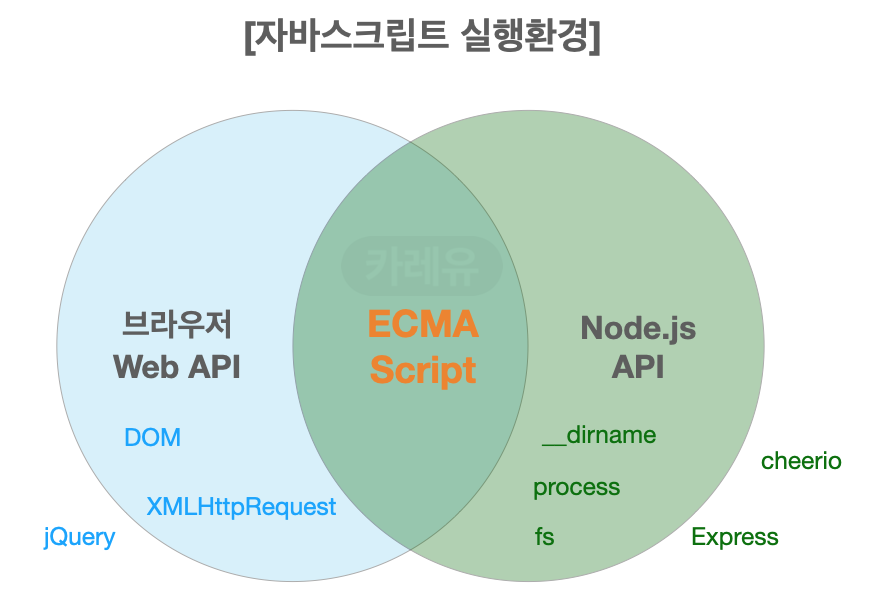
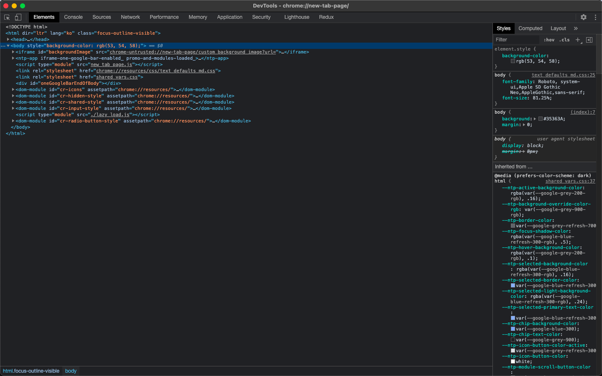
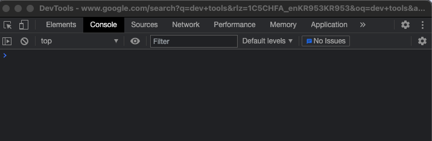
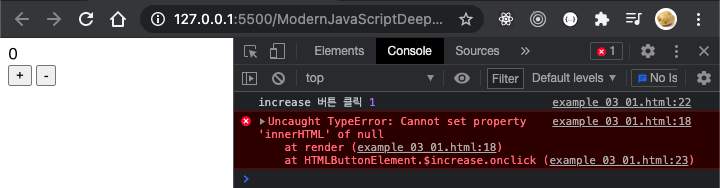
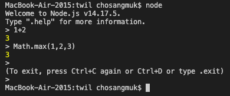
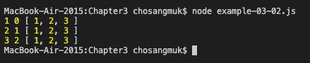
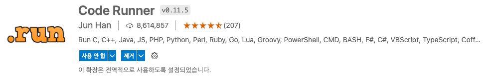
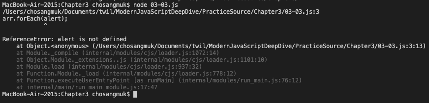
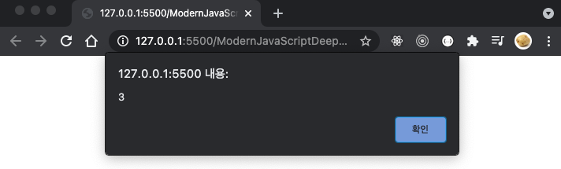

# 03장: 자바스크립트 개발 환경과 실행 방법

## 3.1 자바스크립트 실행 환경
기본적으로 **브라우저와 Node.js 모두 자바스크립트 코어인 ECMAScript를 실행**할 수 있다. 다만 주의해야할 것은 **브라우저와 Node.js에서 사용되는 자바스크립트의 용도가 다르다**는 것이다.<br>
브라우저는 웹 페이지를 브라우저의 화면에 랜더링하는 것이 목적임으로 클라이언트 Web API를 지원하지만, Node.js는 브라우저 외부에서 자바스크립트 실행 환경을 제공하는 것이 목적임으로 Web API대신 Node.js 고유의 API를 지원한다.

<br> - 이미지 출처 : https://curryyou.tistory.com/200

<br>

## 3.2 웹 브라우저
구글의 크롬(Chrome, 초로미)는 ECMAScript 사양을 준수하는 것은 물론이고 시장 점유율도 높다. 또한 크롬의 V8 자바스크립트 엔진을 Node.js에서도 사용함으로 개발 브라우저로 크롬을 사용하는 것이 유리하다.
- [Chrome 다운로드 링크](https://www.google.co.kr/intl/ko/chrome/)

<br>

### 3.2.1 개발자 도구
Chrome이 제공하는 개발자 도구는 **웹 애플리케이션 개발에 필수적인 도구**로, 기본적으로 내장되어있어 별도의 설치가 필요없다. 

- macOS인 경우 _F12, Command + Option + I_ 로 실행 가능하다.
- 윈도우 OS인 경우 _F12, Ctrl + Shift + I_ 로 실행 가능하다.

<br> - Chrome 개발자 도구 실행 화면

- **개발자 도구의 주요 기능**

|패널|설명|
|-----|----------|
|Elements|로딩된 웹 페이지의 DOM과 CSS를 편집해서 렌더링된 뷰를 확인해 볼 수 있다.<br>편집 내용이 저장되지는 않으며, 웹페이지가 의도대로 랜더링되지 않았다면 이 패널에서 유용한 정보를 얻을 수 있다.|
|Console|로딩된 웹 페이지의 에러를 확인하거나 console.log 메서드의 실행 결과를 확인할 수 있다. |
|Sources|로딩된 웹 페이지의 자바스크립트 코드를 디버깅할 수 있다.|
|Network|로딩된 웹 페이지에 관련된 네트워크 요청 정보와 성능을 확인할 수 있다.|
|Application|웹 스토리지, 세션, 쿠키를 확인하고 관리할 수 있다.|

<br>

### 3.2.2 콘솔
콘솔은 자바스크립트 코드를 직접 입력, 실행하여 결과를 확인할 수 있는 REPL(Read Eval Print Loop : 입력 수행 출력 반복)환경을 지원하며, 각종 오류 정보를 확인할 수 있다.

<br>

<br>

### 3.2.3 브라우저에서 자바스크립트 실행
브라우저는 HTML파일을 로드하면 script 태그에 포함된 자바스크립트 코드를 실행한다.<br>
[예제 03-01](../PracticeSource/Chapter3/03-01.html)를 브라우저에서 실행하면 다음과 같은 화면을 확인할 수 있으며, 개발자 도구를 이용하여 +, - 버튼 클릭 시 발생하는 오류를 확인할 수 있다. 

<br>

<br>

### 3.2.4 디버깅
개발자 도구 콘솔에서 오류 내용의 오른쪽에 링크를 클릭하면 자바스크립트 코드를 디버깅할 수 있는 Source 패널로 이동하여 오류의 원인을 확인할 수 있다.<br>
직접 오류의 원인을 학인하고 수정하여 정상적으로 작동하는 웹페이지를 만들어 보는 것을 추천한다. 이처럼 디버깅은 오류 메세지를 확인하고 에러가 발생한 원인을 제거하는 일련의 과정이다. 더 자세한 내용은 하단의 참고에서 확인할 수 있습니다.

<br>

## 3.3 Node.js
브라우저에서 동작하는 간단한 웹 어플리케이션은 브라우저만으로 개발할 수 있다. 하지만 프로젝트의 규모가 커짐에 따라 React, Angular, Lodash 같은 프레임워크 또는 라이브러리를 도입하거나 Babel, Webpack, ESLint 등 여러가지 도구가 필요함으로 Node.js와 npm을 설치 해야한다.

<br>

### 3.3.1 Node.js와 npm 소개
2009년, 라이언 달(Ryan Dahl)이 발표한 Node.js는 구글의 V8 자바스크립트 엔진을 이용하여 브라우저 이외의 환경에서도 동작할 수 있도록 독립시킨 **자바스크립트 실행(런타임)환경**이다.<br>
npm(Node Package Manager)는 Node.js에서 사용할 수 있는 모듈들을 패키지화해서 모아둔 저장소 역할과 패키지 설치 및 관리를 위한 CLI를 제공한다.

<br>

### 3.3.2 Node.js 설치
Node.js 웹 사이트에 접속하면 LTS, Current 버전이 존재한다. LTS 버전은 장기적으로 안정적인 지원이 보장되며, Current 버전은 최신기능을 제공하지만 덜 안정적이다. 상황에 맞게 버전을 설치하면 npm도 함께 설치된다.
- [Node.js 다운로드 링크](https://nodejs.org/ko/)
- macOS인 경우 _/usr/local/bin/node_ 에 설치된다.
- 윈도우 OS인 경우 _C:\Program Files\nodejs\node.exe_ 에 설치된다.
- 버전에 따라 설치 위치가 변경될 수 있다.
```sh
# Shell
$ node -v # Node.js 버전 확인
v14.17.5
$ npm -v # npm 버전 확인
6.14.14
```

<br>

### 3.3.3 Node.js REPL
node.js가 제공하는 REPL(Read Eval Print Loop : 입력 수행 출력 반복)을 사용하면 간단한 자바스크립트 코드를 실행해 결과를 확인할 수 있다.
자바스크립트 파일을 실행하려면 node 명령어 뒤에 피일 이름을 입력하여 실행하며, .js는 생략 가능하다. _CTRL + C_를 두 번 입력하면 Node.js REPL이 종료된다.

<br>

<br>

## 3.4 비주얼 스튜디오 코드
### 3.4.1 비주얼 스튜디오 코드 설치
Visual Studio Code는 Microsoft에서 제공하는 무료 코드 에디터(Microsoft의 선물)이며, 개발의 편의를 돕는 다양한 확장 플러그인을 제공한다.
- [VS Code 다운로드 링크](https://code.visualstudio.com/)

<br>

### 3.4.2 내장 터미널
VSCode는 기본적으로 터미널(윈도우의 경우 명령 프로프트)이 내장되어 있어 실행 결과를 확인하거나 파일 시스템에 접근이 가능하다. [예제 03-02](../PracticeSource/Chapter3/03-02.js)를 작성한 후, 터미널에서 Node.js 명령어로 자바스크립트 파일을 실행시킬 수 있다.

- macOS인 경우 _Command + J_ 로 터미널을 끄고 킬 수 있다.
- 윈도우 OS인 경우 _Ctrl + `_ 로 터미널을 끄고 킬 수 있다.
<br>

<br>

### 3.4.3 Code Runner 확장 플러그인
VSCode의 내장 터미널에서 단축키를 사용해 자바스크립트를 비롯한 다양한 프로그래밍 언어로 구현된 소스코드를 간단히 실행할 수 있는데, 이때 사용될 확장 플러그인이 Code Runner이다. 단 Code Runner는 Node.js 환경을 사용해서 자바스크립트를 실행함으로 Web API에 대한 테스트는 브라우저를 통해 진행해야한다.

- macOS인 경우 _Control + Option + N_ 로 현재 표시 중인 자바스크립트 파일을 실행할 수 있다.
- 윈도우 OS인 경우 _Ctrl + Alt + N_ 로 현재 표시 중인 자바스크립트 파일을 실행할 수 있다.
<br>

<br>

[예제 03-03](../PracticeSource/Chapter3/03-03.js)을 작성한 뒤 실행하면 ReferenceError: alert is not defined 오류가 발생한다. 
소스코드 중 alert 메소드는 클라이언트 Web API, 브라우저에서만 동작하는 함수이기 때문에 발생하는 오류이다.
<br>

<br>

### 3.4.4 Live Server 확장 플러그인
Web API가 포함된 자바스크립트를 실행하려면 크롬 개발자 도구의 콘솔에서 실행하거나 자바스크립트 코드를 HTML에 삽입해서 HTML 파일을 브라우저에서 실행해야한다. 
브라우저에서 직접 파일을 열어도 좋지만 파일 경로 문제가 발생할 수도 있고, 소스를 수정할 때마다 매번 새로고침해야 함으로 번거롭다. 
이때 Live Server라는 확장 플러그인을 이용하면 소스가 변경되어 저장될 때마다 브라우저에 반영해줌으로 개발을 좀 더 빠르고 편리하게 개발할 수 있다.

- macOS인 경우 _Command + L, Command + O_ 로 현재 표시 중인 HTML 파일을 가상 서버로 실행할 수 있다.
<br>

<br>

아래 화면 캡쳐는 [예제 03-04](../PracticeSource/Chapter3/03-04.html)을 Live Server을 통해 실행한 결과입니다.
<br>

<br>

## Summary
- 브라우저와 Node.js에서 작동하는 자바스크립트는 환경에 따라 서로 다른 API를 지원하지만 동작 방식은 동일하며, 기본적으로 ECMAScript를 따른다.
- 브라우저의 개발자도구를 이용하여 웹 개발에 필요한 기본적인 정보를 얻을 수 있다. 
- Node.js 실행환경 구성을 위해 설치가 필요하며, Visual Studio Code와 확장 플러그인(Live Server, Code Runner)을 통해 편리하게 개발을 진행할 수 있다.

<br>

## Reference
- [모던 자바스크립트 Deep Dive 공식 예제코드 저장소](https://github.com/wikibook/mjs) 
- [Tools for Web Developers: 콘솔 사용](https://developer.chrome.com/docs/devtools/console/)
- [Tools for Web Developers: Chrome DevTools에서 자바스크립트 디버깅 시작하기](https://developer.chrome.com/docs/devtools/javascript/)

<br>

-----
### [< 이전](Chapter2.md) | [목차](../README.md) | [다음 >](Chapter4.md)