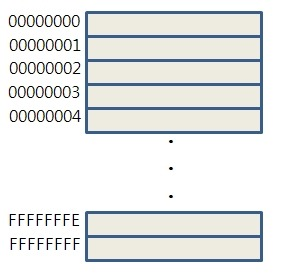

# 04장: 변수

## 4.1 변수란 무엇인가? 왜 필요한가?
먼저 사람이 [예제 04-01](../PracticeSource/Chapter4/04-01.js)를 계산하려면 10, 20, + 라는 기호의 의미와 10 + 20이라는 식의 의미를 해석할 수 있어야 한다. 식의 연산(+, 더하기)은 두뇌에서 진행되며, 사용된 피연산자(10, 20)와 연산의 결과(30) 또한 두뇌에 기억된다. 
컴퓨터 역시 사람과 유사하게 동작한다. 자바스크립트 엔진은 10, 20, + 기호(리터럴과 연산자)의 의미를 알고 있어야 하며, 식(표현식)의 의미도 해석(파싱)할 수 있어야 한다. 사람의 경우 모든 기억 및 연산이 두뇌에서 이루어지지만, **컴퓨터는 CPU를 통해 연산하고, 메모리(Memory)를 통해 데이터를 기억**한다.

 

**메모리는 데이터를 저장할 수 있는 메모리 셀(Memory Cell)의 집합체**를 의미한다. 메모리 셀 하나의 크기는 1Byte(8Bit)이며, 컴퓨터는 메모리 셀의 크기, 즉 1바이트 단위로 데이터를 저장하거나 읽어 들인다. 
각 **셀은 주소가 존재하여 메모리 공간 상의 실제 위치**를 나타내며, 0부터 시작해서 메모리의 크기만큼 정수로 표현(16진수)된다. 예를 들어 4GB 메모리는 0x00000000 ~ 0xFFFFFFFF까지의 메모리 주소를 갖는다.

  - 이미지 출처 : https://blog.daum.net/coolprogramming/8

 

CPU 연산이 성공적으로 종료되면 그 결과도 메모리에 저장되게 되는데, 결과가 저장된 **메모리의 주소를 기억하지 않으면 메모리에 저장된 값을 재사용할 수 없는 문제**가 발생한다. 
개발자가 메모리 주소로 직접 제어하는 방법이 가장 효율적이라고 생각할 수 있지만, 운영체제가 사용 중인 메모리에 접근하여 값을 제어하면 시스템 전체에 심각한 오류를 발생시키며, 동일한 코드의 실행이어도 값이 저장될 메모리의 주소는 메모리 상황에 따라 결정됨으로 사실상 불가능하다. 따라서 **자바스크립트 엔진은 개발자의 직접적인 메모리 제어를 허용하지 않는다. 그렇다면 어떻게 메모리 주소를 기억해서 사용할 수 있을까?** 
프로그래밍 언어는 메모리에 대한 제어를 위해 **변수**라는 메커니즘을 제공한다. **변수(variable)는 값(메모리 공간)의 위치를 가르키는 상징적인 이름**을 의미하며, 프로그래밍 언어 번역기(컴파일러, 인터프리터)에 의해 값이 저장된 메모리 공간의 주소로 치환되어 실행된다. 이러한 방식을 통해 개발자는 메모리 주소를 통해 값을 직접 제어할 필요가 없이 변수를 통해 안전하게 값을 제어할 수 있다.
> 하나의 변수에 여러 개의 값을 저장하고 싶은 경우, 배열 혹은 객체와 같은 자료구조를 이용한다. ([예제 04-02](../PracticeSource/Chapter4/04-02.js) 참고)

 

[예제 04-03](../PracticeSource/Chapter4/04-03.js)에서 자바스크립트 엔진은 연산(10 + 20)을 수행하고 그 결과(30)를 메모리 공간에 저장한다. 이때 저장된 결과(30)를 다시 읽어들여 재사용할 수 있도록 해당 메모리 공간(주소)에 상징적인 이름을 붙인 것이 바로 변수다. 
고유한 이름을 **변수 명**(또는 변수 이름), 변수에 저장된 값을 **변수 값**, 변수에 값을 저장하는 것은 **할당(대입, 저장)**, 변수에 저장된 값을 읽어들이는 것을 **참조**라고 한다. **변수 명으로 참조를 요청하면 자바스크립트 엔진은 변수 명과 매핑된 메모리 주소를 통해 메모리 공간에 접근해서 저장된 값을 반환**한다. 변수에 저장된 값의 의미를 파악할 수 있는 변수 명은 가독성을 높이는 부수적인 효과가 있다.

 

## 4.2 식별자
변수 명, 변수 이름을 식별자(identifier)라고도 한다. 식별자는 값이 저장된 메모리의 주소를 기억해야할 필요가 있는데, 이 매핑 정보 역시 메모리에 저장되어야 한다. 식별자라는 용어는 변수 이름에만 국한되어 사용되는 것이 아니며 함수, 클래스 등의 이름은 모두 식별자이다.
변수 이름으로는 메모리 상에 존재하는 변수 값을 식별할 수 있고, 함수 이름으로는 메모리 상에 존재하는 함수(자바스크립트에서는 함수도 값)를 식별할 수 있다. 즉 메모리 상에 존재하는 어떤 값을 식별할 수 있는 이름은 모두 식별자라고 하며, 자바스크립트는 선언(declaration)에 의해 식별자의 존재를 자바스크립트 엔진에게 알린다.

 

## 4.3 변수 선언
## 4.4 변수 선언의 실행 시점과 변수 호이스팅
## 4.5 값의 할당
## 4.6 값의 재할당
## 4.7 식별자 네이밍 규칙
## Summary

 

## Reference
- [모던 자바스크립트 Deep Dive 공식 예제코드 저장소](https://github.com/wikibook/mjs) 

 

-----
### [< 이전](Chapter3.md) | [목차](../README.md) | [다음 >](Chapter5.md)