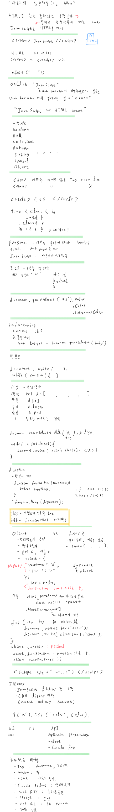

# JavaScript Opentutorials

- [인프런(WEB2 - JavaScript)](https://www.inflearn.com/course/web2-javascript/dashboard)
- [생활코딩 홈페이지](https://opentutorials.org/module/3180)
- [Youtube divide](https://www.youtube.com/playlist?list=PLuHgQVnccGMBB348PWRN0fREzYcYgFybf)

