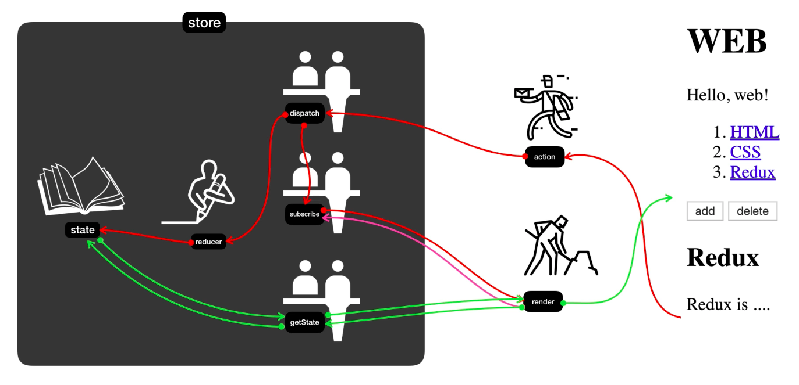

# Redux

- [인프런(생활코딩 - Redux)](https://www.inflearn.com/course/redux-%EC%83%9D%ED%99%9C%EC%BD%94%EB%94%A9/dashboard)
- [생활코딩 홈페이지](https://opentutorials.org/module/4078)
- [Youtube divide](https://www.youtube.com/playlist?list=PLuHgQVnccGMB-iGMgONoRPArZfjRuRNVc)
- [강사 github](https://github.com/egoing/redux-tutorial-example)

### 결과 미리보기 
- [without-redux.html](PracticeSource/Redux/without-redux.html) VS [with-redux.html](PracticeSource/Redux/with-redux.html)
- [CRD with Redux](PracticeSource/Redux/main.html)

## 오리엔테이션
### 1. 수업 소개
- [WEB2 JavaScript](https://opentutorials.org/module/3180) 수업 참고
  - [학습 내용 정리](./JavaScript.md)
- [JavaScript Immutability](https://opentutorials.org/module/4075) 수업 참고
  - [학습 내용 정리](./JavaScriptImmutability.md)
- 웹 애플리케이션은 (데이터의) 상태에 따라 화면의 UI구성이 변경되어야함
- 이러한 요구사항은 구현하기 복잡하고 어렵거나 자원을 많이 소모해야함
- 코드의 복잡성을 낮추어야 복잡한 애플리케이션을 만드는데 도전할 수 있음  

<br>

- [Redux](https://redux.js.org/)
> Redux is a predictable(예측 가능한) state container for JavaScript apps.
- Single Source of Truth : 단 하나의 상태(객체)를 가짐
- 하나의 (중앙 집중) 객체에 애플리케이션에 필요한 모든 데이터를 넣어 상태의 복잡도를 낮춤
  - Store라는 저장소에 State라는 값을 통해 데이터를 저장
- 외부로부터 접근을 철저하게 차단하고 사전에 약속된 함수 호출만을 통해 데이터 조작이 가능
  - Reducer 함수의 Return값(객체)으로 State의 변경할 수 있으며, 예기치 않은 변경을 사전에 차단
  - Dispatch 함수는 Reducer, Subscribe함수를 호출하도록 약속됨
  - getState 함수를 통해서만 State 값을 사용할 수 있음
  - Subscribe 함수를 통해 State가 변경되었을 때, 애플리케이션의 구성 요소를 변경할 수 있게끔 지원
- 데이터를 조작하는 방식이 Immutable 하기 때문에 Undo, Redo가 쉬움
- Hot Module Reloading : 애플리케이션이 새로 고침될때 이전에 입력된 데이터도 그대로 사용할 수 있음

## 리덕스 여행의 지도
### 2.1. 리덕스 여행의 지도 : 소개
- CRD 를 순수 HTML, CSS, Redux만을 이용하여 간단한 웹 애플리케이션을 만들기
- Redux 자체를 음미해보기

<br><br>

### 2.2. 리덕스 여행의 지도 : state와 render의 관계
- Store는 정보가 저장되는 핵심, 은행과 유사
- State는 실제 정보, 은행의 장부와 유사
  - Reducer 함수를 통해서 State를 수정, Store 생성 시 주입해 주어야함
  - getState 함수를 통해서 State를 읽기
```js
// JavaScript
function reducer(oldState, action){ // Reducer 정의
  // ...
}
var store = Redux.createStore(reducer); // Store 생성
```
- Render 함수는 Redux와 상관없이 State를 참고해 화면(UI)을 만듬
```js
// JavaScript
function render(){ // Render 생성
  var state = store.getState(); // getState로 Store의 State에 접근
  // 가져온 State로 화면(UI)를 만드는 코드
  document.querySelector('#app').innerHTML = `<div>${state.something}</div>` 
}
```
- Subscribe함수에 Render함수를 등록하면 Store의 State가 변경될 때 마다 자동으로 Render가 호출됨
```js
// JavaScript
store.subscribe(render);
```

### 2.3. 리덕스 여행의 지도 : action과 reducer
- Dispatch 함수는 전달자의 역할로 2가지의 일을 차례로 진행함
  1. Reducer함수를 호출, 현재 State와 입력 받은 Action을 전달
  2. Subscribe 함수에 등록된 Render(구독자)를 전부 호출함
```js
// JavaScript
// type이 create인 객체(Action)를 Dispatch에 전달
store.dispatch({type:'create', payload:{title:title, desc:desc}})
```
- 이후, Reducer 함수는 입력받은 현재 State와 Action를 참조해서 새로운 State를 만들어 반환
```js
// JavaScript
function reducer(oldState, action){ // Reducer 정의
  return { } // 새로운 State 객체 return
}
```

### 3. Redux가 좋은 가장 중요한 이유
- 일반적인 구현
  1. 상호작용 하는 부품이 늘어날 수록 상호작용에 대한 로직이 기하급수적으로 늘어남
  2. 부품간의 강한 연결성을 가짐, 부품이 아닌 하나의 전체가 되어버림
- Redux 사용 시
  1. 부품 간의 직접적인 상호 작용을 줄이기
  2. Redux 툴을 통해 시간 여행이 가능
  3. 상태 자체를 import, export할 수 있음  

### 4. Redux가 없다면
- 구성 요소가 늘어날때 마다 구성 요소 간의 상호작용을 추가해주어야함
- [소스 참고(without-redux.html)](PracticeSource/Redux/without-redux.html)

## Redux의 적용
### 5.1. Redux의 적용 : store 생성
- Redux npm 설치
```sh 
# Shell
npm install --save redux
```
- Redux CDN 사용
```html
<!-- html head -->
<script src="https://cdnjs.cloudflare.com/ajax/libs/redux/4.1.0/redux.min.js"></script>
```
- [앞서 작성한 소스 코드(without-redux.html)](PracticeSource/Redux/without-redux.html)와 같은 기능을 Redux를 사용해서 구현
- Store을 만들어서 Store의 State를 조작하는 것이 핵심
- **Reducer 함수**를 가장 먼저 정의하여 **Store 생성 시 주입**해 주어야함
- Reducer 함수는 Dispatch 함수에 의해 입력된 Action과 기존의 State 값을 참고하여 새로운 State값을 만들어 주는 역할
```html
<html>
<!-- Redux CDN -->
<body>
  <!-- style -->
  <h1>With redux</h1>
  <div id="red"></div>

  <script>
    function reducer(state, action) { // 두 가지 인자(기존의 State, Action)을 받도록 약속됨
      if (state === undefined) { // 이전 state가 없으면 처음 호출했다는 뜻 : State의 초기화
        return { color: 'yellow' }
      }
    }
    var store = Redux.createStore(reducer); // Store 생성

    function red() { // 화면을 작성하는 Render 함수
      var state = store.getState(); // getState로 State({ color: 'yellow' }) 값 가져오기
      // 가져온 State를 화면을 작성할 때 사용하기 ${state.color}
      document.querySelector('#red').innerHTML = `
        <div class="container" id="component_red" style="background-color:${state.color}">
            <h1>red</h1>
            <input type="button" value="fire" onclick="
            document.querySelector('#component_red').style.backgroundColor = 'red';
            document.querySelector('#component_green').style.backgroundColor = 'red';
            document.querySelector('#component_blue').style.backgroundColor = 'red';
            ">
        </div>
    `;
    }
    red(); // Render 호출
  </script>
</body>
</html>
```

### 5.2. Redux의 적용 : reducer와 action을 이용해서 새로운 state 값 만들기
- Dispatch 함수를 호출하면 Store를 생성할 때 주입한 Reducer 함수를 호출하도록 약속됨
- 이 때, Dispatch함수에 입력된 Action 객체를 전달
```js
// in script tag 
function reducer(state, action) {
  console.log(state, action); 
  // 버튼 클릭 시, {color: "yellow"} {type: "CHANGE_COLOR", color: "red"} 출력
  if (state === undefined) return { color: 'yellow' }
  var newState; // 새로운 State 객체를 생성해서 반환
  if (action.type === 'CHANGE_COLOR')newState = Object.assign({}, state, { color: 'red' });
  return newState; // State가 변경됨
}
var store = Redux.createStore(reducer);

function red() {
  var state = store.getState();
  document.querySelector('#red').innerHTML = `
    <div class="container" id="component_red" style="background-color:${state.color}">
        <h1>red</h1>
        <input type="button" value="fire" onclick="
          store.dispatch({type:'CHANGE_COLOR', color:'red'}); // Dispatch 함수 작성
        ">
    </div>
`;
}
red();
```
- 주의사항
  - Action 객체에 type는 필수 값
  - State를 직접 변경하지 말고, State의 복제복은 생성하고 복제본을 변경, 반환할 것

### 5.3. Redux의 적용 : state의 변화에 따라서 UI 반영하기
- Action -> Dispatch -> Reducer -> State -> **이제 Render**
- Render 함수가 한번만 실행되는게 아닌 State가 변경될 때마다 실행 시켜주고 싶음 
- Subscribe 함수에 Render를 등록
- Redux를 쓰게 되면 각 구성 요소는 2 가지의 기능만 주의하여 작성하면됨
  1. State가 변경된 것(Action)을 Store에 알림(Dispatch)
  2. 변경된 State의 값에 따라 어떤 화면(UI)을 구상할지 + Subscribe 함수로 구독
- [완성된 소스 코드(with-redux.html)](PracticeSource/Redux/with-redux.html)

### 6. Redux 선물 : 시간여행과 로깅
- Chrome의 Redux DevTools 확장 플러그인 설치, createStore 부분에 코드 추가
- 파일 시스템으로는 실행이 불가능하니 VS Code Live Server 플러그인 이용
```js
var store = Redux.createStore(reducer, window.__REDUX_DEVTOOLS_EXTENSION__ && window.__REDUX_DEVTOOLS_EXTENSION__());
```

## 실전 Redux
### 7.1. 실전 Redux : 정적인 웹페이지 만들기
- 조금 더 실용적인 예제(CRD) 만들기
- 기본 정적 웹 페이지 구성
```html
<!DOCTYPE html>
<html>

<head>
  <script src="https://cdnjs.cloudflare.com/ajax/libs/redux/4.1.0/redux.min.js"></script>
</head>

<body>
  <header>
    <h1>WEB</h1>
    Hello, WEB!
  </header>
  <nav>
    <ol>
      <li><a href="1.html">HTML</a></li>
      <li><a href="2.css">CSS</a></li>
    </ol>
  </nav>
  <article>
    <ul>
      <li><a href="/create">Create</a></li>
      <li><input type="button" value="Delete" /></li>
    </ul>
    <h2>HTML</h2>
    HTML is ...
  </article>
</body>

</html>
```

### 7.2. 실전 Redux : 부품화
- 주요한 구성 요소를 함수로 분리 
```html
<!DOCTYPE html>
<html>

<head>
  <script src="https://cdnjs.cloudflare.com/ajax/libs/redux/4.1.0/redux.min.js"></script>
</head>

<body>
  <div id="subject"></div>
  <div id="TOC"></div>
  <div id="control"></div>
  <div id="content"></div>
  <script>
    function subject() {
      document.querySelector('#subject').innerHTML = `
        <header>
          <h1>WEB</h1>
          Hello, WEB!
        </header>
      `
    }
    function TOC() {
      document.querySelector('#TOC').innerHTML = `
        <nav>
          <ol>
            <li><a href="1.html">HTML</a></li>
            <li><a href="2.css">CSS</a></li>
          </ol>
        </nav>
      `
    }
    function control() {
      document.querySelector('#control').innerHTML = `
        <ul>
          <li><a href="/create">Create</a></li>
          <li><input type="button" value="Delete" /></li>
        </ul>
      `
    }
    function article() {
      document.querySelector('#content').innerHTML = `
        <article>
          <h2>HTML</h2>
          HTML is ...
        </article>
      `
    }
    subject();
    TOC();
    control();
    article();
  </script>
</body>

</html>
```

### 7.3. 실전 Redux : store 생성과 state 사용하기
- Redux를 사용하기 위해서 먼저 Store 생성
- Store 생성 시, Reducer(State, Action)를 정의하여 연결해 주어야험
- Reducer 함수 내에서 초기 State 값이 undefined일 때, 앞으로 사용될 State값을 초기화
- TOC의 글 목록 부분을 Redux의 State(contents)로 만들어 사용하기
```js
// in script tag
function reducer(state, action) {
  if (state === undefined) { // State 초기화
    return {
      contents: [
        { id: 1, title: "HTML", desc: "html is ..." },
        { id: 2, title: "CSS", desc: "css is ..." }
      ]
    };
  }
}
var store = Redux.createStore(reducer); // Store 생성

function subject() { /* ... */ }
function TOC() {
  var state = store.getState(); // getState함수로 State 가져오기
  var litags = ``;
  state.contents.map(value => { litags += `<li><a href='/${value.id}'>${value.title}</a></li>` })
  document.querySelector('#TOC').innerHTML = `<nav> <ol> ${litags} </ol> </nav>`
}
// ...
```

### 7.4. 실전 Redux : action을 dispatch를 통해서 전달하기
- TOC의 글 목록 클릭 시, 해당 글이 본문에 나타나게 하기
- Store의 State값 변경시키기
- Action -> Dispatch -> Reducer -> State -> Subscribe -> Render
- onclick 이벤트 발생 시, Action -> Dispatch 과정을 수행
  - event.preventDefault() 함수는 기본 기능의 작동을 방지함
  - Action 객체를 만들어 Dispatch에 전달하기 
  - Action의 type속성은 필수이며 행위를 나타내야함
- 해당 Action에 의해 변경되야할 State를 Reducer 내부에서 작성
```js
// in script tag
function reducer(state, action) {
  if (state === undefined) {
    return {
      selected_id: null, // 선택된 내용을 표현하기 위해 selected_id라는 State 생성
      contents: [
        { id: 1, title: "HTML", desc: "html is ..." },
        { id: 2, title: "CSS", desc: "css is ..." }
      ]
    };
  }
  var newState = {};
  if (action.type === 'SELECT') { // type이 SELECT인 경우에 State를 새롭게 생성하는 로직을 작성
    newState = Object.assign({}, state, { selected_id: action.id });
  }
  console.log(state, action, newState);
  return newState;
}
var store = Redux.createStore(reducer);

function subject() { /* ... */ }
function TOC() {
  var state = store.getState();
  var litags = ``;
  state.contents.map(value => {
    litags += `
      <li>
        <a href='/${value.id}' onclick="
          event.preventDefault();
          var action = {type:'SELECT', id:${value.id}};
          store.dispatch(action);
        ">${value.title}</a>
      </li>
    `
  })
  document.querySelector('#TOC').innerHTML = `<nav> <ol> ${litags} </ol> </nav>`
}
// ...
```

### 7.5. 실전 Redux : subscribe를 통해서 자동 갱신 되도록 처리
- State(selected_id)값에 따라 자동으로 화면(article)에 반영이 되게끔 로직을 작성
- 정상 작동 확인 후, Subscribe에 등록
```js
// in script tag
function article() {
  var state = store.getState();
  var i = 0, aTitle, aDesc;
  while (i < state.contents.length) {
    if (state.contents[i].id === state.selected_id) {
      aTitle = state.contents[i].title;
      aDesc = state.contents[i].desc;
      break;
    }
    i++;
  }
  if (state.selected_id === null) {
    aTitle = "Web";
    aDesc = "Web is ...";
  }

  document.querySelector('#content').innerHTML = `
    <article>
      <h2>${aTitle}</h2>
      ${aDesc}
    </article>
  `
}
store.subscribe(article);
// ...
```

### 7.6. 실전 Redux : 글생성 기능 구현
- 글을 작성하는 기능 구현, Create 링크 클릭 시 글을 작성하는 화면으로 변경
1. Create 링크 클릭(onclick) 시, 페이지 이동 방지(event.preventDefault()) & State(mode)의 값을 create로 변경(mode라는 기능의 상태에 관한 State를 생성)
```js
// in script tag 
function reducer(state, action) {
  if (state === undefined) {
    return {
      mode: "create",
      // ...
    };
  }
  var newState = {};
  if (action.type === 'SELECT') {
    newState = Object.assign({}, state, { selected_id: action.id });
  } else if (action.type === 'CHANGE_MODE') {
    newState = Object.assign({}, state, { mode: action.mode });
  }

  console.log(state, action, newState);
  return newState;
}
// ...
function control() {
  document.querySelector('#control').innerHTML = `
    <ul>
      <li><a href='/create' onclick="
        event.preventDefault();
        store.dispatch({ type:'CHANGE_MODE', mode:"create" });
      ">Create</a></li>
      <li><input type="button" value="Delete" /></li>
    </ul>
  `
}
```
2. content영역(article)에서 State(mode)에 따라 보이는 화면을 다르게 작성하는 로직을 추가
3. create 상태일 때의 화면(form)과 기능을 작성(onsubmit -> preventDefault -> store.dispatch(action))
```js
// in script tag ... 
function article() {
  var state = store.getState();
  if (state.mode === "create") {
    document.querySelector('#content').innerHTML = `
      <article>
        <form onsubmit="
          event.preventDefault();
          store.dispatch({ type: 'CREATE', title: this.title.value, desc: this.desc.value });
        ">
          <p><input type="text" name="title" placeholder="title" /></p>
          <p><input type="text" name="desc" placeholder="description" /></p>
          <p><input type="submit"></p>
        </form>
      </article>
    `
  } else if (state.mode === "read") {
    // read 화면 작성 로직
  }
}   
```
4. Reducer함수에서 입력 받은 Action({ type: 'CREATE', title: '', desc: ''})을 통해 새로운 State를 생성, 이때 글 목록의 최대 id 값인 max_id을 State로 만들어 사용하고, 배열 역시 immutable 하게 코드를 작성 
```js
// in script tag
function reducer(state, action) {
  if (state === undefined) {
    return {
      mode: "create",
      max_id: 2,
      // ...
    };
  }
  var newState = {};
  if (action.type === 'SELECT') {
    newState = Object.assign({}, state, { selected_id: action.id });
  } else if (action.type === 'CREATE') {
    var newMaxId = state.max_id + 1;
    newState = Object.assign({}, state, {
      mode: "read",
      max_id: newMaxId,
      selected_id: newMaxId,
      contents: state.contents.concat({ id: newMaxId, title: action.title, desc: action.desc })
    });
  } else if (action.type === 'CHANGE_MODE') {
    newState = Object.assign({}, state, { mode: action.mode });
  }

  console.log(state, action, newState);
  return newState;
}
```
5. State가 변경되었을 때, 글 목록도 자동으로 반영이 되게끔 subscribe에 TOC 추가 
```js
// in script tag ...
store.subscribe(TOC);
```

### 7.7. 실전 Redux : 글삭제 기능 구현
- State.contents 배열에서 현재 선택된 값을 삭제해주기
1. Delete 버튼 클릭(onclick) 시, 글 목록에서 선택된 글이 삭제될 것임을 알림. 이때, 선택된 ID 값은 State에 저장되어 있음으로 간략하게 Action을 전달
```js
// in script tag ... 
function control() {
  document.querySelector('#control').innerHTML = `
    <ul>
      <li><a href='/create' onclick="
        event.preventDefault();
        store.dispatch({ type:'CHANGE_MODE', mode:"create" });
      ">Create</a></li>
      <li><input type="button" onclick="
        store.dispatch({ type:'DELETE' });
      " value="Delete" /></li>
    </ul>
  `
}
```
2. Reducer함수에서 입력 받은 Action({ type: 'DELETE' })을 통해 현재 선택된 글이 삭제된 새로운 State(mode: "welcome", contents: newContents)를 생성, 배열 역시 immutable 하게 코드를 작성 
```js
// in script tag
function reducer(state, action) {
  // State 초기화
  var newState = {};
  if (action.type === 'SELECT') {
    newState = Object.assign({}, state, { selected_id: action.id });
  } else if (action.type === 'CREATE') {
    // CREATE Action
  } else if (action.type === 'DELETE') {
    var newContents = state.contents.concat();
    for (var i = 0; i < state.contents.length; i++) {
      if (state.contents[i].id === state.selected_id) {
        newContents.splice(i, 1);
        break;
      }
    }
    newState = Object.assign({}, state, {
      mode: "welcome",
      contents: newContents
    });
  } else if (action.type === 'CHANGE_MODE') {
    newState = Object.assign({}, state, { mode: action.mode });
  }

  console.log(state, action, newState);
  return newState;
}
```
3. mode에 welcome이 추가되었음으로 content영역(article)에서 해당 로직 추가 처리
```js
// in script tag ... 
function article() {
  var state = store.getState();
  if (state.mode === "create") {
    // create 화면 작성 로직
  } else if (state.mode === "read") {
    // read 화면 작성 로직
  } else if (state.mode === "welcome") {
    document.querySelector('#content').innerHTML = `
      <article>
        <h2>Welcome</h2>
        Hello, Redux!
      </article>
    `
  }
}
```
4. 삭제 후 글 목록(TOC) 클릭 시, content영역(article)이 변경되지 않는 것은 mode의 값을 변경해주지 않아서 임
```js
function reducer(state, action) {
  // State 초기화
  var newState = {};
  if (action.type === 'SELECT') {
    newState = Object.assign({}, state, { mode: "read", selected_id: action.id });
  } else if (action.type === 'CREATE') {
    // CREATE Action
  } else if (action.type === 'DELETE') {
    // DELETE Action
  } else if (action.type === 'CHANGE_MODE') {
    // CHANGE_MODE Action
  }

  console.log(state, action, newState);
  return newState;
}
```
- [완성된 소스 코드(main.html)](PracticeSource/Redux/main.html)

## 마무리
### 8. 수업을 마치며
- React, Vue
- Redux 미들웨어 === Redux 플러그인 
- [JavaScript Immutability](https://opentutorials.org/module/4075) 수업 참고
  - [학습 내용 정리](./JavaScriptImmutability.md)
  - [immutable.js](https://immutable-js.com/)