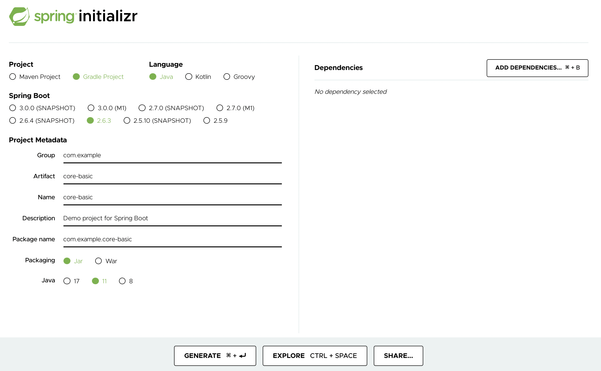
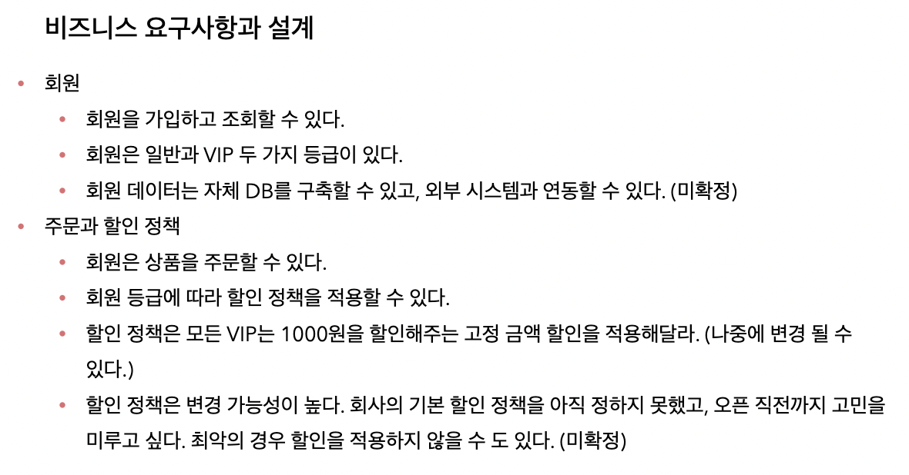

# Inflearn (김영한) / 스프링 핵심 원리 - 기본편

- [Inflearn Lecture Dashboard](https://www.inflearn.com/course/%EC%8A%A4%ED%94%84%EB%A7%81-%ED%95%B5%EC%8B%AC-%EC%9B%90%EB%A6%AC-%EA%B8%B0%EB%B3%B8%ED%8E%B8/dashboard)
- 해당 강의는 유료로 저자의 저작권 보호를 위해 강의 자료 미첨부

## 섹션 1. 객체 지향 설계와 스프링
### 이야기 - 자바 진영의 추운 겨울과 스프링의 탄생
- 자바 진영의 겨울
  - 자바 진영의 표준 기술인 EJB
  - 컨테이너, 설정에 의한 트랜잭션, 분산 처리 등 고급 기술이 편하게 지원됨
  - 낮은 수준의 엔티티 빈 지원(쿼리 없이 DB에 객체를 저장하는 기술)
  - EJB에 의존적이고 코드 자체가 지저분해짐, 또한 비싸고 어렵고 느렸음
- 스프링과 JPA의 탄생
  - 간단한 객체를 사용하자는 의도에서 POJO라는 개념이 등장
  - 로드 존슨 저서의 3만줄 가량의 소스가 EJB 컨테이너 대체하며 스프링이 됨
  - 개빈 킹이 EJB 엔티티 빈 기술을 대체하는 Hibernate를 발표하면서 JPA 표준이 새롭게 정의됨

### 스프링이란?
- **스프링은 여러 기술의 모음**이며 스프링 프레임워크가 가장 중요
  - 핵심 기술 : 스프링 DI 컨테이너, AOP, 이벤트, 기타
  - 웹, 데이터 접근 기술 : 스프링 MVC, 스프링 WebFlux, 트랜잭션, JDBC, ORM 지원, XML 지원
- 스프링은 문맥에 따라 다르게 해석될 수 있음
  - 스프링 DI 컨테이너 기술 혹은 스프링 프레임워크 
  - 스프링 부트, 스프링 프레임워크 등을 모두 포함한 스프링 생태계
- **스프링 부트**는 스프링 프레임워크를 편리하게 사용할 수 있도록 지원, 최근에는 기본으로 사용 
  - 단독으로 실행할 수 있는 스프링 애플리케이션을 쉽게 생성 
  - Tomcat 같은 웹 서버를 내장해서 별도의 웹 서버를 설치하지 않아도 됨 
  - 손쉬운 빌드 구성을 위한 starter 종속성 제공 등
- 스프링을 왜 만들어 졌고, 핵심 컨셉은 무엇?
  - 단순 스프링의 API 사용법을 익히는 것이 아니라 핵심 컨셉을 이해하는 것이 중요
  - 스프링은 **자바(객체 지향) 언어 기반의 프레임워크**로 객체 지향 언어가 가진 강력한 특징을 살려내는 프레임워크

### 좋은 객체 지향 프로그래밍이란?
- 세상을 역할과 구현으로 구분하면
  - 사용자는 구현 대상 자체를 변경해도 영향을 받지 않음으로 변화에 유연하며, 변경 자체도 편리
  - 사용자는 대상의 역할만 알면 구현 대상의 내부 구조가 변경되어도 영향을 받지 않음
  - 역할에 수정이 발생하는 경우 모든 구현체를 수정해야하는 문제가 발생함으로 역할을 안정적으로 잘 설계하는 것이 가장 중요
- 세상의 역할과 구현이라는 편리한 컨셉을 자바 언어의 다형성을 통해 객체 세상으로 가져올 수 있음
  - 역할 : 인터페이스 
  - 구현 : 인터페이스를 구현한 클래스, 구현 객체 
  - 객체 설계 시 역할과 구현을 명확히 분리하고 실행 시점에 구현체를 유연하게 변경
  - 객체 설계 시 역할(인터페이스)을 먼저 부여하고, 그 역할을 수행하는 구현 객체 만들기
  - 클라이언트를 변경하지 않고, 서버의 구현 기능을 유연하게 변경할 수 있음
- 스프링의 제어의 역전(IoC), 의존관계 주입(DI)은 다형성을 활용해서 역할과 구현을 편리하게 다룰 수 있도록 지원 

### **좋은 객체 지향 설계의 5가지 원칙(SOLID)**
- **SRP : 단일 책임 원칙(single responsibility principle)**
  - **한 클래스는 하나의 책임만**
  - 중요한 기준은 변경, 변경이 있을 때 파급 효과가 적으면 단일 책임 원칙을 잘 따른 것
- **OCP : 개방-폐쇄 원칙 (Open/closed principle)**
  - 소프트웨어 요소는 **확장에는 열려 있으나 변경에는 닫혀 있어야 한다**
  - 객체를 생성하고, 연관관계를 맺어주는 별도의 조립, 설정자가 필요 -> 스프링 DI 컨테이너의 역할
```java
public class MemberService {
    /*
     private MemberRepository memberRepository = new MemoryMemberRepository();
     구현체를 변경하려면 클라이언트의 변경이 필수적임
     분명 다형성을 사용했지만 OCP 원칙을 지킬 수 없음
    */
    private MemberRepository memberRepository = new JdbcMemberRepository();
}
```
- **LSP : 리스코프 치환 원칙 (Liskov substitution principle)**
  - 다형성에서 하위 클래스는 인터페이스 규약을 지켜야 함
  - 다형성을 지원하기 위한 원칙으로 **인터페이스 구현체의 신뢰성을 보장**
- **ISP : 인터페이스 분리 원칙 (Interface segregation principle)**
  - 특정 클라이언트를 위한 인터페이스 여러 개가 범용 인터페이스 하나보다 좋음
- **DIP : 의존관계 역전 원칙 (Dependency inversion principle)**
  - **추상화(인터페이스)에 의존해야지, 구체화(구현 클래스)에 의존하면 안된다.**
  - 클라이언트가 구현체에 의존하게 되면 변경이 아주 어려워짐
  - OCP에서 설명한 MemberService는 인터페이스에 의존하지만, 구현 클래스도 동시에 의존 ->  DIP 위반
- **다형성 만으로는 OCP, DIP를 지키기 힘듬**

### 객체 지향 설계와 스프링
- 스프링은 다음 기술로 다형성 + OCP, DIP를 가능하게 지원
  - DI(Dependency Injection) : 의존관계, 의존성 주입
  - DI 컨테이너 제공
- 클라이언트 코드의 변경 없이 기능 확장

## 섹션 2. 스프링 핵심 원리 이해1 - 예제 만들기
### 프로젝트 생성 및 비즈니스 요구사항과 설계
- Project 
  - 라이브러리 로드, 빌드 등을 관리하는 Tool을 명시
  - Maven, Gradle 등이 있으며, Gradle의 빈도가 증가하는 추세
  - 라이브러리는 추가적으로 의존성을 가질 수 있으며, 의존관계 역시 빌드 툴에 의해 관리됨
- no Dependencies 
  - 프로젝트에서 사용하는 라이브러리
  - 스프링이 없을 때 불편함을 경험하기 위해 의존성 추가는 하지 않음

<a href="https://start.spring.io/">
  
</a>

- 배운 내용을 토대로 요구사항을 역할과 구현을 분리하여 순수 자바로 개발하기
- Spring Web을 포함하지 않음으로 톰캣이 실행되지 않고 종료됨
- 요구사항 변경 시, 다형성과 SOLID를 잘 지킬수 있는지 검증



### 회원 도메인 설계, 개발, 실행과 테스트
- 회원 도메인에 대한 설계
  - 클라이언트는 회원 서비스를 호출함
  - 회원 서비스는 회원 가입과 조회 기능을 제공하며, 회원 저장소를 호출하여 데이터에 접근 
  - 회원 저장소는 아직 미확정 상태임으로 역할(인터페이스)을 정의하고 임시로 메모리를 이용하여 구현
  - 상황이 변함에 따라 회원 저장소 역할의 구현체를 변경

> 도메인 협력 관계 : 기획자도 볼수 있는 그림  
> 클래스 다이어그램 : 도메인 협력 관계를 바탕으로 구현을 위해 구체화한 정적 그림  
> 객체 다이어그램 : 실제 작동 시 객체 인스턴스간의 참조 관계를 나타낸 동적 그림

- 클래스 다이어그램을 참고, member 패키지에 회원과 관련된 내용을 개발
  - [Grade](src/main/java/com/example/corebasic/member/Grade.java)와 [Member](src/main/java/com/example/corebasic/member/Member.java)
  - [MemberRepository](src/main/java/com/example/corebasic/member/MemberRepository.java)
    - [MemoryMemberRepository](src/main/java/com/example/corebasic/member/MemoryMemberRepository.java)
    - 인터페이스와 구현체는 패키지를 나누는 것이 좋지만 간단한 예제를 위해 분리하지 않음
  - [MemberService](src/main/java/com/example/corebasic/member/MemberService.java)
    - [MemberServiceImpl](src/main/java/com/example/corebasic/member/MemberServiceImpl.java)
    - 인터페이스의 구현체가 1개인 경우 관례적으로 뒤에 impl 을 붙임
- 회원 도메인이 정상적으로 동작하는지 확인하는 절차
  - [MemberApp](src/main/java/com/example/corebasic/MemberApp.java)
  - [MemberServiceTest](src/test/java/com/example/corebasic/member/MemberServiceTest.java)
- 인터페이스 뿐만 아니라 구현체까지 의존하기 때문에 **DIP 원칙을 못 지킴**
- 다른 저장소로 변경할 때 OCP 원칙은 잘 준수할 수 있을까?

### 주문과 할인 도메인 설계, 개발, 실행과 테스트
- 주문과 할인 도메인에 대한 설계
  - 주문 생성 : 클라이언트는 주문 서비스에 주문 생성을 요청
  - 회원 조회 : 할인을 위해서는 회원 등급이 필요, 주문 서비스는 회원 저장소에서 회원을 조회
  - 할인 적용 : 주문 서비스는 회원 등급에 따른 할인 여부를 할인 정책에 위임
  - 주문 결과 반환 : 주문 서비스는 할인 결과를 포함한 주문 결과를 반환
  - 주문 데이터를 DB에 저장해야하지만 예제가 너무 복잡해 질 수 있어서 생략, 단순히 주문 결과를 반환
  - 상품에 대한 도메인이 필요하지만 주문 내역 안에 단순하게 포함시킴
- 클래스 다이어그램을 참고, discount 패키지에 할인과 관련된 내용을 개발
  - 할인에 대한 행위 개념을 역할과 구현으로 나눔
  - [DiscountPolicy](src/main/java/com/example/corebasic/discount/DiscountPolicy.java)
    - [FixDiscountPolicy](src/main/java/com/example/corebasic/discount/FixDiscountPolicy.java)
- 클래스 다이어그램을 참고, order 패키지에 주문과 관련된 내용을 개발
  - [Order](src/main/java/com/example/corebasic/order/Order.java)
  - [OrderService](src/main/java/com/example/corebasic/order/OrderService.java)
    - [OrderServiceImpl](src/main/java/com/example/corebasic/order/OrderServiceImpl.java)
- 주문, 할인 도메인이 정상적으로 동작하는지 확인하는 절차
  - [OrderApp](src/main/java/com/example/corebasic/OrderApp.java)
  - [OrderServiceTest](src/test/java/com/example/corebasic/order/OrderServiceTest.java)

## 섹션 3. 스프링 핵심 원리 이해2 - 객체 지향 원리 적용
### 새로운 할인 정책 개발
- 기존의 할인 정책 역할(인터페이스)를 구현하는 새로운 할인 정책(구현체) 개발
  - [RateDiscountPolicy](src/main/java/com/example/corebasic/discount/RateDiscountPolicy.java)
- 새롭게 작성한 할인 정책이 정상적으로 동작하는지 테스트
  - [RateDiscountPolicyTest](src/test/java/com/example/corebasic/discount/RateDiscountPolicyTest.java)

### 새로운 할인 정책 적용과 문제점
- 역할과 구현을 잘 분리하였음, 새로운 할인 정책의 구현은 비교적 쉽게 진행 -> **다형성은 비교적 잘 지킴**
- 주문서비스 클라이언트([OrderServiceImpl](src/main/java/com/example/corebasic/order/OrderServiceImpl.java))는 할인 정책 인터페이스뿐만 아니라 할인 정책 구현체에도 의존하고 있음 -> **DIP 원칙 위반**
- 새로운 할인 정책을 적용하기 위해서는 해당 정책을 사용하는 클라이언트에서 **직접 FixDiscountPolicy에서 RateDiscountPolicy로 변경**해 주어야함 -> **OCP 원칙 위반**
- 아무리 다형성을 잘 지켜도 DIP 원칙을 위반하면 변경이 발생할 떄, OCP 원칙을 지키기 어려움
  - DIP 원칙을 지키기 위해 구현체의 생성 부분을 삭제하면 **DIP 원칙 준수**할 수 있음
  - 그러나 구현체 없이 인터페이스만으로 로직을 실행하면 NullPointerException이 발생
- 외부에서 클라이언트(OrderServiceImpl)에 필요한 의존성(DiscountPolicy) 구현 객체를 대신 생성하고 주입하면 문제를 해결할 수 있음

### 관심사의 분리
- 공연의 배역과 이를 연기하는 배우가 존재
  - 배우가 직접 상대 배우를 섭외하게 되면 배우 본인의 역할뿐만 아니라 섭외라는 전혀 다른 작업도 해야함
  - 상대 배우가 변경되어도 공연이 가능해야하지만 그렇지 못함
  - 별도의 공연 기획자가 배우를 섭외하여 배정하는게 바람직함
- OOP에서도 마찬가지로 역할을 명시하는 인터페이스와 이를 구현하는 구현체가 존재
  - 클라이언트가 의존성을 가지는 객체를 직접 선택, 생성하게되면 클라이언트 본인의 역할뿐만 아니라 의존성 객체의 생성에도 신경써야함 
  - 의존성 객체가 변경되어도 클라이언트는 영향을 받지 않고 자신의 역할을 수행해야하지만 그렇지 못함
  - 외부에서 의존성을 주입받아서 사용하는 것이 바람직함
- 애플리케이션의 전체 동작 방식을 구성, 구현 객체를 생성 및 연결하는 책임을 가지는 별도의 설정 클래스([AppConfig](src/main/java/com/example/corebasic/AppConfig.java)) 작성
  - 클라이언트는 특정 역할(인터페이스)을 사용하겠다고 명시, 생성자 혹은 Setter를 통해 생성이 완료된 구현체를 주입(전달)받음
  - **AppConfig에서 구현체를 생성하고 클라이언트가 원하는 방식(생성자 혹은 Setter)으로 주입(전달)해줌**
  - 클라이언트는 어떤 구현체를 사용하게 될지 전혀 모르며, 오로지 외부(AppConfig)에서 결정됨
  - **클라이언트 입장에서는 의존성을 마치 주입받는 것 같다하여 DI(Dependency Injection), 의존관계 주입, 의존성 주입이라함**
- 클라이언트 의존성 생성 방식 수정
  - 의존성 객체 직접 생성 -> 의존성 주입
  - [OrderServiceImpl](src/main/java/com/example/corebasic/order/OrderServiceImpl.java)
  - [MemberServiceImpl](src/main/java/com/example/corebasic/member/MemberServiceImpl.java)
- 예제 코드 실행 방식 수정
  - 실행 객체 직접 생성 -> AppConfig로 부터 전달
  - [OrderApp](src/main/java/com/example/corebasic/OrderApp.java)와 [OrderServiceTest](src/test/java/com/example/corebasic/order/OrderServiceTest.java)
  - [MemberApp](src/main/java/com/example/corebasic/MemberApp.java)와 [MemberServiceTest](src/test/java/com/example/corebasic/member/MemberServiceTest.java)

### [AppConfig](src/main/java/com/example/corebasic/AppConfig.java) 리팩터링, 새로운 구조와 할인 정책 적용
- 중복을 줄이고 역할과 구현을 명확하게 수정
- AppConfig에서 할인 정책을 변경하면 적용 완료
- 애플리케이션을 사용 영역과 구성 영역으로 명확하게 분리
- 애플리케이션의 변경사항이 발생해도 기존 사용 영역은 영향을 받지 않음

### 전체 흐름 정리
- **새로운 할인 정책 개발**
  - 역할과 구현을 분리해 두었음으로 새로운 정책을 생성하는 데 문제가 없음
- **새로운 할인 정책 적용과 문제점**
  - 정책을 변경하고자 하면 이를 사용하는 클라이언트의 소스의 변경이 필요 -> OCP 원칙 위반
  - 클라이언트 내에서 인터페이스와 구현체 모두에 의지하고 있음 -> DIP 원칙 위반
- **관심사의 분리**
  - 클라이언트가 본래의 역할 이외에 객체를 직접 생성하는 것이 문제
  - AppConfig에게 의존성 객체를 생성하고, 필요한 부분에 의존성을 주입(연결)하는 책임을 위임
  - 클라이언트는 자신의 역할(책임)에만 집중할 수 있음
- **AppConfig 리펙터링, 새로운 구조와 할인 정책 적용**
  - AppConfig 내에서도 중복을 줄이고 구조를 명확히함
  - 구성 영역과 사용 영역을 명확하게 분리
  - AppConfig 만 수정함으로서 할인 정책을 변경, 클라이언트 코드는 수정되지 않음
  - OCP 원칙과 DIP 원칙을 모두 준수

### 좋은 객체 지향 설계의 5가지 원칙의 적용
- 3가지 (SRP, DIP, OCP) 원칙의 준수
- **SRP : 한 클래스는 하나의 책임만을 가져야 한다.**
  - 의존성 객체의 생성과 역할의 실행이라는 관심사를 AppConfig를 통해 분리
  - 클라이언트는 역할의 실행에만 책임을 가짐
  - AppConfig는 객체의 생성과 의존성 주입을 관리하는 책임을 가짐
- **DIP : 추상화에 의존해야지, 구체화에 의존하면 안된다.**
  - 클라이언트는 구현 클래스가 아닌 인터페이스에만 의존
  - 인터페이스만으로는 실행이 불가능함으로 생성자 혹은 Setter 등을 통해 외부에서 구현체를 주입받음
- **OCP : 소프트웨어 요소는 확장에는 열려 있으나 변경에는 닫혀 있어야 한다.**
  - 다형성과 DIP 원칙을 준수하면서 구성(AppConfig)과 사용 영역을 분리
  - 애플리케이션 변경(확장) 시, 구성 영역만 변경함으로 기존의 사용 영역은 변경에 닫혀있음

### IoC, DI, 그리고 컨테이너
- **IoC(Inversion of Control)**
  - 기존에는 객체가 스스로 필요한 의존성 객체를 생성하고, 연결하고, 실행하여 프로그램의 흐름을 직접 제어
  - AppConfig 등장 이후 객체는 맡은 역할만을 수행, 의존성 객체를 생성하고 연결하는 등의 프로그램 흐름은 AppConfig가 제어
  - 프로그램의 흐름을 직접 제어하는 것이 아니라 외부에서 관리하는 것을 제어의 역전(IoC)이라 함

> 프레임워크 vs 라이브러리  
>
> 프레임워크는 개발자가 작성한 코드를 제어하고 대신 실행함(JUnit)  
> 개발자가 작성한 코드가 직접 프로그램의 제어를 담당한다면 라이브러리  

- **의존관계 Dependency**
  - 정적인 클래스 의존관계 : 클래스 다이어그램
    - 클래스가 사용하는 import 코드만 보고 의존관계를 쉽게 판단할 수 있음
    - 애플리케이션을 실행하지 않아도 분석할 수 있지만 실제 어떤 객체 인스턴스가 주입될지 알 수 없음
  - 동적인 객체 인스턴스 의존관계 : 객체 다이어그램
    - 애플리케이션 실행 시점(런타임)에 생성되는 객체 인스턴스들간의 관계
- **의존관계 주입 DI(Dependency Injection)**
  - 외부에서 의존성 객체를 생성하고 필요한 객체에 전달(주입)해서 의존관계를 연결하는 것
  - 의존관계 주입을 사용하면
    - 클라이언트 코드를 변경하지 않고, 클라이언트가 호출하는 대상의 타입 인스턴스를 변경할 수 있음
    - 정적인 클래스 의존관계를 변경하지 않고, 동적인 객체 인스턴스 의존관계를 쉽게 변경할 수 있음
- **IoC 컨테이너** 혹은 **DI 컨테이너**
  - AppConfig 처럼 **객체를 생성하고 관리하면서 의존관계를 연결해 주는 것**
  - 의존관계 주입에 초점을 맞추어 최근에는 주로 DI 컨테이너라 함
  - 또는 어샘블러, 오브젝트 팩토리 등으로 불리기도 함

### 스프링으로 전환하기
- 스프링이 없던 순수 자바 DI 코드를 스프링(스프링 컨테이너)이 제공하는 DI 방식으로 변경
- AppConfig DI 방식 수정
  - 순수 자바 코드 -> 스프링 기반 DI
  - [AppConfig](src/main/java/com/example/corebasic/AppConfig.java)
- 예제 코드 실행 방식 수정
  - 실행 객체 직접 생성 -> AppConfig로 부터 전달 -> 스프링 컨테이너로 부터 전달
  - [OrderApp](src/main/java/com/example/corebasic/OrderApp.java)
  - [MemberApp](src/main/java/com/example/corebasic/MemberApp.java)
- 스프링 사용을 위해 등록된 빈이 로그에 출력된 것 이외의 결과는 동일
  - 코드가 약간 더 복잡해진 것 같은데, 스프링 컨테이너를 사용하면 어떤 장점이 있을까? -> 앞으로의 강의 내용

## 섹션 4. 스프링 컨테이너와 스프링 빈
### 스프링 컨테이너 생성
```java
ApplicationContext applicationContext = new AnnotationConfigApplicationContext(AppConfig.class);
```
- ApplicationContext 는 인터페이스이며, 스프링 컨테이너라고 이야기함
  - 개발자의 의도에 따라 여러 형태의 구현체(xml, java)가 존재
  - 최근에는 대부분 java 어노테이션을 사용

> 정확히는 스프링 컨테이너를 부를 때 BeanFactory, ApplicationContext 로 구분  
> BeanFactory 를 직접 사용하는 경우는 거의 없으므로 일반적으로 ApplicationContext 를 스프링 컨테이너라 함

**스프링 컨테이너의 생성 과정**

- 스프링 컨테이너 생성 시, 필요한 구성 정보(AppConfig)를 지정하면 Bean 저장소를 만들어 채움
  - @Bean이 존재하는 모든 메소드를 실행
  - 메소드 이름과 반환 객체를 key - value 로 매핑하여 저장
  - 임의로 빈 명칭을 변경할 수도 있음 @Bean(name="memberService2")

> 빈 이름은 항상 다른 이름을 부여해야 함, 같은 이름을 부여하면 다른 빈이 무시되거나 기존 빈을 덮어버리거나 설정에 따라 오류가 발생함  
> 초기 설계에서 그러한 상황이 발생하지 않게끔 잘 설계하는 것이 중요

- 빈을 생성한 후, 스프링 컨테이너가 설정 정보를 참고해서 동적인 의존관계를 주입(DI)
  - 단순히 자바 코드를 순서에 맞게 실행하는 것이 아님!
  - 추가 학습 예정임으로 단순 자바 코드 실행이 아니라는 것만 확인 

> 스프링은 빈을 생성하고, 의존관계를 주입하는 단계가 나누어져 있음  
> But, 자바 코드로 스프링 빈을 등록하면 생성자를 호출하면서 의존관계 주입도 한번에 처리되지만 이해를 돕기 위해 개념적으로 나누어 설명

- 스프링 컨테이너를 생성하고, 설정(구성) 정보를 참고하여 스프링 빈 등록, 의존관계도 설정함
  - 의도한 설정 정보대로 등록되었는지 확인 필요

### 컨테이너에 등록된 모든 빈 조회
- [ApplicationContextInfoTest](src/test/java/com/example/corebasic/beanfind/ApplicationContextInfoTest.java)
- 개발자가 작성한 빈(AppConfig 포함) 이외에도 스프링이 기본적으로 사용하는 빈이 자동으로 등록됨
- 개발자가 작성한 빈과 스프링이 등록한 빈을 구분하기 위해 빈의 정보(BeanDefinition)를 사용
  - ROLE_APPLICATION : 직접 등록한 애플리케이션 빈
  - ROLE_INFRASTRUCTURE : 스프링이 내부에서 사용하는 빈
- JUnit5 부터는 접근자(public)를 지정하지 않아도 됨

### 스프링 빈 조회 - 기본
- [ApplicationContextBasicFindTest](src/test/java/com/example/corebasic/beanfind/ApplicationContextBasicFindTest.java)
- 빈을 조회하는 기본적인 방식
  - getBean(빈 이름, 타입) : 이름과 타입으로 조회
  - getBean(타입) : 타입으로만 조회
- 반환 타입이 아닌 스프링 빈에 등록된 인스턴스 타입으로 검색하기 때문에 구현체 타입으로 적어도됨
  - But, 인터페이스가 아닌 구현체에 의지하게 되며 변경에 유연성이 떨어짐으로 추천하지 않음
- 조회 대상 스프링 빈이 없으면 예외 발생
  - NoSuchBeanDefinitionException: No bean named 'xxxxx' available

### 스프링 빈 조회 - 동일한 타입이 둘 이상
- [ApplicationContextSameBeanFindTest](src/test/java/com/example/corebasic/beanfind/ApplicationContextSameBeanFindTest.java)
- 같은 타입이 2개 이상 인 경우, 오류가 발생 
  - NoUniqueBeanDefinitionException: No qualifying bean of type 'com.example.corebasic.member.MemberRepository' available
  - 빈 이름을 지정하여 해결
- **자동의존관계 주입 시에도 적용됨(no unique)**

### 스프링 빈 조회 - 상속 관계
- [ApplicationContextExtendsFindTest](src/test/java/com/example/corebasic/beanfind/ApplicationContextExtendsFindTest.java)
- 스프링 빈을 타입으로만 조회 시, 상속 관계가 있다면 하위 클래스는 전부 검색됨
  - 이를 방지하기 위해 빈 이름을 추가하여 검색
  - 혹은, 구현체 타입을 명확히 지정하여 해결(추천하지 않음)
  - Object 는 모든 클래스의 상위 클래스임으로 Object 타입으로 조회하면 스프링의 모든 빈이 검색됨
- 실제 테스트에선 출력은 제외하는 것을 권장

### 중간 정리
- 스프링 빈을 조회하는 기본적인 방법을 살펴봄
- 개발자가 ApplicationContext에서 직접 getBean할 일이 별로 없음
  - 기본 기능이기도 하며, 아주 드물게 순수 자바 애플리케이션에서 스프링 컨테이너를 가져다 쓸때 사용
  - 그 외에 일반적인 경우 스프링 컨테이너가 자동으로 의존관계 주입을 사용하거나 @Bean을 통해 설정함

### BeanFactory와 ApplicationContext
- BeanFactory는 스프링 컨테이너의 최상위 인터페이스
  - 스프링 빈을 관리하고 조회(getBean)하는 역할을 담당
- ApplicationContext는 BeanFactory을 상속받아 부가 기능을 추가한 인터페이스
  - 메시지 소스를 활용한 국제화 기능 : 한글, 영어 등의 언어에 관한 설정 지원
  - 환경변수 : 로컬, 개발, 운영등을 구분 처리
  - 애플리케이션 이벤트 : 이벤트를 발행하고 구독하는 모델을 편리하게 지원
  - 편리한 리소스 조회 : 파일, 클래스패스, 외부 등에서 리소스를 편리하게 조회
- BeanFactory를 직접 사용할 일은 거의 없으며, 부가 기능이 포함된 ApplicationContext를 사용
- BeanFactory나 ApplicationContext를 스프링 컨테이너라 함

### 다양한 설정 형식 지원 - 자바 코드, XML
- 스프링은 Java이외에도 XML과 같은 다양한 형식으로 설정 정보를 지정할 수 있게끔 유연하게 설계
- XmlAppConfig 사용 자바 코드
  - [XmlAppContextTest](src/test/java/com/example/corebasic/xml/XmlAppContextTest.java)
- XML 기반의 스프링 빈 설정 정보
  - [appConfig.xml](src/main/resources/appConfig.xml)
  - 설정 방법은 어노테이션 기반 자바(AppConfig.java)와 거의 비슷
  - Java 소스 파일 이외에 나머지 파일은 resources에 생성
- 많은 레거시 프로젝트에 XML기반 설정이 남아 있으며, 컴파일 없이 빈 설정 정보를 변경할 수 있는 장점도 있으므로 사용법 정도만 익혀두기
  - [스프링 공식 레퍼런스 문서](https://spring.io/projects/spring-framework) 확인

### 스프링 빈 설정 메타 정보 - BeanDefinition
- 스프링 빈의 정보를 나타내는 파일은 형식이 자유로움
  - 스프링은 설정 파일(XML, Java)에 직접 의존하는 것이 아니라 BeanDefinition이라는 추상화(인터페이스)에만 의존하고 있음
  - 스프링 컨테이너가는 BeanDefinition의 빈 설정 메타 정보를 기반으로 스프링 빈(인스턴스)을 생성
  - 설정 파일에 형식에 상관없이 BeanDefinition의 구현체를 만들어 사용하면 됨
- ApplicationContext 인터페이스를 구현한 구현체(XXXXXApplicationContext) 내부에 XXXBeanDefinitionReader가 설정 파일을 읽고 BeanDefinition을 생성
  - AnnotationConfigApplicationContext에서는 AnnotatedBeanDefinitionReader가 설정 정보를 읽어 BeanDefinition을 생성
  - GenericXmlApplicationContext에서는 XmlBeanDefinitionReader가 설정 정보를 읽어 BeanDefinition을 생성
- BeanDefinition 정보 ([BeanDefinitionTest](src/test/java/com/example/corebasic/beandefinition/BeanDefinitionTest.java))
  - Scope : 싱글톤(기본값)
  - lazyInit : 스프링 컨테이너를 생성할 때 빈을 생성하는 것이 아니라, 실제 빈을 사용할 때 까지 최대한 생성을 지연처리 하는지 여부
  - BeanClassName : 생성할 빈의 클래스 명(자바 설정 처럼 팩토리 역할의 빈을 사용하면 null)
  - factoryBeanName : 팩토리 역할의 빈을 사용할 경우 이름, 예) appConfig
  - factoryMethodName : 빈을 생성할 팩토리 메서드 지정, 예) memberService
  - InitMethodName : 빈을 생성하고, 의존관계를 적용한 뒤에 호출되는 초기화 메서드 명
  - DestroyMethodName : 빈의 생명주기가 끝나서 제거하기 직전에 호출되는 메서드 명
  - Constructor arguments, Properties : 의존관계 주입에서 사용한다. (자바 설정 처럼 팩토리 역할의 빈을 사용하면 null)
- BeanDefinition을 직접 작성하여 인스턴스를 생성할 수도 있지만 거의 안함

## 섹션 5. 싱글톤 컨테이너
### 웹 애플리케이션과 싱글톤
- 스프링은 태생이 웹 애플리케이션으로 동시에 다수 사용자의 요청을 처리
- 스프링 컨테이너(ApplicationContext)를 이용하지 않는 순수한 DI 컨테이너(AppConfig) 테스트
  - [SingletonTest/pureContainer](src/test/java/com/example/corebasic/singleton/SingletonTest.java)
  - AppConfig는 요청 시 마다 새로운 객체(의존성 객체 포함)를 생성하여 반환함
  - 동일한 기능을 하는 객체는 1개만 생성하여 공유하는 것이 효율적

### 싱글톤 패턴
- 클래스의 인스턴스가 딱 1개만 생성되는 것을 보장하는 디자인 패턴
  - make constructor to private, so can't new operation
  - make method Singleton Class getInstance(), so can access of use singleton class
```java
public class Single{
  // Simplest and safest way to pre-create objects
  private static Single instance = new Single();
  private Single(){}
  public static Single getInstance(){
    return instance;
  }
}
/* or */
public class Single{
  // Lazy creation of objects when requested
  private static Single instance;
  private Single(){}
  public static Single getInstance(){
    if(single == null) this.instance = new Single();
    return instance;
  }
}
```
- 싱글톤 객체 클래스 작성
  - [SingletonService](src/test/java/com/example/corebasic/singleton/SingletonService.java)
- 싱글톤 패턴 사용 테스트
  - [SingletonTest/singletonServiceTest](src/test/java/com/example/corebasic/singleton/SingletonTest.java)
- 싱글톤은 하나의 객체 생성을 보장한다는 장점이 있지만 단점도 매우 많음
  - 싱글톤 패턴을 구현하는 코드 자체가 필요
  - 의존관계상 클라이언트가 구체 클래스에 의존 -> DIP 원칙 위반 -> OCP 원칙 위반 가능성 증가
  - private 생성자로 자식 클래스를 만들기 어려움
  - 결론적으로 유연성이 감소하며 안티패턴으로 분류되기도 함
- 스프링 컨테이너(싱글톤 컨테이너)는 싱글톤 패턴이 가지는 단점은 제거하며 객체를 싱글톤으로 관리해줌

### 싱글톤 컨테이너
- 스프링 컨테이너는 싱글톤 컨테이너(레지스트리) 역할을 하며 싱글톤 패턴의 문제점을 해결
  - [SingletonTest/springContainer](src/test/java/com/example/corebasic/singleton/SingletonTest.java)
  - 싱글톤 패턴을 위한 지저분한 코드가 들어가지 않음
  - DIP, OCP, 테스트, private 생성자로 부터 자유롭게 싱글톤을 사용
- 스프링 빈의 기본 동작 방식은 싱글톤이며 싱글톤이 아니어야할 경우, 스코프를 조정하여 변경 가능

### 싱글톤 방식의 주의점
- 1개의 객체만 생성되어 모두가 공용으로 사용하기에 **변경 가능한 상태 값을 가지거나 의존적으로 설계해서는 안됨**
  - **스프링 빈은 항상 무상태(stateless)로 설계**
  - 특정 클라이언트에 의존적인 필드 혹은 특정 클라이언트가 값을 변경할 수 있는 필드가 있어서는 안됨
  - 가급적 클래스 필드는 읽기만 가능하게 하며, 자바에서 공유되지 않는, 지역변수, 파라미터, ThreadLocal 등을 사용
  - 스프링 빈의 필드에 공유 값을 설정하면 정말 큰 장애가 발생할 가능성이 있음
- 상태(price)를 유지하는 클래스와 문제 발생 테스트
  - [StatefulService](src/test/java/com/example/corebasic/singleton/StatefulService.java)
  - [StatefulServiceTest](src/test/java/com/example/corebasic/singleton/StatefulServiceTest.java)

### @Configuration과 싱글톤
- @Configuration는 싱글톤을 위해 존재한다고 봐도 무방함
- AppConfig에서 new MemoryMemberRepository()는 3번 호출되는데 과연 싱글톤을 보장할까?
  - [MemberServiceImpl](src/main/java/com/example/corebasic/member/MemberServiceImpl.java)의 MemberRepository와 [OrderServiceImpl](src/main/java/com/example/corebasic/order/OrderServiceImpl.java)의 MemberRepository를 비교
  - [ConfigurationSingletonTest/configurationTest](src/test/java/com/example/corebasic/singleton/ConfigurationSingletonTest.java)
  - 3개 모두 같은 객체 정보, 싱글톤을 보장하고 있음
- 스프링은 어떻게 싱글톤을 보장하는 것이 가능할까? 함수 자체가 실행되지 않는걸까?
  - [AppConfig](src/main/java/com/example/corebasic/AppConfig.java) 수정 후 테스트
  - 자바 코드에서 3번의 Call AppConfig.memberRepository 가 출력되어야 하지만 1번만 출력
  - 함수 자체가 실행되지 않음을 의미

### @Configuration과 바이트코드 조작의 마법
- 스프링은 싱글톤을 보장해야 하지만 자바 코드 자체를 수정할 수는 없음
- @Configuration 이 사용된 AppConfig를 자세히 확인
  - [ConfigurationSingletonTest/configurationDeep](src/test/java/com/example/corebasic/singleton/ConfigurationSingletonTest.java)
  - AppConfig 뒤에 EnhancerBySpringCGLIB 가 더 붙음 
- 스프링은 클래스의 바이트코드를 조작하는 라이브러리(CGLIB)를 사용하여 싱글톤을 보장
  - 내가 작성한 클래스가 아닌 이를 상속받는 클래스를 스프링 빈으로 등록
  - @Bean 메서드를 실행하면서 이미 빈이 존재하면 존재하는 빈을 반환, 빈이 없으면 생성해서 스프링 빈으로 등록하고 반환하는 코드가 동적으로 생성됨
  - 상속을 받아 생성한 임시 객체임으로 검색이 가능
- @Configuration이 없이 @Bean만 사용하면
  - 사용자가 작성한 순수한 클래스가 빈으로 등록됨
  - 스프링 빈도 다 정상적으로 등록되지만, 싱글톤은 보장하지 않음

## 섹션 6. 컴포넌트 스캔
### 컴포넌트 스캔과 의존관계 자동 주입 시작하기
- 지금까지 자바 코드의 @Bean이나 XML의 \<bean\> 등 설정 정보에 스프링 빈을 직접 명시
  - 등록해야 할 스프링 빈이 증가하게되면 설정 정보도 커지고, 누락하는 문제도 발생
  - 개발자가 일일히 설정 정보를 명시하지 않아도 자동으로 스프링 빈을 등록할 수 있게 지원하는 **컴포넌트 스캔**이 존재
  - **의존관계도 자동으로 주입**(지정)할 수 있게끔 **@Autowired** 라는 기능도 제공
- 기존 AppConfig는 학습을 위해 유지, 컴포넌트 스캔 학습을 위한 새로운 AutoAppConfig.java 작성
  - [AutoAppConfig](src/main/java/com/example/corebasic/AutoAppConfig.java)
  - @ComponentScan 을 설정 정보에 추가하면 스프링이 제공하는 컴포넌트 스캔을 사용할 수 있음
  - 기존의 AppConfig와는 다르게 @Bean으로 등록한 클래스는 물론이고 아무 내용이 없음
    - 어떻게 빈이 될 클래스를 지정할 것인가? -> @Component
    - 어떻게 의존관계를 주입해야 할까? -> @Autowired
- @Component 를 추가하면 컴포넌트 스캔의 대상이 되어 스프링 빈으로 등록됨
  - [MemoryMemberRepository](src/main/java/com/example/corebasic/member/MemoryMemberRepository.java)
  - [RateDiscountPolicy](src/main/java/com/example/corebasic/discount/RateDiscountPolicy.java)
- @ComponentScan 사용 시 설정 정보(@Bean)가 없기 때문에, 의존관계 주입도 각 클래스 안에서 해결해야 함
- @Autowired 를 추가하면 스프링이 의존관계를 자동으로 주입해줌
  - [OrderServiceImpl](src/main/java/com/example/corebasic/order/OrderServiceImpl.java)
  - [MemberServiceImpl](src/main/java/com/example/corebasic/member/MemberServiceImpl.java)
- ComponentScan 테스트 코드
  - [AutoAppConfigTest](src/test/java/com/example/corebasic/scan/AutoAppConfigTest.java)
  - AnnotationConfigApplicationContext 를 사용하는 것은 기존과 동일하며, 설정 정보로 AutoAppConfig 클래스를 전달
  - 로그 정보를 통해 컴포넌트 스캔이 잘 동작하는 것을 확인할 수 있음
```log
ClassPathBeanDefinitionScanner - Identified candidate component class: file [.. RateDiscountPolicy.class]
ClassPathBeanDefinitionScanner - Identified candidate component class: file [.. MemberServiceImpl.class]
ClassPathBeanDefinitionScanner - Identified candidate component class: file [.. MemoryMemberRepository.class]
ClassPathBeanDefinitionScanner - Identified candidate component class: file [.. OrderServiceImpl.class]
// ...
DefaultListableBeanFactory - Creating shared instance of singleton bean 'autoAppConfig'
DefaultListableBeanFactory - Creating shared instance of singleton bean 'rateDiscountPolicy'
DefaultListableBeanFactory - Creating shared instance of singleton bean 'memberServiceImpl'
DefaultListableBeanFactory - Creating shared instance of singleton bean 'memoryMemberRepository'
DefaultListableBeanFactory - Autowiring by type from bean name 'memberServiceImpl' via constructor to bean named 'memoryMemberRepository'
DefaultListableBeanFactory - Creating shared instance of singleton bean 'orderServiceImpl'
DefaultListableBeanFactory - Autowiring by type from bean name 'orderServiceImpl' via constructor to bean named 'memoryMemberRepository'
DefaultListableBeanFactory - Autowiring by type from bean name 'orderServiceImpl' via constructor to bean named 'rateDiscountPolicy'
```

**요약**  

- @ComponentScan 스프링 빈 등록
  - @Component 가 붙은 클래스를 스프링 빈으로 등록
  - 스프링 빈의 기본 이름은 클래스명을 사용하되 맨 앞글자만 소문자를 사용
    - 빈 이름 기본 전략 : MemberServiceImpl 클래스 -> memberServiceImpl
    - 빈 이름 직접 지정 : 스프링 빈의 이름을 직접 지정하는 경우, @Component("memberService2")로 이름을 부여
- @Autowired 의존관계 자동 주입
  - 생성자에 @Autowired 를 지정하면 스프링 컨테이너가 자동으로 해당 스프링 빈을 찾아서 주입
  - 기본 조회 전략은 **타입이 같은 빈을 찾아서 주입**
  - getBean(MemberRepository.class) 와 동일하다고 이해하면 편함
  - 생성자에 파라미터가 많아도 다 찾아서 자동으로 주입

### 탐색 위치와 기본 스캔 대상
- 모든 클래스를 컴포넌트 스캔하면 시간이 오래 걸림으로 컴포넌트 스캔의 시작 위치를 지정하여 필요한 클래스만 스캔할 수 있음
```java
@ComponentScan(
        // basePackages 로 탐색할 패키지의 시작 위치를 지정
        // 해당 패키지를 포함해서 하위 패키지를 모두 탐색
        basePackages = "com.example.corebasic",

        // 여러 시작 위치 지정하는 경우
        basePackages = {"com.example.corebasic.member", "com.example.corebasic.order"},

        // 지정한 클래스의 패키지를 탐색 시작 위치로 지정하는 경우
        basePackageClasses = AutoAppConfig.class,

        // basePackages 혹은 basePackageClasses 미 지정시,
        // @ComponentScan 이 붙은 설정 정보 클래스의 패키지를 탐색 시작 위치로 지정
}
```
- 패키지 위치를 지정하지 않고, 설정 정보 클래스의 위치를 프로젝트 최상단에 두는 것을 권장
  - 프로젝트 메인 설정 정보는 프로젝트를 대표하는 정보이기 때문에 프로젝트 시작 루트 위치에 두는 것을 권장
  - 최근 스프링 부트도 이 방법을 기본으로 제공
    - 스프링 부트의 대표 시작 정보인 @SpringBootApplication 를 프로젝트 시작 루트 위치에 두는 것이 관례
    - 해당 애노테이션 안에 @ComponentScan이 포함 됨
- 다음 애노테이션들은 내부적으로 @Component 를 포함하기 때문에 컴포넌트 스캔의 대상에 포함되며, 스프링에 의해 부가 기능을 수행
  - @Component : 컴포넌트 스캔에서 사용
  - @Controller : 스프링 MVC 컨트롤러에서 사용, 인식 됨
  - @Service : 스프링 비즈니스 로직에서 사용, 개발자에게 핵심 비즈니스 계층을 인식하는데 도움을 주는 것 이외에 특별한 처리를 하지 않음, 보통의 경우 트랜잭션의 시작과 종료 위치
  - @Repository : 스프링 데이터 접근 계층에서 사용, 인식되며 데이터 계층의 예외를 스프링 예외로 추상화하여 변환
  - @Configuration : 스프링 설정 정보에서 사용, 인식되며 스프링 빈이 싱글톤을 유지하도록 추가 처리

> 애노테이션에는 상속관계라는 것이 없음  
> 애노테이션이 특정 애노테이션을 들고 있는 것을 인식할 수 있는 것은 자바가 아닌 스프링이 지원하는 기능  
>
> useDefaultFilters 옵션은 기본으로 켜져있는데, 이 옵션을 끄면 기본 스캔 대상들이 제외됨  

### 필터
- ComponentScan의 Filter 설정을 통해 스캔 대상을 지정할 수 있음
  - includeFilters : 컴포넌트 스캔 대상을 추가로 지정
  - excludeFilters : 컴포넌트 스캔에서 제외할 대상을 지정
- 컴포넌트 스캔 대상에 추가할 애노테이션과 클래스
  - [MyIncludeComponent](src/test/java/com/example/corebasic/scan/filter/MyIncludeComponent.java)
  - [BeanInclude](src/test/java/com/example/corebasic/scan/filter/BeanInclude.java)
- 컴포넌트 스캔 대상에서 제외할 애노테이션과 클래스
  - [MyExcludeComponent](src/test/java/com/example/corebasic/scan/filter/MyExcludeComponent.java)
  - [BeanExclude](src/test/java/com/example/corebasic/scan/filter/BeanExclude.java)
- 설정 정보와 전체 테스트 코드
  - [ComponentFilterAppConfigTest](src/test/java/com/example/corebasic/scan/filter/ComponentFilterAppConfigTest.java)
  - includeFilters 에 MyIncludeComponent 애노테이션을 추가해서 BeanInclude가 스프링 빈에 등록됨
  - excludeFilters 에 MyExcludeComponent 애노테이션을 추가해서 BeanExclude가 스프링 빈에 등록되지 않음

> @Component 면 충분하기 때문에 includeFilters 를 사용할 일은 거의 없으며, excludeFilters 는 여러가지 이유로 간혹 사용할 때가 있지만 많지는 않음  
> 스프링 부트는 컴포넌트 스캔을 기본으로 제공하는데, 옵션을 변경하여 사용하기 보다는 스프링의 기본 설정에 최대한 맞추어 사용하는 것을 권장

### 중복 등록과 충돌
- 컴포넌트 스캔 시, 빈 이름을 중복 등록하는 문제
- @Component 자동 빈 등록 vs @Component 자동 빈 등록
  - 컴포넌트 스캔에 의해 자동으로 스프링 빈이 등록될 때, 빈 이름이 중복되는 경우 스프링은 오류를 발생시킴
    - ConflictingBeanDefinitionException
- @Bean 수동 빈 등록 vs @Component 자동 빈 등록
  - [AutoAppConfig](src/main/java/com/example/corebasic/AutoAppConfig.java) 수정 후 테스트 시, 작동 가능
    - Overriding bean definition for bean 'memoryMemberRepository' with a different definition: replacing
  - 빈 이름 중복 등록 시, 수동 빈 등록이 우선권을 가지며, 수동 빈이 자동 빈을 오버라이딩 해버림
  - 개발자가 의도적으로 사용한다면 우선권을 주는게 올바른 설계, But 실제로는 여러 설정들이 꼬여서 결과가 우연히 만들어지는 경우가 대부분
- 최근 스프링 부트에서는 수동 빈 등록과 자동 빈 등록이 충돌나면 오류가 발생하도록 기본 값을 변경
  - Consider renaming one of the beans or enabling overriding by setting spring.main.allow-bean-definition-overriding=true

## 섹션 7. 의존관계 자동 주입
### 다양한 의존관계 주입 방법
#### 생성자 주입
- 생성자를 통해서 의존관계를 주입받는 방법
- 생성자 호출 시점에 딱 1번만 호출되는 것을 보장함으로 **불변, 필수 의존관계에 사용**
- 생성자가 딱 1개만 있으면 @Autowired를 생략해도 자동 주입됨
```java
@Component
public class OrderServiceImpl implements OrderService {
    private final MemberRepository memberRepository;
    private final DiscountPolicy discountPolicy;
    
    @Autowired // 생략 가능
    public OrderServiceImpl(MemberRepository memberRepository, DiscountPolicy discountPolicy) {
        this.memberRepository = memberRepository;
        this.discountPolicy = discountPolicy;
    }
}
```

#### 수정자 주입(setter 주입)
- setter라 불리는 자바빈 프로퍼티 규약의 수정자 메서드를 통해 필드의 값을 변경하여 의존관계를 주입하는 방법
- 의존관계의 변경이 가능함으로 **선택, 변경 가능성이 있는 의존관계에 사용**
```java
@Component
public class OrderServiceImpl implements OrderService {
    private MemberRepository memberRepository;
    private DiscountPolicy discountPolicy;
    
    @Autowired
    public void setMemberRepository(MemberRepository memberRepository) {
        this.memberRepository = memberRepository;
    }
    @Autowired
    public void setDiscountPolicy(DiscountPolicy discountPolicy) {
        this.discountPolicy = discountPolicy;
    }
}
```

> @Autowired 의 기본 동작은 주입할 대상이 없으면 오류가 발생  
> 주입할 대상이 없어도 동작하게 하려면 @Autowired(required = false) 로 지정

#### 필드 주입
- 의존성 필드에 바로 주입하는 방법
- 편의성은 높지만 외부에서 변경이 불가능해서 테스트하기 힘들다는 치명적인 단점이 존재하며 DI 프레임워크가 없으면 아무것도 할 수 없음
- 다음의 경우에 **사용을 고려하고 그 외에는 사용하지 말것**
  - 애플리케이션의 실제 코드와 관계 없는 테스트 코드
  - 스프링 설정을 목적으로 하는 @Configuration 같은 곳에서 특별한 용도로 사용
```java
@Component
public class OrderServiceImpl implements OrderService {
    @Autowired private MemberRepository memberRepository;
    @Autowired private DiscountPolicy discountPolicy;
}
```

> 순수한 자바 테스트 코드에는 당연히 @Autowired가 동작하지 않으며 @SpringBootTest 처럼 스프링 컨테이너를 테스트에 통합한 경우에만 가능  

#### 일반 메서드 주입
- 일반 메서드를 통해서 의존성을 주입받는 방법
- 한번에 여러 필드를 주입 받을 수 있지만 **일반적으로 잘 사용하지 않음**
```java
@Component
public class OrderServiceImpl implements OrderService {
    private MemberRepository memberRepository;
    private DiscountPolicy discountPolicy;

    @Autowired
    public void init(MemberRepository memberRepository, DiscountPolicy discountPolicy) {
        this.memberRepository = memberRepository;
        this.discountPolicy = discountPolicy;
    }
}
```

> 의존관계 자동 주입은 스프링 컨테이너가 관리하는 스프링 빈이어야 동작  
> 스프링 빈이 아닌 Member 같은 클래스에서 @Autowired 코드를 적용해도 아무 기능도 동작하지 않음

### 옵션 처리
- 의존성 객체가 스프링 빈에 등록되지 않아도 동작해야 할 때가 있는 경우
  - @Autowired 만 사용하면 required 옵션의 기본값이 true 임으로 자동 주입 대상이 없으면 오류가 발생
- 자동 주입 대상을 옵션으로 처리하는 방법
  - @Autowired(required=false) : 자동 주입할 대상이 없으면 수정자 메서드 자체가 호출 안됨
  - org.springframework.lang.@Nullable : 자동 주입할 대상이 없으면 null이 입력
  - Optional<> : 자동 주입할 대상이 없으면  Optional.empty 가 입력
  - [AutowiredTest](src/test/java/com/example/corebasic/autowired/AutowiredTest.java)

> @Nullable, Optional은 스프링 전반에 걸쳐서 지원됨, 따라서 생성자 자동 주입에서 특정 필드에만 사용할 수 있음

### 생성자 주입을 선택해라!
#### 불변
- 의존관계는 한번 결정되면 애플리케이션 종료 시점까지 변경할 일이 거의 없으며, 변경해서는 안되는 경우가 더 많음
- 수정자 주입은 setXxx 메서드를 public으로 설정함으로 누군가 실수로 변경할 가능성이 있음
  - 변경하면 안되는 메서드를 열어두는 것은 좋은 설계가 아님
- 생성자 주입은 객체를 생성할 때 1번만 호출하는 것을 보장함으로 불변하게 설계할 수 있음

#### 누락
- [OrderServiceImplTest](src/test/java/com/example/corebasic/order/OrderServiceImplTest.java)
- 수정자 주입의 경우 의존관계(memberRepository, discountPolicy) 주입이 누락되었기 때문에 실행 시, Null Point Exception이 발생
- 생성자 주입을 사용하면 주입 데이터를 누락했을 때 IDE에서 바로 어떤 값을 필수로 주입해야 하는지 확인할 수 있으며 실행 시, 컴파일 오류가 발생

#### final 키워드
- final 멤버 변수는 선언 시 값을 지정하거나 생성자를 통해서만 값을 할당할 수 있음
- 생성자 주입 방식만이 필드에 final 키워드를 사용할 수 있으며, 생성자에서 혹시라도 값이 할당되지 않는 경우 컴파일 오류가 발생
  - 생성자 주입을 제외한 나머지 주입 방식은 모두 생성자 이후에 호출되므로, 필드에 final 키워드를 사용할 수 없음

#### 정리
- 생성자 주입 방식은 프레임워크에 의존하지 않고, 순수한 자바 언어의 특징을 잘 살리는 방법
- 기본으로 생성자 주입을 사용하고, 필수 값이 아닌 경우에는 수정자 주입 방식을 옵션으로 부여
- 필드 주입은 프레임워크가 없이는 테스트를 할 수 없음으로 사용하지 않는게 좋음

### 롬복과 최신 트랜드
- 생성자 주입, Setter, Getter 작성은 무엇을 해야할지 명확한 단순 반복
- Lombok 라이브러리가 제공하는 @RequiredArgsConstructor 기능을 사용하면 final이 붙은 필드를 모아서 생성자를 자동으로 작성해줌
  - 자바의 애노테이션 프로세서라는 기능을 이용해서 컴파일 시점에 생성자 코드를 자동으로 생성
  - class 파일 확인하면 실제 코드가 추가된 것을 확인할 수 있음
- @RequiredArgsConstructor
  - [OrderServiceImpl](src/main/java/com/example/corebasic/order/OrderServiceImpl.java)
  - [MemberServiceImpl](src/main/java/com/example/corebasic/member/MemberServiceImpl.java)
- @Getter, @Setter
  - [Order](src/main/java/com/example/corebasic/order/Order.java)
  - [Member](src/main/java/com/example/corebasic/member/Member.java)

### 조회 빈이 2개 이상 - 문제
- 기본적으로 @Autowired 는 타입(Type)으로 빈을 조회
```java
@Autowired // ac.getBean(DiscountPolicy.class)과 유사하게 동작
private DiscountPolicy discountPolicy
```
- [스프링 빈 조회](#스프링-빈-조회---동일한-타입이-둘-이상)에서 같은 타입의 빈이 2개 이상일 때 타입으로만 빈을 조회하면 오류가 발생
- 의존관계 자동 주입(@Component, @Autowired)에서도 같은 타입의 빈이 2개 이상일 때 같은 오류가 발생
  - [FixDiscountPolicy](src/main/java/com/example/corebasic/discount/FixDiscountPolicy.java)
```log
NoUniqueBeanDefinitionException: No qualifying bean of type 'com.example.corebasic.discount.DiscountPolicy' available: expected single matching bean but found 2: fixDiscountPolicy,rateDiscountPolicy
```
- 문제를 해결하는 방법
  - 구현체를 직접 지정 -> DIP 원칙 위반(유연성 감소), 빈 이름이 다르고 완전히 같은 타입의 스프링 빈이 2개 있을 때 해결이 안됨
  - 스프링 빈 수동 등록(AppConfig) 작성을 통해 문제를 해결
  - 의존관계 자동 주입(@Autowired)에서 문제를 해결하는 방법도 존재

### @Autowired 필드 명, @Qualifier, @Primary
- 조회 빈이 2개 이상 - 문제 해결 방법

#### @Autowired 필드 명 매칭
- @Autowired 는 기본적으로 타입 매칭을 시도, 여러 빈이 조회되면 필드 혹은 파라미터 이름으로 추가 매칭
```java
// 필드 주입
@Autowired private DiscountPolicy rateDiscountPolicy;

// 생성자 주입
@Autowired
public OrderServiceImpl(DiscountPolicy rateDiscountPolicy) {
    this.discountPolicy = rateDiscountPolicy;
}

// 수정자 주입
@Autowired
public void setDiscountPolicy(DiscountPolicy rateDiscountPolicy){
    this.discountPolicy = rateDiscountPolicy;
}
```

#### @Qualifier -> @Qualifier끼리 매칭 -> 빈 이름 매칭
- @Qualifier 는 추가 구분자를 붙여주는 방법으로 빈 이름을 변경하는 것은 아님
- 빈 등록시 @Qualifier를 사용하며, 해당 빈을 주입받을 소스에도 @Qualifier를 추가
```java
// ComponentScan에 의한 자동 빈 등록
@Component
@Qualifier("mainDiscountPolicy")
public class RateDiscountPolicy implements DiscountPolicy {}

// 자바 애노테이션 활용한 수동 빈 등록
@Bean
@Qualifier("mainDiscountPolicy")
public DiscountPolicy discountPolicy() {
  return new ...
}

// 생성자 자동 주입 예시
@Autowired
public OrderServiceImpl(@Qualifier("mainDiscountPolicy") DiscountPolicy discountPolicy) {
    this.discountPolicy = discountPolicy;
}

// 수정자 자동 주입 예시
@Autowired
public DiscountPolicy setDiscountPolicy(@Qualifier("mainDiscountPolicy") DiscountPolicy discountPolicy) {
    this.discountPolicy = discountPolicy;
}
```
- @Qualifier 주입 시,  @Qualifier("mainDiscountPolicy") 를 못찾으면 @Autowired와 마찬가지로 mainDiscountPolicy라는 이름의 스프링 빈을 추가로 찾음
  - 즉, @Qualifier끼리 매칭 -> 빈 이름 매칭 -> NoSuchBeanDefinitionException 예외 발생 순서로 진행
  - But, @Qualifier 는 @Qualifier 를 찾는 용도로만 사용하는게 명확하고 좋은 코드

#### @Primary 사용
- @Primary 는 우선 순위를 정하는 방법, @Autowired 시에 여러 빈이 매칭되면 @Primary 가 우선권을 가짐
```java
// 우선 순위 부여
@Component
@Primary
public class RateDiscountPolicy implements DiscountPolicy {}

// 생성자 자동 주입 예시
@Autowired
public OrderServiceImpl(DiscountPolicy discountPolicy) {
    this.discountPolicy = discountPolicy;
}

// 수정자 자동 주입 예시
@Autowired
public DiscountPolicy setDiscountPolicy(DiscountPolicy discountPolicy) {
    this.discountPolicy = discountPolicy;
}
```
- 같은 타입의 2개 이상의 빈 모두에 @Primary가 존재하면 오류가 발생
```log
NoUniqueBeanDefinitionException: No qualifying bean of type 'com.example.corebasic.discount.DiscountPolicy' available: more than one 'primary' bean found among candidates: [fixDiscountPolicy, rateDiscountPolicy]
```

#### 정리
- @Qualifier 의 단점은 주입 받을 때, 모든 코드에 @Qualifier 를 붙여주어야 한다는 점
- @Primary 를 사용하면 주입받는 소스에서 @Qualifier 를 붙일 필요가 없음
- @Primary, @Qualifier 우선 순위
  - [AutoAppConfigTest/noUniqueBeanTest](src/test/java/com/example/corebasic/scan/AutoAppConfigTest.java)
  - 스프링은 자동보다는 수동이, 넒은 범위의 선택권 보다는 좁은 범위의 선택권이 우선 순위가 높음
  - @Qualifier의 우선 순위가 더 높음 (중요! @Qualifier를 사용한 빈들에만 해당!) 
  - @Qualifier 사용하지 않고 빈을 주입받을 경우, @Primary 빈이 주입됨

### 애노테이션 직접 만들기
- @Qualifier("MainDiscountPolicy")은 컴파일시 타입 체크가 안됨 
- [MainDiscountPolicy](src/main/java/com/example/corebasic/annotation/MainDiscountPolicy.java) 애노테이션을 직접 정의하여 문제를 해결할 수 있음
  - [RateDiscountPolicy](src/main/java/com/example/corebasic/discount/RateDiscountPolicy.java) 애노테이션 변경
  - [OrderServiceImpl](src/main/java/com/example/corebasic/order/OrderServiceImpl.java) 애노테이션 변경
- 애노테이션에는 상속이라는 개념이 없으며, 여러 애노테이션을 모아서 사용하는 기능은 스프링이 지원하는 기능
- 스프링이 제공하는 기능을 뚜렷한 목적없이 무분별하게 재정의하는 것은 유지보수에 더 혼란만 가중할 수 있음

### 조회한 빈이 모두 필요할 때, List, Map
- 의도적으로 해당 타입의 스프링 빈이 다 필요한 경우가 존재
  - ex) 2개의 할인(rate, fix)이 모두 필요할 때
- 스프링을 사용하면 전략 패턴을 매우 간단하게 구현할 수 있음
- [AllBeanTest](src/test/java/com/example/corebasic/autowired/AllBeanTest.java)
  - DiscountService는 Map으로 모든 DiscountPolicy(fixDiscountPolicy, rateDiscountPolicy) 를 주입받음
  - discount(..., discountCode) 메서드는 discountCode로 Map에서 스프링 빈(DiscountPolicy)을 찾아서 실행

### 자동, 수동의 올바른 실무 운영 기준
- 설정 정보를 통한 빈 등록과 의존관계 수동 주입 VS 컴포넌트 스캔과 의존관계 자동 주입

#### 편리한 자동 기능을 기본으로 사용하자
- 스프링이 나오고 시간이 갈수록 점점 컴포넌트 스캔과 의존관계 자동 주입을 선호하는 추세
  - @Component 뿐만 아니라 @Controller, @Service, @Repository 처럼 계층에 맞추어 일반적인 애플리케이션 로직을 자동으로 스캔할 수 있도록 지원
  - 스프링 부트는 컴포넌트 스캔을 기본으로 사용하고, 스프링 부트의 다양한 스프링 빈들도 조건이 맞으면 자동으로 등록하도록 설계
- 설정 정보를 기반으로 애플리케이션을 구성하는 부분과 실제 동작하는 부분을 명확하게 나누는 것이 이상적, But!
  - @Configuration 설정 정보에 @Bean 을 작성하여 객체를 생성하고 주입할 대상을 일일이 적어주는 과정은 상당히 번거로움
  - 개발자 입장에서 @Component 만 추가하여 스프링 빈 등록을 끝내는 것이 훨씬 편하고 간결함
  - 관리할 빈이 많아서 설정 정보가 커지면 설정 정보를 관리하는 것 자체가 부담
  - 결정적으로 자동 빈 등록을 사용해도 OCP, DIP를 지킬 수 있음

#### 그러면 수동 빈 등록은 언제 사용하면 좋을까?
- 애플리케이션은 크게 업무 로직과 기술 지원 로직으로 구분
- 업무 로직 빈
  - 웹을 지원하는 컨트롤러, 핵심 비즈니스 로직이 있는 서비스, 데이터 계층의 로직을 처리하는 리포지토리 등, 비즈니스 요구사항을 개발할 때 추가되거나 변경되는 빈
  - 업무 로직은 숫자도 매우 많고, 어느정도 정해진 패턴이 존재하며, 문제가 발생해도 명확하게 파악이 가능  
  - 따라서, 업무 로직은 자동 등록과 주입 기능을 적극 사용하는 것이 좋음
- 기술 지원 빈
  - 기술적인 문제나 공통 관심사(AOP) 처리, 데이터베이스 연결, 공통 로그 처리 처럼 업무 로직을 지원하기 위한 하부 기술이나 공통 기술이 구현된 빈
  - 업무 로직과 비교해서 그 수가 매우 적고, 애플리케이션 전반에 걸쳐서 광범위하게 영향을 미침
  - 기술 지원 로직은 적용이 잘 되고 있는지 아닌지 조차 파악하기 어려운 경우가 많음
  - 따라서, 기술 지원 로직들은 가급적 수동 빈 등록을 사용해서 명확하게 들어내는 것이 유지보수 측면에서도 좋음

#### 비즈니스 로직 중에서 다형성을 적극 활용할 때
- [AllBeanTest](src/test/java/com/example/corebasic/autowired/AllBeanTest.java)의 DiscountService는 의존관계 자동 주입으로 Map\<String, DiscountPolicy\> policyMap 을 주입 받음
  - 어떤 빈들이 주입될 지, 각 빈들의 이름은 무엇일지 코드만 보고 한번에 쉽게 파악할 수 없으며, 여러 코드를 확인해야함
- 이러한 경우 수동으로 빈을 등록하거나 컴포넌트 스캔 사용 시, 특정 패키지(discount)에 같이 묶어두면 한눈에 빈의 이름은 물론이고 어떤 빈들이 주입될지 쉽게 파악이 가능함
```java
@Configuration
public class DiscountPolicyConfig {
    @Bean
    public DiscountPolicy rateDiscountPolicy() {
        return new RateDiscountPolicy();
    }
    @Bean
    public DiscountPolicy fixDiscountPolicy() {
        return new FixDiscountPolicy();
    }
}
```

#### 스프링과 스프링 부트가 자동으로 등록하는 수 많은 빈들은 예외
- 스프링 내부 기술 지원 객체들은 메뉴얼 참고하여 스프링 자체를 잘 이해하고 스프링의 의도대로 잘, 편리하게 사용하는게 중요
  - 스프링 부트의 경우, DataSource 같은 데이터베이스 연결에 사용하는 기술 지원 로직까지 내부에서 자동으로 등록
- 스프링 부트가 아니라 내가 직접 기술 지원 객체를 스프링 빈으로 등록한다면 수동으로 등록해서 명확하게 들어내는 것이 좋음

#### 정리
- 편리한 자동 기능을 기본으로 사용하자
- 직접 등록하는 기술 지원 객체는 수동 등록, 스프링의 기술 지원 로직은 메뉴얼을 통해 파악하고 자동 등록 사용
- 다형성을 적극 활용하는 비즈니스 로직은 수동 등록을 고민해보자

## 섹션 8. 빈 생명주기 콜백
### 빈 생명주기 콜백 시작
- 스프링을 통해 객체의 초기화와 종료 작업을 어떻게 진행하는지 학습
  - 초기화 작업 : 애플리케이션 시작 시점에 데이터베이스 커넥션 풀, 네트워크 소켓처럼 필요한 연결을 미리 해두는 작업
  - 종료 작업 : 애플리케이션 종료 시점에 연결을 모두 종료하는, 사용한 자원을 해제하는 작업

> **객체의 생성? 초기화? 책임의 분리!**  
>   
> 생성자는 필수 정보(파라미터)를 받아 빠르게 메모리를 할당해서 객체를 생성하는 책임  
> 초기화는 생성된 값들을 활용해서 외부 커넥션을 연결하는 등 무거운 동작을 수행하는 책임  
> 생성자 안에서 무거운 초기화 작업을 함께하는 것 보다는 객체를 생성하는 부분과 초기화하는 부분을 명확하게 나누는 것이 유지보수와 성능(lazy loading 등) 관점에서 좋음

- 외부 네트워크에 연결을 흉내내는 객체
  - [NetworkClient](src/test/java/com/example/corebasic/lifecycle/NetworkClient.java) 부모 클래스
  - 애플리케이션 시작 시점(모든 객체 생성이 완료된 후)에 connect 을 호출해서 연결을 맺어두고(초기화 작업) 애플리케이션이 종료되면 disConnect 를 호출해서 연결을 끊어야 함(종료 작업)
    - [StartConstructor](src/test/java/com/example/corebasic/lifecycle/StartConstructor.java) 생성자에서 초기화 진행
    - [StartInBean](src/test/java/com/example/corebasic/lifecycle/StartInBean.java) 빈 생성 중 초기화 진행
- 스프링 환경설정과 실행 테스트 코드, 결과
  - [BeanLifeCycleTest](src/test/java/com/example/corebasic/lifecycle/BeanLifeCycleTest.java)
  - 객체를 생성하는 단계에는 URL이 없고, 객체를 생성한 다음에 외부에서 수정자 주입을 통해서 setURL() 이 호출되어야 URL이 존재할 수 있음
  - StartConstructorConfig & Test
    - 생성자에서 초기화를 진행하면 정상적인 초기화를 기대할 수 없음 
  - StartInBeanConfig & Test
    - connect 와 call 호출을 생성자가 아닌 빈 생성 과정에 포함시키는 경우 초기화는 정상적으로 진행됨. But, 여전히 객체 생성 과정 중에 초기화가 일어남으로 의도와 맞지 않음 
- 초기화 작업은 의존관계 주입까지 모두 완료되고 난 다음에 호출해야 하는데, 어떻게 개발자가 의존관계 주입이 모두 완료된 시점을 알 수 있을까?
  - 스프링은 의존관계 주입이 완료되면 스프링 빈에게 콜백 메서드를 통해서 초기화 시점을 알려주는 다양한 기능을 제공함
  - 또한 스프링은 스프링 컨테이너가 종료되기 직전에 소멸 콜백을 전달(일반적인 싱글톤 스코프를 가지는 객체의 경우)함으로 안전하게 종료 작업을 진행할 수 있음
- 스프링 빈의 이벤트 라이프사이클
  - 초기화 콜백 : 빈이 생성되고, 빈의 의존관계 주입이 완료된 후 호출
  - 소멸전 콜백 : 빈이 소멸되기 직전에 호출
  - 생성자 주입은 객체를 생성하면서 재귀적으로 의존성 객체를 생성, 주입 받음으로 생성자 주입은 예외
```txt
스프링 컨테이너 생성 -> 스프링 빈 생성 -> 의존관계 주입 -> *초기화 콜백 -> 사용 -> *소멸전 콜백 -> 스프링 종료
```
- 스프링은 다양한 방식으로 생명주기 콜백을 지원하며 크게 3가지 방법이 사용됨
  - 인터페이스(InitializingBean, DisposableBean)
  - 설정 정보에 초기화 메서드, 종료 메서드 지정
  - @PostConstruct, @PreDestroy 애노테이션 지원

### 인터페이스 InitializingBean, DisposableBean
- InitializingBean 인터페이스는 afterPropertiesSet() 메서드로 초기화를 지원
- DisposableBean 인터페이스는 destroy() 메서드로 소멸을 지원
- 테스트 코드
  - [InterfaceSet](src/test/java/com/example/corebasic/lifecycle/InterfaceSet.java)
  - [BeanLifeCycleTest](src/test/java/com/example/corebasic/lifecycle/BeanLifeCycleTest.java) InterfaceSetConfig & Test
- 초기화, 소멸 인터페이스 단점
  - 스프링 전용 인터페이스이며, 초기화, 소멸 메서드의 이름을 변경할 수 없음
  - 수정 불가능한 외부 라이브러리에 적용할 수 없음

### 빈 등록 초기화, 소멸 메서드
- @Configuration 설정 정보 중 @Bean에 초기화, 소멸 메서드 이름을 기입
```java
@Bean(initMethod = "methodName1", destroyMethod = "methodName2")
```
- 테스트 코드
  - [BeanSet](src/test/java/com/example/corebasic/lifecycle/BeanSet.java)
  - [BeanLifeCycleTest](src/test/java/com/example/corebasic/lifecycle/BeanLifeCycleTest.java) BeanSetConfig & Test
- 설정 정보 사용 특징
  - 메서드 이름 변경이 가능하며, 빈이 될 객체가 스프링에 의존하지 않음
  - 설정 정보를 사용하기 때문에 수정 불가능한 외부 라이브러리에도 초기화, 종료 메서드를 적용할 수 있음
  - @Bean의 destroyMethod 는 기본값은 (inferred) (추론), 추론 기능은 close, shutdown 라는 이름의 메서드를 자동으로 호출
  - 라이브러리는 대부분 close, shutdown 이라는 이름의 종료 메서드를 사용하기 때문에 외부 라이브러리를 스프링 빈으로 등록할 때는 destroyMethod는 따로 적어주지 않아도 동작함
  - 추론 기능을 사용하기 싫으면 빈 공백을 지정(destroyMethod="")

### 애노테이션 @PostConstruct, @PreDestroy
- @PostConstruct, @PreDestroy 편리하게 초기화와 종료를 실행
- 테스트 코드
  - [AnnotationSet](src/test/java/com/example/corebasic/lifecycle/AnnotationSet.java)
  - [BeanLifeCycleTest](src/test/java/com/example/corebasic/lifecycle/BeanLifeCycleTest.java) AnnotationSetConfig & Test
- @PostConstruct, @PreDestroy 애노테이션 특징
  - 최신 스프링에서 가장 권장하는 방법으로, 애노테이션 하나만 붙이면 되므로 편리하고, 컴포넌트 스캔과 잘 어울림
  - 해당 애노테이션은 javax.annotation.PostConstruct 패키지로 스프링에 종속적인 기술이 아니라 JSR-250라는 자바 표준임으로 스프링이 아닌 다른 컨테이너에서도 동작
  - 단, 외부 라이브러리에는 적용하지 못함으로, 외부 라이브러리의 초기화, 종료 작업이 필요한 경우 @Bean의 기능을 사용

### 정리
- 생성자 안에서 무거운 초기화 작업을 함께하는 것 보다는 객체를 생성하는 부분과 초기화하는 부분을 명확하게 나누는 것이 바람직
- 스프링 빈의 이벤트 라이프사이클
```txt
스프링 컨테이너 생성 -> 스프링 빈 생성 -> 의존관계 주입 -> 초기화 콜백 -> 사용 -> 소멸전 콜백 -> 스프링 종료
```
- 인터페이스 InitializingBean, DisposableBean 은 되도록 사용하지 않는 것이 좋음
- @PostConstruct, @PreDestroy 애노테이션을 기본으로 사용
- 코드를 고칠 수 없는 외부 라이브러리를 초기화, 종료 작업이 필요한 경우 @Bean 의 initMethod, destroyMethod를 사용

## 섹션 9. 빈 스코프
### 빈 스코프란?
- scope는 번역 그대로 범위를 뜻하며, 스프링에서는 **빈이 존재할 수 있는 (시간적) 범위를 의미**
- 스프링 빈은 기본적으로 싱글톤 스코프를 가지기 떄문에 스프링 컨테이너의 시작과 함께 생성되어서 스프링 컨테이너가 종료될 때 까지 유지됨
- 스프링은 싱글톤 이외에도 다양한 스코프를 지원
  - 싱글톤 : 기본 스코프, 스프링 컨테이너의 시작과 종료까지 유지되는 가장 넓은 범위의 스코프
  - 프로토타입 : 스프링 컨테이너는 프로토타입 빈의 생성과 의존관계 주입, 초기화까지만 관여하고 더는 관리하지 않는 매우 짧은 범위의 스코프
  - 웹 관련 스코프
    - request : 웹 요청이 들어오고 나갈때 까지 유지되는 스코프
    - session : 웹 세션이 생성되고 종료될 때 까지 유지되는 스코프, 로그인 관련
    - application : 웹의 서블릿 컨텍스트와 같은 범위로 유지되는 스코프
- 스코프 설정 방법 예시
```java
// 컴포넌트 스캔 자동 등록
@Scope("prototype")
@Component
public class HelloBean {}

// 수동 등록
@Scope("prototype")
@Bean
PrototypeBean HelloBean() {
    return new HelloBean();
}
```

### 프로토타입 스코프
- 싱글톤 스코프의 빈을 조회하면 스프링 컨테이너는 항상 같은 인스턴스의 스프링 빈을 반환
  - [BeanScopeTest/singletonBeanFind](src/test/java/com/example/corebasic/scope/BeanScopeTest.java)
  - 컨테이너 생성 시점에 빈 생성과 의존관계 주입, 초기화를 진행
  - 클라이언트 요청 시 컨테이너 내부에서 관리되고 있는 빈을 반환
```log
SingletonBean.init com.example.corebasic.scope.BeanScopeTest$SingletonBean@2df6226d
find singletonBean1
singletonBean1 = com.example.corebasic.scope.BeanScopeTest$SingletonBean@2df6226d
find singletonBean2
singletonBean2 = com.example.corebasic.scope.BeanScopeTest$SingletonBean@2df6226d
12:34:36.559 [main] DEBUG org.springframework.context.annotation.AnnotationConfigApplicationContext - Closing ...
SingletonBean.destroy
```
- 프로토타입 스코프를 스프링 컨테이너에 조회하면 스프링 컨테이너는 항상 새로운 인스턴스를 생성해서 반환
  - [BeanScopeTest/prototypeBeanFind](src/test/java/com/example/corebasic/scope/BeanScopeTest.java)
  - 스프링 컨테이너에 빈을 요청한 시점에 객체 생성과 의존관계 주입, 초기화를 진행하여 반환
  - 반환 후에는 컨테이너에서 관리되지 않으며, 재요청 시 새롭게 빈을 구성하여 반환
  - 프로토타입 빈의 관리, 책임은 이를 요청한 클라이언트에 있음, 따라서 @PreDestroy 같은 종료 메서드를 직접 호출해야함
```log
find prototypeBean1
PrototypeBean.init com.example.corebasic.scope.BeanScopeTest$PrototypeBean@a4add54
prototypeBean1 = com.example.corebasic.scope.BeanScopeTest$PrototypeBean@a4add54
find prototypeBean2
PrototypeBean.init com.example.corebasic.scope.BeanScopeTest$PrototypeBean@6ccdb29f
prototypeBean2 = com.example.corebasic.scope.BeanScopeTest$PrototypeBean@6ccdb29f
12:34:36.513 [main] DEBUG org.springframework.context.annotation.AnnotationConfigApplicationContext - Closing ...
```

### 프로토타입 스코프 - 싱글톤 빈과 함께 사용시 문제점
- 스프링 컨테이너에 프로토타입 스코프의 빈을 요청하면 항상 새로운 객체 인스턴스를 생성해서 반환
- 프로토타입 빈 직접 요청
  - [SingletonWithPrototypeTest/directRequest](src/test/java/com/example/corebasic/scope/SingletonWithPrototypeTest.java)
  - 클라이언트가 스프링 컨테이너에 빈을 직접 요청하면 클라이언트 마다 각기 다른 프로토타입 빈을 사용하는 것을 보장
- 싱글톤 빈에서 프로토타입 빈 사용
  - [SingletonWithPrototypeTest/requestWithSingletonClient](src/test/java/com/example/corebasic/scope/SingletonWithPrototypeTest.java)
  - 싱글톤 빈은 보통 스프링 컨테이너 생성 시점에 함께 생성되면서 의존관계 주입을 받기 떄문에 프로토타입 빈 역시 같은 시점에 생성되어 싱글톤 빈에 할당됨
  - 싱글톤 빈은 재생성되지 않으므로 최초에 생성된 프로토타입 빈을 계속해서 사용, 즉 프로토타입 빈 역시 싱글톤 빈 처럼 한번만 생성되어 계속해서 사용됨
  - 프로토타입 빈을 주입 시점에만 새로 생성하는게 아니라, 사용할 때 마다 새로 생성해서 사용하는 것이 목적
  
> 여러 빈에서 같은 프로토타입 빈을 주입 받으면, 주입 받는 시점에 각각 새로운 프로토타입 빈이 생성됨   
>
> clientA, clientB가 각각 의존관계 주입을 받으면 각각 다른 인스턴스의 프로토타입 빈을 주입 받음  
> clientA  prototypeBean@x01  
> clientB  prototypeBean@x02  
> 물론 사용할 때 마다 새로 생성되는 것은 아님!  

### 프로토타입 스코프 - 싱글톤 빈과 함께 사용시 Provider로 문제 해결
- 스프링 컨테이너에 요청
  - [SingletonWithPrototypeTest/requestWithApplicationContext](src/test/java/com/example/corebasic/scope/SingletonWithPrototypeTest.java)
  - 싱글톤 빈이 프로토타입 빈을 사용할 때 마다 스프링 컨테이너에 새로 요청하는 방법으로, ac.getBean() 을 통해서 항상 새로운 프로토타입 빈이 생성
  - 의존관계를 외부에서 주입(DI) 받는게 아니라 직접 필요한 의존관계를 찾는 것을 Dependency Lookup (DL) 의존관계 조회(탐색)라고 함
  - 스프링의 애플리케이션 컨텍스트 전체를 주입받게 되면, 스프링 컨테이너에 종속적인 코드가 되며 단위 테스트도 어려워짐
- ObjectFactory, ObjectProvider
  - [SingletonWithPrototypeTest/requestWithObjectProvider](src/test/java/com/example/corebasic/scope/SingletonWithPrototypeTest.java)
  - ObjectProvider는 지정한 빈을 컨테이너에서 대신 찾아주는 DL 서비스를 제공
  - getObject() 를 호출하면 내부에서는 스프링 컨테이너를 통해 해당 빈을 찾아서 반환(DL), 따라서 항상 새로운 프로토타입 빈이 생성
  - 스프링이 제공하는 기능을 사용하지만, 기능이 단순하므로 단위테스트를 만들거나 mock 코드를 만들기는 훨씬 쉬움
  - 과거 사용되던 ObjectFactory에 편의 기능을 추가한 것이 ObjectProvider
- JSR-330 Provider
  - [SingletonWithPrototypeTest/requestWithInjectProvider](src/test/java/com/example/corebasic/scope/SingletonWithPrototypeTest.java)
  - javax.inject.Provider 라는 JSR-330 자바 표준을 사용, javax.inject:javax.inject:1 라이브러리를 gradle에 추가
  - get() 을 호출하면 내부에서는 스프링 컨테이너를 통해 해당 빈을 찾아서 반환(DL), 따라서 항상 새로운 프로토타입 빈이 생성
  - 자바 표준이므로 스프링이 아닌 다른 컨테이너에서도 사용할 수 있으며, 기능이 단순하므로 단위테스트를 만들거나 mock 코드를 만들기는 훨씬 쉬움
  - get() 메서드 하나로 기능이 매우 단순하지만, 별도의 라이브러리가 필요하다는 단점
- 정리
  - 프로토타입 빈은 매번 사용할 때 마다 의존관계 주입이 완료된 새로운 객체가 필요하면 사용
  - 실무 웹 애플리케이션은 싱글톤 빈으로 대부분의 문제를 해결할 수 있기 때문에 프로토타입 빈을 직접적으로 사용하는 일은 매우 드뭄
  - ObjectProvider, JSR330 Provider 등은 프로토타입 뿐만 아니라 DL이 필요한 경우는 언제든지 사용할 수 있음
  - 스프링의 메서드에 @Lookup 애노테이션을 사용하는 방법도 있음(생략)

> 자바 표준인 JSR-330 Provider VS Spring의 ObjectProvider  
> 
> ObjectProvider는 DL을 위한 편의 기능을 많이 제공해주고 스프링 외에 별도의 의존관계 추가가 필요 없기 때문에 편리함  
> 만약(정말 그럴일은 거의 없겠지만) 코드를 스프링이 아닌 다른 컨테이너에서도 사용할 수 있어야 한다면 JSR-330 Provider를 사용해야함  
>
> 자바 표준과 스프링이 제공하는 기능이 겹치는 경우 특별히 다른 컨테이너를 사용할 일이 없다면, 스프링이 제공하는 기능을 사용하는 것을 권장  

### 웹 스코프
- 웹 스코프는 웹 환경에서만 동작하며, 프로토타입 스코프와는 다르게 스프링이 스코프의 종료 시점까지 관리하기 때문에 종료 메서드가 호출됨
- 웹 스코프 종류
  - request: HTTP 요청 하나가 들어오고 나갈 때 까지 유지되는 스코프, 각각의 HTTP 요청마다 별도의 빈 인스턴스가 생성되고, 관리됨
  - session: HTTP Session과 동일한 생명 주기를 가지는 스코프
  - application: 서블릿 컨텍스트(ServletContext)와 동일한 생명주기를 가지는 스코프
  - websocket: 웹 소켓과 동일한 생명주기를 가지는 스코프

### request 스코프 예제 만들기
#### 웹 환경 추가
- 웹 스코프는 웹 환경에서만 동작하므로 web 환경이 동작하도록 [build.gradle](build.gradle)에 라이브러리(spring-boot-starter-web)를 추가
- com.example.corebasic.CoreBasicApplication 의 main 메서드를 실행하면 웹 애플리케이션이 실행됨
  - spring-boot-starter-web 라이브러리를 추가하면 스프링 부트는 내장 톰켓 서버를 활용해서 웹 서버와 스프링을 함께 실행시킴
  - [application.properties](src/main/resources/application.properties) 기본 포트 변경


> ApplicationContext  
>
> 스프링 부트는 웹 라이브러리가 없으면 AnnotationConfigApplicationContext 을 기반으로 애플리케이션을 구동  
> 웹 라이브러리가 추가되면 웹과 관련된 추가 설정과 환경들이 필요하므로 AnnotationConfigServletWebServerApplicationContext 를 기반으로 애플리케이션을 구동

#### request 스코프 예제 개발
- 웹 에플리케이션에 동시에 여러 HTTP 요청이 오면 정확히 어떤 요청이 남긴 로그인지 구분하기 어려움
  - request 스코프를 활용하여 요청 별로 어떠한 로그를 발생시켰는지 확인
  - UUID를 사용해서 HTTP 요청을 구분하고, requestURL 정보도 추가로 넣어서 어떤 URL을 요청해서 남은 로그인지 확인
- [MyLogger](src/main/java/com/example/corebasic/common/MyLogger.java)
  - 로그를 출력하기 위한 클래스로 @Scope(value = "request")를 사용해서 request 스코프로 지정
  - MyLogger는 HTTP 요청 당 하나씩 생성되고, HTTP 요청이 끝나는 시점에 소멸
- [LogDemoController](src/main/java/com/example/corebasic/web/LogDemoController.java)
  - HttpServletRequest를 통해서 요청 URL(http://localhost:9090/log-demo)을 수신
  - requestURL 값을 myLogger에 저장하는데 myLogger는 HTTP 요청 당 각각 구분되므로 다른 HTTP 요청 때문에 값이 변경되지 않음

> requestURL을 MyLogger에 저장하는 부분은 컨트롤러 보다는 공통 처리가 가능한 스프링 인터셉터나 서블릿 필터 같은 곳을 활용하는 것이 좋음  

- [LogDemoService](src/main/java/com/example/corebasic/web/LogDemoService.java)
  - request scope를 사용하지 않고 파라미터로 로거 정보를 서비스 계층에 넘길 경우
    - 파라미터가 많아서 지저분해지며, requestURL 같은 웹과 관련된 정보가 웹과 관련없는 서비스 계층까지 넘어감
    - 서비스 계층은 웹 기술에 종속되지 않고, 가급적 순수하게 유지하는 것이 유지보수 관점에서 좋음으로 웹과 관련된 부분은 컨트롤러까지만 사용하는 것을 권고
  - request scope의 MyLogger의 멤버변수에 저장해서 코드와 계층을 깔끔하게 유지할 수 있음
- 애플리케이션 실행 시점에 오류 발생
  - 스프링 애플리케이션을 실행하는 시점에 싱글톤 빈은 생성해서 주입이 가능하지만, request 스코프 빈은 아직 생성되지 않았음
```log
Caused by: org.springframework.beans.factory.support.ScopeNotActiveException: Error creating bean with name 'myLogger': Scope 'request' is not active for the current thread; consider defining a scoped proxy for this bean if you intend to refer to it from a singleton;
```

### 스코프와 Provider
- 앞서 배운 스프링의 ObjectProvider를 사용하여 문제를 해결
  - [LogDemoController](src/main/java/com/example/corebasic/web/LogDemoController.java)
  - [LogDemoService](src/main/java/com/example/corebasic/web/LogDemoService.java)
- ObjectProvider.getObject() 를 호출하는 시점까지 request scope 빈의 생성(스프링 컨테이너에 요청)이 지연됨
- ObjectProvider.getObject() 를 호출하는 시점에는 HTTP 요청이 진행 중이므로 request scope 빈의 생성이 가능
- ObjectProvider.getObject() 를 LogDemoController, LogDemoService 에서 각각 한번씩 따로 호출해도 같은 HTTP 요청이면 같은 스프링 빈이 반환

### 스코프와 프록시
- ObjectProvider가 아닌 프록시 방식으로 교체
- [MyLogger](src/main/java/com/example/corebasic/common/MyLogger.java) 에 proxyMode = ScopedProxyMode.TARGET_CLASS 추가
- ObjectProvider 사용 전으로 코드를 수정
  - [LogDemoController](src/main/java/com/example/corebasic/web/LogDemoController.java)
  - [LogDemoService](src/main/java/com/example/corebasic/web/LogDemoService.java)
```log
LogDemoController.myLogger = class com.example.corebasic.common.MyLogger$$EnhancerBySpringCGLIB$$e5753de1
[2e503653-6e6b-41cb-a4b1-7f8ca42306e6] request scope bean create:com.example.corebasic.common.MyLogger@428aa78c
[2e503653-6e6b-41cb-a4b1-7f8ca42306e6][http://localhost:9090/log-demo] controller test
LogDemoService.myLogger = class com.example.corebasic.common.MyLogger$$EnhancerBySpringCGLIB$$e5753de1
[2e503653-6e6b-41cb-a4b1-7f8ca42306e6][http://localhost:9090/log-demo] service id = testId
[2e503653-6e6b-41cb-a4b1-7f8ca42306e6] request scope bean close:com.example.corebasic.common.MyLogger@428aa78c
```
- 웹 스코프와 프록시 동작 원리
  - @Scope 의 proxyMode = ScopedProxyMode.TARGET_CLASS 를 설정하면 스프링 컨테이너는 CGLIB라는 바이트코드를 조작하는 라이브러리를 사용
  - HTTP request (scope)와 관련 없이 MyLogger 클래스를 상속 받은 가짜 프록시 & 싱글톤 객체를 만들어서 다른 빈에 미리 주입
  - 가짜 프록시 객체는 요청이 오면 그때 내부에서 진짜 빈을 찾아 위임하는 로직이 존재
  - 가짜 프록시 객체는 원본 클래스를 상속 받아서 만들어졌기 때문에 이 객체를 사용하는 클라이언트 입장에서는 사실 원본인지 아닌지도 모르게, 동일하게 사용할 수 있음
- 특징 정리
  - 프록시 객체를 이용하면 클라이언트는 마치 싱글톤 빈을 사용하듯이 편리하게 request scope를 사용할 수 있음
  - Provider를 사용하든, 프록시를 사용하든 핵심 아이디어는 진짜 객체 조회를 꼭 필요한 시점까지 지연처리 한다는 점
  - 단지 애노테이션 설정 변경만으로 원본 객체를 프록시 객체로 대체할 수 있는데 이것이 바로 다형성과 DI 컨테이너가 가진 큰 강점
  - 가짜 프록시 객체는 웹 스코프가 아니어도 사용할 수 있음
- 주의점
  - 마치 싱글톤을 사용하는 것 같지만 다르게 동작하기 때문에 결국 주의해서 사용해야 함
  - 특별한 scope는 꼭 필요한 곳에만 최소화해서 사용하는 것이 중요하며 무분별하게 사용하면 유지보수하기 어려워짐

## 섹션 10. 다음으로
### 다음으로
- 이 강의에서 스프링의 핵심 원리와 핵심 기능에 대해서 깊이있게 학습
  - 스프링이 왜 만들어졌고, 왜 필요한지
  - 객체 지향 설계와 스프링이 왜 땔 수 없는 관계인지

#### 스프링 핵심 원리
- 객체 지향 설계
- 다형성 - 역할과 구현의 분리
- SOLID [OCP, DIP]
- DI 컨테이너

#### 스프링 핵심 기능
- 스프링 컨테이너, 빈
- 싱글톤
- 컴포넌트 스캔
- 의존관계 자동 주입
- 빈 생명주기 콜백
- 빈 스코프

## Reference
- [Java Enum](https://honbabzone.com/java/java-enum/)
- [Java Static Import](https://offbyone.tistory.com/283)
- [섹션 4. 스프링 컨테이너와 스프링 빈 정리 자료](https://jihyunhillpark.github.io/springframework/spring-fundamental4/)
- [Java Strategy Pattern(전략패턴) (feat. Interface)](https://jackjeong.tistory.com/108)