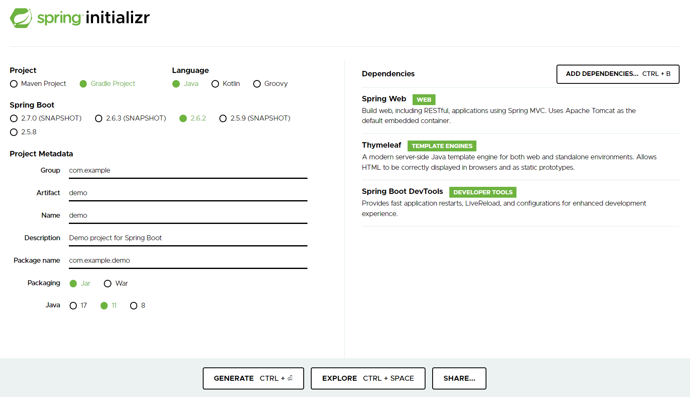
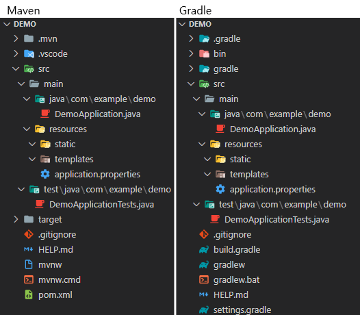

# Inflearn (김영한) / 스프링 입문 - 코드로 배우는 스프링 부트, 웹 MVC, DB 접근 기술

- [Inflearn Lecture Dashboard](https://www.inflearn.com/course/%EC%8A%A4%ED%94%84%EB%A7%81-%EC%9E%85%EB%AC%B8-%EC%8A%A4%ED%94%84%EB%A7%81%EB%B6%80%ED%8A%B8/dashboard)

## 섹션 1. 프로젝트 환경설정
### 프로젝트 생성
- Project 
  - 라이브러리 로드, 빌드 등을 관리하는 Tool을 명시
  - Maven, Gradle 등이 있으며, Gradle의 빈도가 증가하는 추세
  - 라이브러리는 추가적으로 의존성을 가질 수 있으며, 의존관계 역시 빌드 툴에 의해 관리됨
- Dependencies 
  - 프로젝트에서 사용하는 라이브러리
  - 각 라이브러리에 대한 간략한 설명과 용도는 [강의 자료](etc/스프링%20입문%20-%20코드로%20배우는%20스프링%20부트,%20웹%20MVC,%20DB%20접근%20기술%20v2021-12-01_2.pdf)를%20확인
```
- Thymeleaf
- Spring Web
- Spring Boot DevTools (선택)
- H2 Database (추가)
- JDBC API (추가, 학습 후 제외)
- Spring Data JPA (추가)
```
<a href="https://start.spring.io/">
  
</a>

### 프로젝트 생성 결과


- src/main : 실제 소스 및 Resource
  - java : 실제 패키지 & 소스 파일
  - resource : java 소스 파일을 제외한 xml, html, property와 같은 설정 파일
- src/test : 테스트 코드 부분
- pom.xml, build.gradle : 프로젝트에 대한 라이브러리 정보

### 프로젝트 실행 & JAR 파일 생성
```sh
# 프로젝트 실행
./gradlew bootRun

# jar 생성
./gradlew build

# jar 실행
## 구형 배포 방식 : Tomcat에 war 파일을 업로드
## 최근 배포 방식 : 해당 서버에서 jar 파일을 실행
java -jar build/libs/hello-spring-member-0.0.1-SNAPSHOT.jar

# Build 결과물 clean
./gradlew clean
```

## 섹션 2. 스프링 웹 개발 기초
- 웹 서버를 개발하는 3가지의 방법
- Spring boot 웹 어플리케이션 실행 시, 내부적으로 Tomcat을 실행
- 외부의 모든 요청에 대해 컨트롤러에서 처리 여부를 확인
  - 컨트롤러 처리 불가능 -> [정적 컨텐츠](#정적-컨텐츠)
  - 컨트롤러 처리, 화면 응답 -> [MVC와 템플릿 엔진](#mvc와-템플릿-엔진)
  - 컨트롤러 처리, 데이터 응답 -> [API](#api)

### 정적 컨텐츠
- resources/static에서 해당 자원을 찾아 있는 그대로 전달
- 정적 내용 이외에 데이터 바인딩, 코딩 등은 불가능
- resources/static/index.html이 스프링의 Default Welcome Page
- resources/static/hello-static.html 그대로 사용

### MVC와 템플릿 엔진
- 서버에서 정적 html이 아닌 동적으로 생성된 html을 전달하고자 함
- 스프링에서 Model, View, Controller 패턴 기능을 제공 
- 템플릿 처리 과정
  1. 사용자로부터 요청을 받은 톰캣은 스프링에게 해당 요청을 전달
  2. 스프링은 해당 요청을 처리할 수 있는 컨트롤러와 메소드를 확인 (@Controller와 @RequestMapping, @GetMapping 등을 사용)
  3. 컨트롤러 안에서 입력 받은 내용(@RequestParam, Model 등)을 바탕으로 해당 요청을 처리. 이때 화면에서 사용될 정보는 Model 객체에, 템플릿으로 활용될 파일의 이름은 리턴 값(문자열)으로 명시
  4. 스프링이 반환된 ViewName(문자열)을 viewResolver에게 전달하면, viewResolver가 화면을 찾아 템플릿 엔진에 연결
  5. 템플릿 엔진(Thymleaf 등)이 html과 Model을 바탕으로 랜더링을 진행한 후 사용자에게 반환한다.
```java
// package com.example.hellospringmember.controller;
// import something;

@Controller
public class HelloController {
    @GetMapping("hello")
    public String hello(Model model) {
        model.addAttribute("data", "Hello World!");
        return "hello"; // resources/templates/hello.html
    }
    @GetMapping("hello-mvc")
    public String helloMvc(@RequestParam("name") String name, Model model) {
        model.addAttribute("name", name);
        return "hello-template"; // resources/templates/hello-template.html
    }
// ...
```

### API
- Json 데이터 구조 포맷으로 데이터를 전달
- Controller에 실행 메소드 상단에 @ResponseBody를 선언
  - viewResolver 대신 HttpMessageConverter가 동작(스프링 부트의 자동 설정)
  - HTTP의 body에 문자 내용을 직접 반환(html body tag가 아님!)
  - @ResponseBody와 @Controller의 합성이 @RestController
- byte 처리 등등 기타 여러 HttpMessageConverter가 기본으로 등록되어 있음
  - 클라이언트의 HTTP Accept 해더와 컨트롤러 반환 타입 정보를 조합하여 HttpMessageConverter가 선택됨
  - 메소드가 문자열을 반환하는 경우, Default 문자 처리 컨버터인 StringHttpMessageConverter가 작동히여 문자열로 반환
  - 객체를 반환하는 경우, Default 객체 처리 컨버터인 MappingJackson2HttpMessageConverter가 작동하여 Json으로 반환
  - 객체를 Json으로 변경해주는 여러 라이브러리가 존재(Jackson, Gson ... )
```java
// package com.example.hellospringmember.controller;
// import something;

@Controller
public class HelloController {
    // ...
    @GetMapping("hello-string")
    @ResponseBody
    public String helloString(@RequestParam("name") String name) {
        return "hello " + name; // StringHttpMessageConverter 작동
    }

    @GetMapping("hello-api")
    @ResponseBody
    public Hello helloApi(@RequestParam("name") String name) {
        Hello hello = new Hello();
        hello.setName(name);
        return hello; // MappingJackson2HttpMessageConverter 작동, Hello 객체를 Json으로 전달
    }

    static class Hello { // 사용자에게 전달할 객체
        private String name;
        public String getName() { return name; }
        public void setName(String name) { this.name = name; }
    }
}
```

## 섹션 3. 회원 관리 예제 - 백엔드 개발
- 매우 간단한 요구사항을 통해 레이어드 아키텍쳐와 테스트 코드를 실습
  - 컨트롤러 : 웹 MVC의 컨트롤러 역할
  - 서비스 : 핵심 비즈니스 로직 구현
  - 리포지토리 : 데이터베이스에 접근, 도메인 객체를 DB에 저장하고 관리
  - 도메인 : 비즈니스 도메인 객체, 예) 회원, 주문 등 주로 데이터베이스에 저장, 관리
- 비즈니스 요구사항 정리
  - 회원 데이터 : id(시스템이 정하는 Long), name(사용자가 입력하는 String)
  - 회원 등록과 조회 기능
  - 데이터 베이스 선정이 이루어지지않음 -> Repository는 인터페이스(역할)로 구현

### 회원 도메인과 리포지토리 개발과 테스트 케이스 작성
- domain
  - [Member](src/main/java/com/example/hellospringmember/domain/Member.java)
- repository
  - [MemberRepository](src/main/java/com/example/hellospringmember/repository/MemberRepository.java)
  - [MemoryMemberRepository](src/main/java/com/example/hellospringmember/repository/MemoryMemberRepository.java)
- repository(test)
  - [MemoryMemberRepositoryTest](src/test/java/com/example/hellospringmember/repository/MemoryMemberRepositoryTest.java)
### 회원 서비스 개발과 테스트 케이스 작성
- service
  - [MemberService](src/main/java/com/example/hellospringmember/service/MemberService.java)
- service(test)
  - [MemberServiceTest](src/test/java/com/example/hellospringmember/service/MemberServiceTest.java)

## 섹션 4. 스프링 빈과 의존관계
### 컴포넌트 스캔과 자동 의존관계 설정
### 자바 코드로 직접 스프링 빈 등록하기

## 섹션 5. 회원 관리 예제 - 웹 MVC 개발
### 회원 웹 기능 - 홈 화면 추가
### 회원 웹 기능 - 등록
### 회원 웹 기능 - 조회

## 섹션 6. 스프링 DB 접근 기술
### H2 데이터베이스 설치
### 순수 JDBC
### 스프링 통합 테스트
### 스프링 JdbcTemplate
### JPA
### 스프링 데이터 JPA

## 섹션 7. AOP
### AOP가 필요한 상황
### AOP 적용

## 섹션 8. 다음으로

## 추가 학습