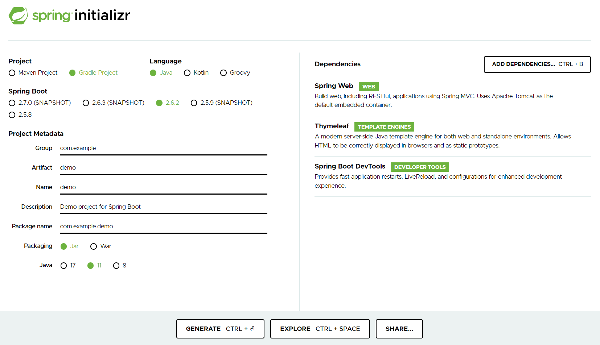
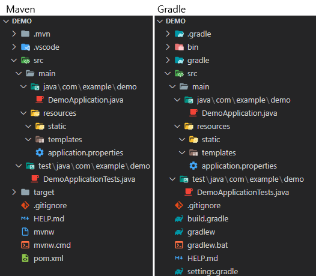

# Inflearn (김영한) / 스프링 입문 - 코드로 배우는 스프링 부트, 웹 MVC, DB 접근 기술

- [Inflearn Lecture Dashboard](https://www.inflearn.com/course/%EC%8A%A4%ED%94%84%EB%A7%81-%EC%9E%85%EB%AC%B8-%EC%8A%A4%ED%94%84%EB%A7%81%EB%B6%80%ED%8A%B8/dashboard)

## 섹션 1. 프로젝트 환경설정
### 프로젝트 생성
- Project 
  - 라이브러리 로드, 빌드 등을 관리하는 Tool을 명시
  - Maven, Gradle 등이 있으며, Gradle의 빈도가 증가하는 추세
  - 라이브러리는 추가적으로 의존성을 가질 수 있으며, 의존관계 역시 빌드 툴에 의해 관리됨
- Dependencies 
  - 프로젝트에서 사용하는 라이브러리
  - 각 라이브러리에 대한 간략한 설명과 용도는 [강의 자료](etc/스프링%20입문%20-%20코드로%20배우는%20스프링%20부트,%20웹%20MVC,%20DB%20접근%20기술%20v2021-12-01_2.pdf)를 확인
```
- Thymleaf
- Spring Web
- Spring Boot DevTools (선택)
- H2 Database (추가)
- JDBC API (추가, 학습 후 제외)
- Spring Data JPA (추가)
```
<a href="https://start.spring.io/">
  
</a>

### 프로젝트 생성 결과


- src/main : 실제 소스 및 Resource
  - java : 실제 패키지 & 소스 파일
  - resource : java 소스 파일을 제외한 xml, html, property와 같은 설정 파일
- src/test : 테스트 코드 부분
- pom.xml, build.gradle : 프로젝트에 대한 라이브러리 정보

### 프로젝트 실행 & JAR 파일 생성
```sh
# 프로젝트 실행
./gradlew bootRun

# jar 생성
./gradlew build

# jar 실행
## 구형 배포 방식 : Tomcat에 war 파일을 업로드
## 최근 배포 방식 : 해당 서버에서 jar 파일을 실행
java -jar build/libs/introduction-0.0.1-SNAPSHOT.jar

# Build 결과물 clean
./gradlew clean
```

## 섹션 2. 스프링 웹 개발 기초
- 웹 서버를 개발하는 3가지의 방법
- Spring boot 웹 어플리케이션 실행 시, 내부적으로 Tomcat을 실행
- 외부의 모든 요청에 대해 컨트롤러에서 처리 여부를 확인
  - 컨트롤러 처리 불가능 -> [정적 컨텐츠](#정적-컨텐츠)
  - 컨트롤러 처리, 화면 응답 -> [MVC와 템플릿 엔진](#mvc와-템플릿-엔진)
  - 컨트롤러 처리, 데이터 응답 -> [API](#api)

### 정적 컨텐츠
- resources/static에서 해당 자원을 찾아 있는 그대로 전달
- 정적 내용 이외에 데이터 바인딩, 코딩 등은 불가능
- resources/static/index.html이 스프링의 Default Welcome Page
- resources/static/hello-static.html 그대로 사용

### MVC와 템플릿 엔진
- 서버에서 정적 html이 아닌 동적으로 생성된 html을 전달하고자 함
- 스프링에서 Model, View, Controller 패턴 기능을 제공 
- **템플릿 처리 과정**
  1. 사용자로부터 요청을 받은 톰캣은 스프링에게 해당 요청을 전달
  2. 스프링은 해당 요청을 처리할 수 있는 컨트롤러와 메소드를 확인 (@Controller와 @RequestMapping, @GetMapping 등을 사용)
  3. 컨트롤러 안에서 입력 받은 내용(@RequestParam, Model 등)을 바탕으로 해당 요청을 처리. 이때 화면에서 사용될 정보는 Model 객체에, 템플릿으로 활용될 파일의 이름은 리턴 값(문자열)으로 명시
  4. 스프링이 반환된 ViewName(문자열)을 viewResolver에게 전달하면, viewResolver가 화면을 찾아 템플릿 엔진에 연결
  5. 템플릿 엔진(Thymleaf 등)이 html과 Model을 바탕으로 랜더링을 진행한 후 사용자에게 반환
```java
// package com.example.introduction.controller;
// import something;

@Controller
public class HelloController {
    @GetMapping("hello")
    public String hello(Model model) {
        model.addAttribute("data", "Hello World!");
        return "hello"; // resources/templates/hello.html
    }
    @GetMapping("hello-mvc")
    public String helloMvc(@RequestParam("name") String name, Model model) {
        model.addAttribute("name", name);
        return "hello-template"; // resources/templates/hello-template.html
    }
// ...
```

### API
- Json 데이터 구조 포맷으로 데이터를 전달
- Controller에 실행 메소드 상단에 @ResponseBody를 선언
  - viewResolver 대신 HttpMessageConverter가 동작(스프링 부트의 자동 설정)
  - HTTP의 body에 문자 내용을 직접 반환(html body tag가 아님!)
  - @ResponseBody와 @Controller의 합성이 @RestController
- byte 처리 등등 기타 여러 HttpMessageConverter가 기본으로 등록되어 있음
  - 클라이언트의 HTTP Accept 해더와 컨트롤러 반환 타입 정보를 조합하여 HttpMessageConverter가 선택됨
  - 메소드가 문자열을 반환하는 경우, Default 문자 처리 컨버터인 StringHttpMessageConverter가 작동히여 문자열로 반환
  - 객체를 반환하는 경우, Default 객체 처리 컨버터인 MappingJackson2HttpMessageConverter가 작동하여 Json으로 반환
  - 객체를 Json으로 변경해주는 여러 라이브러리가 존재(Jackson, Gson ... )
```java
// package com.example.introduction.controller;
// import something;

@Controller
public class HelloController {
    // ...
    @GetMapping("hello-string")
    @ResponseBody
    public String helloString(@RequestParam("name") String name) {
        return "hello " + name; // StringHttpMessageConverter 작동
    }
    @GetMapping("hello-api")
    @ResponseBody
    public Hello helloApi(@RequestParam("name") String name) {
        Hello hello = new Hello();
        hello.setName(name);
        return hello; // MappingJackson2HttpMessageConverter 작동, Hello 객체를 Json으로 전달
    }
    static class Hello { // 사용자에게 전달할 객체
        private String name;
        public String getName() { return name; }
        public void setName(String name) { this.name = name; }
    }
}
```

## 섹션 3. 회원 관리 예제 - 백엔드 개발
- 매우 간단한 요구사항을 통해 레이어드 아키텍쳐와 테스트 코드를 실습
  - 컨트롤러 : 웹 MVC의 컨트롤러 역할
  - 서비스 : 핵심 비즈니스 로직 구현
  - 리포지토리 : 데이터베이스에 접근, 도메인 객체를 DB에 저장하고 관리
  - 도메인 : 비즈니스 도메인 객체, 예) 회원, 주문 등 주로 데이터베이스에 저장, 관리
- 비즈니스 요구사항 정리
  - 회원 데이터 : id(시스템이 정하는 Long), name(사용자가 입력하는 String)
  - 회원 등록과 조회 기능
  - 데이터 베이스 선정이 이루어지지않음 -> Repository는 인터페이스(역할)로 구현

### 회원 도메인과 리포지토리 개발과 테스트 케이스 작성
- [Member](src/main/java/com/example/introduction/domain/Member.java)
```
특이사항 없음
```
- [MemberRepository](src/main/java/com/example/introduction/repository/MemberRepository.java)
```
# MemberRepository의 save(메소드)의 입력 변수 타입은 무엇이 적절할까?
강의에서는 Member(객체) 타입을 전달받았는데, 기본 타입을 전달받아 내부에서 객체를 생성한 후에 기능을 수행해도 되지 않을까?

안될건 없지만 여러 상황을 고려했을 때, 객체 타입을 입력받는 것이 바람직할 것 같다.

1. 현재는 저장하고자 하는 객체의 구성 요소가 단순함으로 기본 타입으로 입력받아 저장하는 것이 문제가 되지 않을 것이다.
하지만 구성 요소가 복잡해진다면 메소드 사용 시, 파라미터 입력 순서 고려해야하는 등의 번거로움이 존재한다.

Member save(String name, String email, String address); // Member 객체가 복잡해지기 시작한다면 ...

또한, Member(객체)의 구성 요소가 변경, 삭제, 추가될 때 인터페이스의 변경이 발생할 가능성이 있으며, 
인터페이스의 구현체 역시 연쇄적인 수정이 불가피하다. 이는 OOP의 SOLID 원칙 중 OCP 원칙을 위반한다.

2. save(메소드)의 역할은 Member(객체)를 저장하는 것이다. 
Member save (String name)는 문자열 name을 저장한다는 의미로 받아들여 질 수 있으며, 동료 개발자를 혼란에 빠트리기에 충분하다.
구현에 반드시 문자열 name을 입력 변수로 받아 저장하는 메소드가 필요하다면, 차라리 saveWithName 만드는 것이 그.나.마. 합리적일 것이다.

------------------------------------------------------------

# 그렇다면 MemberRepository의 save(메소드)의 반환 타입은 무엇이 적절할까? 이에 대한 결과를 Boolean으로 반환해도 되지 않을까? -> 생각해보기

Hint? 입력 변수 타입을 Member 객체로 받게되면 Call By Reference에 의해 원본의 수정이 발생할 가능성이 있다.
```
- [MemoryMemberRepository](src/main/java/com/example/introduction/repository/MemoryMemberRepository.java)
```
Java 8 Stream과 Lambda의 개념과 간략한 사용법을 확인하여 정리
```
- [MemoryMemberRepositoryTest](src/test/java/com/example/introduction/repository/MemoryMemberRepositoryTest.java)
```
JUnit의 개념과 간략한 사용법을 확인하여 정리
```

### 회원 서비스 개발과 테스트 케이스 작성
- [MemberService](src/main/java/com/example/introduction/service/MemberService.java)
```
Java 8 Optional의 개념과 간략한 사용법을 확인하여 정리
```
- [MemberServiceTest](src/test/java/com/example/introduction/service/MemberServiceTest.java)
```
# MemberService와 MemberServiceTest는 코드 작성 중, 객체 간의 의존성에 대한 문제가 발생하고 이를 해결하기 위한 과정이 존재한다.
따라서, 주석을 통해 코드 작성의 흐름과 문제점 그리고 해결 방법을 고민해 보아야한다.

------------------------------------------------------------

# BeforeEach를 통해 MemberService, MemoryMemberRepository 객체를 매번 생성할 필요가 있을까?

1. @BeforeAll을 사용하여 1회만 객체를 생성해도 되지 않을까?
가능하다. 단 BeforeAll의 메소드는 static으로 설정해 주어야하며, 이에 따라 MemberService, MemoryMemberRepository의 선언 역시 static으로 해주어야한다. 

static MemberService memberService;
static MemoryMemberRepository memoryMemberRepository;

@BeforeAll
static void beforeAll() {
    memoryMemberRepository = new MemoryMemberRepository();
    memberService = new MemberService(memoryMemberRepository);
}

Test 클래스의 라이프 사이클을 변경하면 static으로 설정하지 않고도 진행이 가능하다.
(Spring에 관한 주제를 다룸으로 별도로 JUnit을 학습할 때 정리하자)

2. 전역변수 선언과 동시에 객체를 생성해도 되지 않을까?
이 방법 역시 가능하다. 특별한 제약 사항이 없으며, 코드 역시 훨씬 간결해 보인다.

MemoryMemberRepository memoryMemberRepository = new MemoryMemberRepository();
MemberService memberService = new MemberService(memoryMemberRepository);

3. 그렇다면 3가지의 방법 중 어떠한 방법이 가장 합리적인 테스트 객체 생성 방법일까? -> 생각해보기
```

## 섹션 4. 스프링 빈과 의존관계
- 사용자의 요청을 처리하고 적절한 응답을 반환하는 컨트롤러를 작성하고 스프링 빈의 개념과 의존성 설정에 대해 학습하는 것이 목표
- 컨트롤러는 이전에 작성한 서비스 레이어를 이용하는데, 이를 **컨트롤러가 서비스 객체에 의존한다** 혹은 **의존성을 가지고 있다**고 표현함

### 컴포넌트 스캔과 자동 의존관계 설정
- 스프링을 사용한다는 것은 [MemberController](src/main/java/com/example/introduction/controller/MemberController.java)처럼 서비스에 필요한 클래스를 스프링 컨테이너에 등록하고 이를 받아서 사용하겠다는 의미
  - **클래스 안에서 사용할 의존성을 외부(스프링)에서 주입 받아 사용하는 것을 DI(Dependency Injection)라 함**
  - 스프링 컨테이너에 등록되는 객체는 단 하나의 인스턴스(싱글톤 객체)만 생성(Default, 설정 변경 가능하지만 거의 그대로 사용)하여 불필요한 중복을 제거
  - Why? 하나의 서비스 레이어는 여러 컨트롤러에서 사용될 수 있지만 다른 인스턴스일 필요는 없음
- 현재의 MemberService는 순수한 형태의 자바 클래스임으로 스프링 컨테이너가 MemberService의 존재를 알 수 없음, 따라서 실행 시 MemberService를 찾을 수 없다는 오류가 발생함
  - MemberService에 @Service를, MemoryMemberRepository에 @Repository를 각각 추가하면 스프링 컨테이너가 해당 객체를 스프링 빈으로 관리
```java
// package com.example.introduction.service;
// import something;

@Service
// 클래스에 @Service 을 사용하면 스프링이 시작하는 시점에 스프링 컨테이너를 통해 해당 객체(MemberService)를 생성, 관리 
public class MemberService {
  private final MemberRepository memberRepository;

  @Autowired
  // 생성자에 @Autowired 를 사용하면 객체 생성 시점에 해당 생성자를 실행하며, 실행에 필요한 스프링 빈(여기서는 MemberRepository)을 스프링 컨테이너에서 찾아서 연결(주입)해줌
  public MemberService(MemberRepository memberRepository) {
    this.memberRepository = memberRepository;
  }
}

// package com.example.introduction.repository;
// import something;

@Repository
// 클래스에 @Repository 을 사용하면 스프링이 시작하는 시점에 스프링 컨테이너를 통해 해당 객체(MemoryMemberRepository)를 생성, 관리
public class MemoryMemberRepository implements MemberRepository { }
```
- 스프링 빈을 등록하는 방법에는 2가지 방법이 존재하며 위와 같이 @Controller, @Service, @Repository 를 사용하는 것을 컴포넌트 스캔 방식이라함
  - @ComponentScan(@SpringBootApplication의 내부 요소) 이 포함된 클래스의 하위 패키지의 @Component를 포함한 클래스들이 스캔 대상
  - @Controller, @Service, @Repository 내부에는 @Component 가 포함됨
```
# 컴포넌트 스캔 방식의 장단점? -> 생각해보기
```

### 자바 코드로 직접 스프링 빈 등록하기
- 컴포넌트 스캔 방식을 사용(추가 설정이 없는 경우)하면 객체의 생성 및 의존성 연결을 **스프링이 자동으로 진행**함
- 이번에는 개발자가 직접 스프링 빈을 설정할 수 있는 방법을 학습
  - 같은 환경을 가정하기 위해 Controller 클래스 제외한 나머지 클래스들의 어노테이션을 제거
  - [MemberService](src\main\java\com\example\introduction\service\MemberService.java)
  - [MemoryMemberRepository](src\main\java\com\example\introduction\repository\MemoryMemberRepository.java)
- 개발자가 직접 스프링 빈을 설정하기 위해 XML이나 Java코드를 이용할 수 있음
  - XML로 설정하는 방식은 최근에는 잘 사용하지 않으므로 생략
  - Java 코드를 이용하여 스프링 빈을 설정하는 초기 SpringConfig.java 소스
```java
// package com.example.introduction;
// import something;

@Configuration
/*
 스프링이 시작하는 시점에 해당 객체의 @Bean 메소드를 이용하여 스프링 빈을 생성, 등록
 어떠한 구현체를 주입할지 개발자가 Java 코드로 설정할 수 있음
*/
public class SpringConfig {
    @Bean
    // 메소드를 실행하여 반환되는 객체를 스프링 빈에 등록
    public MemberService memberService() {
        // MemberService는 생성자는 MemberRepository 구현체를 필요로 함
        return new MemberService(memberRepository());
    }
    @Bean
    // 메소드를 실행하여 반환되는 객체를 스프링 빈에 등록
    public MemberRepository memberRepository() {
      // MemoryMemberRepository 를 주요 구현체로 사용하는 경우
      return new MemoryMemberRepository();
    }
}
```
- 컨트롤러의 경우, 스프링 빈으로 등록되는 것 이외에도 사용자 요청의 진입점을 나타내야함으로 @Controller 를 그대로 사용
  - 컴포넌트 스캔 방식으로 스프링 빈이 됨으로 중간에 @Bean 을 사용하여 설정할 수 없음
  - 예제에서 컨트롤러가 사용하는 의존성 객체는 @Configuration 에 등록된 내용을 기반으로 연결(주입)되어짐
- 컴포넌트 스캔과 Java 스프링 빈 설정은 각각 장단점이 존재
  - 실무에서는 주로 정형화된 컨트롤러, 서비스, 리포지토리 같은 코드는 컴포넌트 스캔을 사용
  - 컴포넌트 스캔은 코드가 간략하여 편해보이지만 변경 시 여러 코드의 수정이 필요
  - Java 스프링 빈 설정 파일을 운영하면 매우 쉽게 구현체를 변경할 수 있음
  - 정형화되지 않거나, 상황에 따라 구현 클래스를 변경해야 하면 Java 스프링 빈 설정 파일을 사용하는 것이 유리
  - 예제에서는 리포지토리 구현체를 변경할 예정이므로, 컴포넌트 스캔 방식 대신 Java 스프링 빈 설정 파일을 사용
- 컴포넌트 스캔 시, 의존성 주입 방식은 3가지 방식이 존재
```java
/*
 Field Injection
 변경할 수 있는 방법이 아예 없음, 현재는 거의 사용하지 않음
*/
@Autowired private MemberRepository memberRepository;

/*
 Setter Injection
 final로 설정할 수 없으며, set 메소드가 public으로 노출 되어야함
 MemberService가 설정된 이후 변경될 이유가 없을 텐데 변경이 가능함
*/
private MemberService memberService;

@Autowired
public void setMemberService(MemberService memberService) {
    this.memberService = memberService;
}

/*
 Constructor Injection
 의존 관계가 실행(runtime) 중에 동적으로 변하는 경우는 거의 없으므로 생성자 주입을 권장
*/
private final MemberService memberService;

@Autowired
public MemberController(MemberService memberService) {
    this.memberService = memberService;
}
```

## 섹션 5. 회원 관리 예제 - 웹 MVC 개발
### 회원 웹 기능 - 홈 화면 추가
### 회원 웹 기능 - 등록
### 회원 웹 기능 - 조회

## 섹션 6. 스프링 DB 접근 기술
### H2 데이터베이스 설치
### 순수 JDBC
### 스프링 통합 테스트
### 스프링 JdbcTemplate
### JPA
### 스프링 데이터 JPA

## 섹션 7. AOP
### AOP가 필요한 상황
### AOP 적용

## 섹션 8. 다음으로

## Reference
- [Template Engine](https://imgzon.tistory.com/97)
- [Call By Reference](https://velog.io/@ahnick/Java-Call-by-Value-Call-by-Reference)
- [Optional](http://www.tcpschool.com/java/java_stream_optional)
- [ConcurrentHashMap](https://devlog-wjdrbs96.tistory.com/269)
- [Java stream](http://tcpschool.com/java/java_stream_creation)
- [Lambda](http://www.tcpschool.com/java/java_lambda_concept)
- [Spring Dependency Injection](https://baek.dev/post/21/)
- [Spring Bean](https://choiyeonho903.tistory.com/11)
- [@Component, @Bean difference](https://ecsimsw.tistory.com/entry/%EC%8A%A4%ED%94%84%EB%A7%81-%EC%BB%A8%ED%85%8C%EC%9D%B4%EB%84%88)
- [Spring Bean 생성 및 사용](https://lazymankook.tistory.com/67)
- [Annotation과 Bean](https://lazymankook.tistory.com/27)
- [H2 Database install path](https://recordsoflife.tistory.com/655)